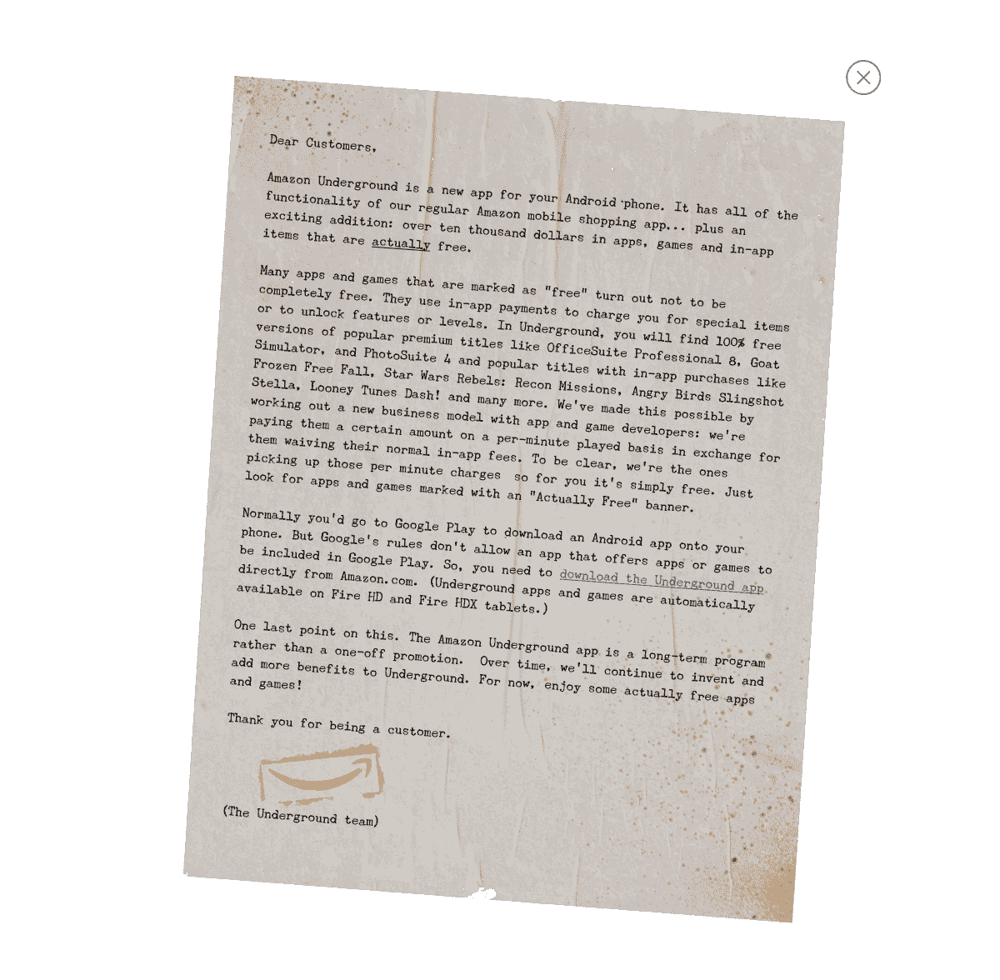

# Amazon Underground 有一个专注于“实际免费”应用的 Android 应用商店 

> 原文：<https://web.archive.org/web/https://techcrunch.com/2015/08/26/amazon-underground-is-an-android-app-store-with-only-actually-free-apps/>

亚马逊刚刚宣布了一款新的安卓应用，拥有你在普通亚马逊应用中能找到的一切，以及一个全新的安卓应用和游戏商店。虽然该公司已经有了亚马逊应用商店，但亚马逊地下是一个全新的应用程序，有可能取代亚马逊应用程序和应用商店。特别是，新的应用程序可以让你免费下载高级应用程序。它是这样工作的。

亚马逊已经与数千名开发者合作，让“超过一万美元的游戏、应用和应用内项目”实际上免费。这些应用通常是付费应用，但亚马逊找到了另一种方式来补偿应用开发者。例如，你已经可以找到 OfficeSuite Professional 8，Frozen Free Fall，星球大战反叛者:侦察任务，愤怒的小鸟弹弓 Stella 等等。这些应用程序将被打上“实际上免费”的标签，它将取代免费的应用程序一天计划。

该公司根据你使用某个应用的时长向开发者支付报酬。亚马逊监控每分钟的使用量，而开发者免除应用内购买和前期费用。亚马逊已经在 Kindle Unlimited 订阅服务中尝试了这一策略——该公司根据你阅读的页数向作家支付版税。除了 Android 应用程序之外，亚马逊地下商店基本上是同样的事情。这种模式也让人想起音乐流媒体服务，如 Spotify、Apple Music 和 Rdio。

在亚马逊地下应用中，你还会发现付费应用、免费增值应用以及实物和数字商品。整个亚马逊 Appstore 目录都会转移到亚马逊地下应用。唯一增加的是“实际免费”程序。

谷歌不允许 Play Store 中存在竞争应用商店，因此，就像以前的亚马逊应用商店一样，亚马逊客户将不得不直接从亚马逊的网站上下载亚马逊地下应用。这就是为什么传统的亚马逊购物应用程序也将留在 [Play Store](https://web.archive.org/web/20230211183847/https://play.google.com/store/search?q=amazon) 的原因。当然，Fire HD 和 Fire HDX 的用户可以自动进入改造后的地下商店。

最后，亚马逊表示，“实际上免费”计划不是一次性的促销活动，该公司致力于这一计划。如果开发者对亚马逊的补偿感到满意，这可能是一个让 Android 用户离开 Play Store，转而使用亚马逊应用商店的好方法。

亚马逊地下是一个有趣的举动，有几个原因。2008 年 App Store 推出时，最受欢迎的应用是付费应用。多年来，随着大型应用程序发行商推出广受欢迎的免费应用程序，小型发行商试图通过暂时免费应用程序来争夺排行榜冠军，出现了一场激烈的竞争。

这种趋势在 Android 上甚至更糟，因为许多用户不想为一个应用程序支付一分钱。应用开发者别无选择，只能依靠横幅广告来支持他们的应用。

2009 年，苹果允许免费应用程序的应用内购买，这基本上塑造了我们今天所知的应用商店和游戏商店。现在，免费游戏是 Android 和 iOS 上最卖座的应用，其中《战争游戏》、《部落冲突》和《糖果粉碎传奇》位居榜首。《愤怒的小鸟》的制作人 Rovio [可能无法在这种新环境下生存。](https://web.archive.org/web/20230211183847/https://techcrunch.com/2015/08/26/rovio-to-cut-260-jobs-as-the-angry-birds-franchise-becomes-irrelevant/)

然而，消费者已经受够了。微交易、付费升级、等待时间是新常态。亚马逊正在利用“实际上免费”的应用程序来顺应这一趋势，称你在“实际上免费”的应用程序中找不到任何应用内购买的迹象。现在，让我们看看亚马逊是否能让大牌开发者加入进来，并为其 Play Store 竞争对手吸引新用户。

