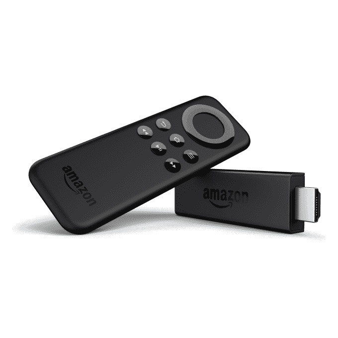

# 亚马逊更新 Fire TV 阵容，支持 USB 存储、无线耳机等 

> 原文：<https://web.archive.org/web/https://techcrunch.com/2015/03/24/amazon-updates-fire-tv-lineup-with-support-for-usb-storage-wireless-headphones-and-more/>

# 亚马逊更新了 Fire TV 阵容，支持 USB 存储、无线耳机等

亚马逊今天早上宣布，其流媒体播放器亚马逊 Fire TV 和 Fire TV stick 将很快获得软件更新，将提供一系列新功能，包括在 Fire TV 上支持可扩展 USB 存储和无线蓝牙耳机，可以通过 Wi-Fi 观看，这需要在两台设备上进行认证，等等。此外，该公司表示，Fire TV Stick 现在已经在两个新市场上市，即英国、德国和奥地利。

这些设备将于今天在这些新国家接受预购，并将于 4 月 15 日开始发货。

亚马逊指出，强制门户支持将使这两款设备成为首批流媒体播放器，用户可以通过 Wi-Fi 观看，但需要你进行认证。在某些情况下，这包括酒店、机场甚至大学宿舍等场所。

与此同时，Fire TV 的可扩展 USB 存储选项意味着用户现在将增加 Fire TV 的存储空间，以便为应用程序和游戏提供更多空间。

Fire TV 也将很快支持蓝牙耳机，允许用户私下听他们的电影、电视节目和游戏，而不会打扰附近的其他人。例如，对于那些和室友住在一起的人来说，这是一个很大的卖点，对于那些想看电视或玩游戏，但不想吵醒孩子的父母来说也是如此。例如，与 Roku 2 和 Roku 3 等其他设备相比，缺少耳机插孔也是 Fire TV 的缺点之一。因此，很高兴看到该公司采取措施尽最大努力解决问题，而不必发布新的硬件。

其他新功能包括浏览和搜索两个设备上的主要音乐播放列表的能力，这允许你根据心情、活动、艺术家或十年来查找歌曲。这两款设备现在都支持隐藏的 PIN 输入，这样其他人在购买时就无法在屏幕上看到你的密码，以及新的快捷方式，让你通过按住遥控器的 Home 键来睡眠或启用显示镜像。

亚马逊表示，所有增加的功能都将通过免费的无线软件更新来提供，但没有提供确切的时间表。相反，该公司承诺这些功能将在“未来几周”到来