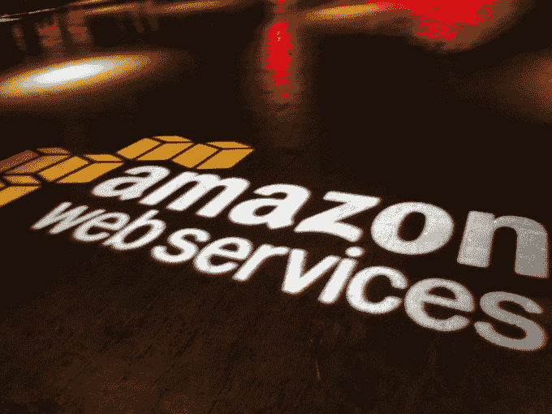

# 完成这些 edX 课程后，亚马逊网络服务将为您提供 1000 美元的积分 

> 原文：<https://web.archive.org/web/http://techcrunch.com/2014/12/23/amazon-web-services-will-give-you-1000-in-credit-for-completing-these-edx-courses/>

# 完成这些 edX 课程后，亚马逊网络服务将为您提供 1000 美元的积分

如果你有更多的时间而不是金钱，并且有一个你认为自己有能力建立的创业想法，亚马逊网络服务公司(T2)和在线教育门户网站(T4)之间的新合作将为你提供 1000 美元的信贷，帮助你完成两门创业课程中的一门。

除非你已经上过一些关于创业的课程，否则你不可能完全通过 MITx 在 edX 上的创业 101 或 102。你实际上必须通过这门课，所以至少要花几十个小时。但是，一旦你完成了课程，你将自动获得 1000 美元的积分，用于购买处理器时间和/或亚马逊云中的存储。

你还可以获得一些额外的奖励，这些奖励是为那些更喜欢代码而不是管理基础设施的人准备的，包括使用 AWS 的讲师指导培训和网络课程的积分，亚马逊高级层的免费支持，以及亚马逊专家的“办公时间”，他们可以帮助找出如何为亚马逊的实例设计你的应用程序或服务。

EdX 在合作关系上有一个 [FAQ 页面，也直接链接到你可以参加的课程，以便有资格获得免费学分。课程将于 1 月 9 日开始，所以你可以在提交之前浏览一下课程总结。](https://web.archive.org/web/20230129085911/https://www.edx.org/AWS-activate)