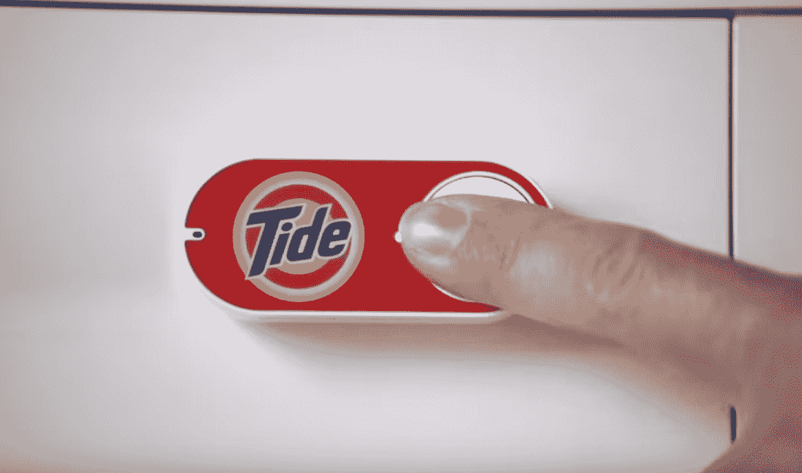

# 亚马逊的 5 美元破折号按钮已经被黑掉了，除了给亚马逊钱之外，还能做其他事情 

> 原文：<https://web.archive.org/web/http://techcrunch.com/2015/08/17/amazons-5-dash-button-already-hacked-to-do-other-stuff-beyond-giving-amazon-money/>

# 亚马逊的 5 美元破折号按钮已经被黑客攻击，除了给亚马逊钱之外，还做其他事情

本周需要一些激发创造力的东西吗？亚马逊价格为 5 美元的[单用途破折号按钮](https://web.archive.org/web/20230131005908/https://techcrunch.com/gallery/what-its-like-to-use-amazons-new-dash-buttons/)的超级聪明的破解怎么样？

破折号按钮原本是用来快速重新订购你经常订购的家庭用品的(订购大量洗衣液？在你的洗衣机上贴一个按钮，快用完的时候按下它。砰。已订购。)，但 Cloudstitch 首席技术官 Ted Benson 已经找到了一种方法，可以让他们做几乎任何他想做的事情。

你可以在这里阅读本森的[全面分析，但要点如下:](https://web.archive.org/web/20230131005908/https://medium.com/@edwardbenson/how-i-hacked-amazon-s-5-wifi-button-to-track-baby-data-794214b0bdd8)

*   本森注意到，每次按下仪表板时，它都会发出独特的信号。
*   本森没有打开 Dash 并修改硬件本身(这可能需要各种痛苦/乏味的芯片刷新)，而是嗅探网络中的信号。当它被检测到时，他可以启动一个脚本去做任何他想做的事情。在他的演示用例中，他用它来记录宝宝的尿布何时被换成谷歌电子表格，而第二个按钮记录宝宝何时从午睡中醒来。
*   为了防止 Dash 在您按下它时订购任何产品，您只需…不要在初始设置时配置它来订购产品。如果你从来没有进入 SKU，它不会有任何订购。

有一个问题:工厂 Dash 可以自己行动，而改装 Dash 需要一些东西——通常是一台计算机——唤醒并运行在您的网络上，以嗅出按钮按压并做出相应的响应。这让等式变得有点复杂，但这仍然是一个有趣的方法。