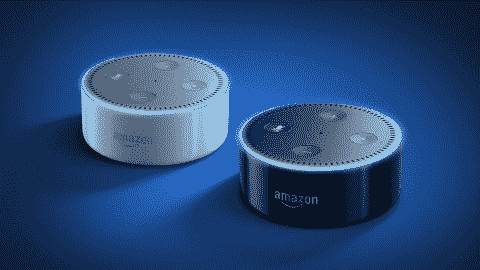

# 亚马逊的 Alexa 通过了 15，000 项技能，高于 2 月份的 10，000 项

> 原文：<https://web.archive.org/web/https://techcrunch.com/2017/07/03/amazons-alexa-passes-15000-skills-up-from-10000-in-february/>

亚马逊的 Alexa 语音平台现在已经通过了 15，000 项技能——这些语音驱动的应用程序可以在 Echo speaker、Echo Dot、newer Echo Show 等设备上运行。这一数字高于亚马逊官方在二月份宣布的 10，000 项技能，比九月份增加了 3 倍。

这个新的 15000 人的数字最初是[通过 Voicebot 的第三方分析报告的](https://web.archive.org/web/20221127014454/https://www.voicebot.ai/2017/07/02/amazon-alexa-skill-count-passes-15000-in-the-u-s/)，亚马逊现在已经向 TechCrunch 证实了这个数字是准确的。

根据只分析美国技能的 Voicebot 的说法，2017 年 6 月 30 日首次达到了里程碑。在 6 月份，新技能引进增加了 23 %,高于前三个月每个月不到 10%的增长率。

这一里程碑也代表了今年年初可用技能数量的两倍多，当时语音机器人[报告](https://web.archive.org/web/20221127014454/https://www.voicebot.ai/2017/01/03/total-number-amazon-alexa-skills-now-7000/)当时有 7000 项技能。这个数字是亚马逊在 CES 上正式确认的。

Voicebot 还指出，Flash 简报仍然是最受欢迎的技能类别之一，就今天在 Alexa 技能商店上直播的那些技能而言。这些专注于新闻和信息的语音应用程序包括来自主要媒体出版物的应用程序，如《华尔街日报》、《NPR》、《华盛顿邮报》(、 [TechCrunch](https://web.archive.org/web/20221127014454/https://www.amazon.com/AOL-Inc-TechCrunch/dp/B01L6HQHGQ/ref=sr_1_1?s=digital-skills&ie=UTF8&qid=1499100078&sr=1-1&keywords=techcrunch) )和其他应用程序。

因为快速简报是最容易培养的技能之一，所以它已经占到可用技能的 20%左右。你可以在 Alexa 技能商店上看到这个数字[，这表明现在有 2891 个“新闻”技能。](https://web.archive.org/web/20221127014454/https://www.amazon.com/s/ref=lp_13727921011_nr_n_11?fst=as%3Aoff&rh=n%3A13727921011%2Cn%3A%2113727922011%2Cn%3A14284857011&bbn=13727922011&ie=UTF8&qid=1499095062&rnid=13727922011)

可用技能的数量是跟踪亚马逊在语音计算领域成功的一个重要指标。

亚马逊目前是语音驱动设备的领导者，预计今年它将控制 70%的 T2 市场，远远领先于 Google Home、联想、LG 和其他公司。如果说有什么不同的话，那就是它的成功在苹果发布自己的 Siri 驱动设备 [HomePod 中发挥了作用。](https://web.archive.org/web/20221127014454/https://beta.techcrunch.com/2017/06/05/apple-announces-the-homepod/)苹果公司的参赛者旨在通过吸引那些[更关心扬声器质量](https://web.archive.org/web/20221127014454/https://beta.techcrunch.com/2017/06/05/not-so-sirious/)而不是附带的虚拟助手的人来占领部分市场。但是有一件事苹果还没有谈及，那就是第三方开发者是否能够开发 HomePod 兼容的应用。

与此同时，亚马逊的 Alexa 正在快速发展，建立起一个完整的语音应用生态系统，速度如此之快，以至于它甚至无法实施通常的保护措施——例如，一个密切检查应用程序是否违反服务条款的团队，甚至是允许开发者从他们的创作中赚钱的工具。(目前，[亚马逊只是简单地向那些建立流行游戏技能的人发放现金奖励](https://web.archive.org/web/20221127014454/https://beta.techcrunch.com/2017/05/16/amazon-begins-rewarding-top-performing-alexa-skill-developers-with-direct-payments/)——它认为这一类别有一些早期吸引力。)

从长远来看，亚马逊对应用生态系统基础设施增长的关注可能会赶上它。但是现在，它的 Alexa 平台比它最接近的竞争对手*遥遥领先。尽管 Google Home [在假期销售中出现了一个高峰](https://web.archive.org/web/20221127014454/https://beta.techcrunch.com/2017/06/29/adobe-echo-dot-now-leads-voice-speaker-sales/)，但由于其较低的价格点，Echo Dot 正被大量采用。*

此外，Voicebot 指出，截至 6 月 30 日，Google Home 只有 378 款语音应用。微软的 Cortana 只有 65。

虽然有人批评亚马逊的许多技能质量低下，但也有一些东西可以用来构建应用商店的长尾。也许并不是所有的技能都像每天喝一杯 NPR 或通过语音订购一杯优步一样有用，但有超过 15000 种可供选择，这意味着你更有可能找到一种适合你需求的。

*图片鸣谢—top:Adobe；图表:语音机器人*