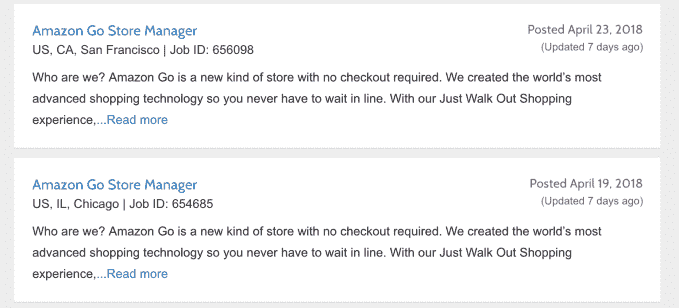

# 亚马逊的无收银员 Go 商店即将进驻芝加哥和旧金山

> 原文：<https://web.archive.org/web/https://techcrunch.com/2018/05/15/amazons-cashier-less-go-stores-are-coming-to-chicago-and-san-francisco/>

# 亚马逊的无收银员 Go 商店即将进驻芝加哥和旧金山

亚马逊正在寻求在美国各地开设更多的无收银员商店，根据旧金山和芝加哥的新招聘信息，这两个城市似乎将是下一批开设无收银员商店的城市。

作为对由[西雅图时报](https://web.archive.org/web/20230325190748/https://www.seattletimes.com/business/amazon/amazon-go-targets-chicago-san-francisco-for-new-stores/?utm_source=newsletter&utm_medium=email&utm_campaign=newsletter_axioslogin&stream=top-stories)发现的帖子的回应，亚马逊发言人证实了在这两个城市开设商店的计划，尽管他们没有具体说明时间安排。

除了一般的工作列表之外，没有太多的细节，但他们确实列出了这两个网站的几个管理职位。

本周早些时候，旧金山纪事报[报道了](https://web.archive.org/web/20230325190748/https://www.sfchronicle.com/bayarea/matier-ross/article/Amazon-Go-cashier-free-store-could-be-headed-to-12910402.php)亚马逊 Go 商店可能会进驻旧金山交通繁忙的联合广场市区。与此同时，[公司有一个许可证](https://web.archive.org/web/20230325190748/https://chicago.curbed.com/2018/2/23/17046534/amazon-go-store-chicago-building-permit),在芝加哥环路地区内建一个小得多的 635 平方英尺的“亚马逊商店”。

亚马逊的 Go 商店的设计理念是让消费者无需经过结账流程就能进出便利的商店式杂货店。该商店在很大程度上依赖于跟踪顾客并看到他们选择什么的摄像头，同时通过 Amazon Go 应用程序直接向他们收费。该公司的“未来商店”目前只在西雅图，似乎是一个完全独立于全食超市的项目，全食超市去年被[亚马逊收购](https://web.archive.org/web/20230325190748/https://techcrunch.com/2017/06/16/report-amazon-is-gobbling-whole-foods-for-a-reported-13-7-billion/)。