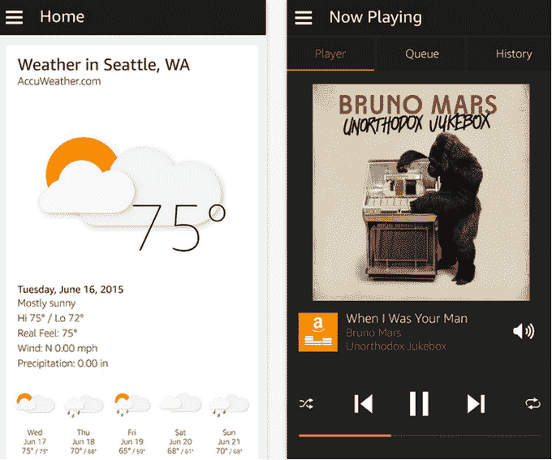

# 亚马逊的联网扬声器 Echo 现在有了一个 iOS 应用 

> 原文：<https://web.archive.org/web/https://techcrunch.com/2014/12/11/amazons-connected-speaker-echo-now-has-an-ios-app/>

当亚马逊上个月推出其 199 美元的联网扬声器 [亚马逊 Echo](https://web.archive.org/web/20221005194708/http://www.amazon.com/echo%20) 时，它可以播放音乐、新闻、广播等内容，并通过其包含的虚拟助理技术来响应命令和查询，它还带有一个专用的移动应用程序来进行配置和其他设置。该应用最初仅适用于亚马逊的 Fire OS 和 Android，而不是 iOS。相反，iPhone 和 iPad 用户不得不使用 Safari 或桌面浏览器。

如今，随着亚马逊发布了 iOS 版[亚马逊 Echo](https://web.archive.org/web/20221005194708/https://itunes.apple.com/us/app/id944011620?mt=8) ，这种情况发生了变化。

和它的 Android 版本一样，新的 iOS 应用程序允许你使用你的 iOS 设备作为遥控器来和 Echo 交互。

开始时，该应用程序会引导您完成一个简单的设置过程，之后您可以使用该应用程序来控制输出回声，作为使用语音命令的替代方法。

该应用程序允许您管理连接的扬声器支持的各种设置，包括闹钟、音乐、购物清单等。

它还提供了一个基本的音乐播放器，可以让你看到正在播放的内容、最近播放的内容和队列中的内容，同时还提供了播放器控制，可以让你播放、暂停、倒带、快进、无序播放和重复播放。

包含的购物清单界面也相当简单，允许您添加或删除项目，或者检查它们。此外，该应用程序的主屏幕显示天气和其他最近的查询，包括 Echo 代表你在维基百科上查找的那些查询，这是硬件设备更有趣的功能之一。

提醒一下，Amazon Echo 还没有普及。相反，感兴趣的用户可以访问 Echo 网站[请求邀请](https://web.archive.org/web/20221005194708/http://www.amazon.com/echo%20)购买该设备。

这里的问题可能不是亚马逊是否能够生产足够的硬件来满足需求，而是是否真的会有*T4 的需求。毕竟，亚马逊凭借 Fire Phone 进入智能手机市场失败了，Echo 充其量只是一个购物助理，而不是萨曼莎。(或者 Alexa，亚马逊给它的虚拟助手起了个名字。)正如其另一款基于硬件的购物助手亚马逊 Dash 一样，该公司基本上是公开进行硬件消费者试用，以观察人们的反应。*

亚马逊 iOS 版 Echo 是[免费下载，点击这里](https://web.archive.org/web/20221005194708/https://itunes.apple.com/us/app/id944011620?mt=8)。