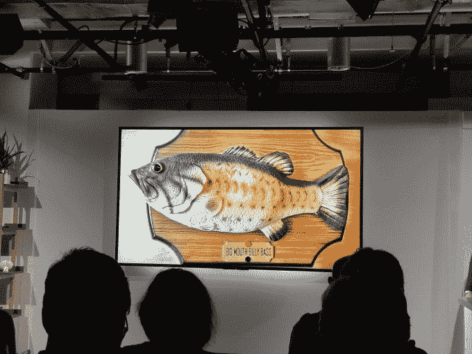

# 亚马逊的 Echo 按钮只是一个开始，今年将推出更多的外形规格 

> 原文：<https://web.archive.org/web/https://techcrunch.com/2018/01/08/amazons-echo-buttons-are-just-the-start-more-form-factors-to-launch-this-year/>

亚马逊的 Echo 按钮，与你用 Alexa 玩的[家庭琐事游戏配合使用的](https://web.archive.org/web/20221007193005/https://beta.techcrunch.com/2017/09/27/amazon-introduces-echo-buttons-for-at-home-trivia-games-using-alexa/)[怪异设备](https://web.archive.org/web/20221007193005/https://beta.techcrunch.com/2017/09/27/heres-why-amazon-made-those-weird-echo-buttons/)，仅仅是一个开始，它可能会成为一个充满各种“连接配件”的新产品线该公司现在正在与 Alexa 游戏开发商测试其他类似性质的小工具，并计划在 2018 年的某个时候推出这些小工具。

亚马逊 Alexa 副总裁史蒂夫·拉布钦(Steve Rabuchin)在本周的 CES 上的一次对话中表示，“我认为，今年你会看到更多利用按钮的游戏问世。”他补充说，消费者也可能会看到更多类型的联网设备。“它们可能是按钮，也可能是其他形式，”他谈到预计今年推出的产品时说。

具体来说，这个产品类别被称为 Alexa Gadgets，它们的存在并非完全不为人知。

该公司在去年年底举行的 [re:Invent](https://web.archive.org/web/20221007193005/https://beta.techcrunch.com/events/aws-reinvent-2017/coverage/) 开发者大会上[宣布了](https://web.archive.org/web/20221007193005/https://www.youtube.com/watch?v=smv_y-TAscY&index=5&list=PLYlhUDXJOaqbGQ7nA3eVf-ODQYr7K3WI_)其针对这一新类别联网产品的计划，这些产品旨在与 Alexa 配合使用——以及创建这些产品所需的开发工具。

与 Echo 本身一样，Echo 按钮展示了可能的技术——这些按钮不是独立的设备，而是通过蓝牙与 Echo 连接。但是有了更新的开发工具，任何人都可以建立自己的连接设备。

拉布钦说:“这个模式是，我们建立一些东西，我们向开发者社区开放，让他们创新。”

一组精选的开发人员正在用他们自己的技能预览这项技术。而且出道的测试人员都是游戏开发者也不奇怪。

从参与度和可用技能的数量来看，游戏已经成为亚马逊技能商店(其语音应用市场)上最受欢迎的技能类别之一。这就是为什么游戏是第一个获得直接支付奖励的技能——亚马逊计划继续这一做法，尽管它后来宣布了更标准的货币化工具，如[应用内购买](https://web.archive.org/web/20221007193005/https://beta.techcrunch.com/2017/11/29/amazon-adds-in-skill-purchases-for-alexa/)和[订阅](https://web.archive.org/web/20221007193005/https://beta.techcrunch.com/2017/10/25/amazon-introduces-subscriptions-for-alexa-skills-makes-them-free-for-prime-members/)(再次，从游戏开始。)

但这也是有意义的，因为游戏是亚马逊旨在利用 Alexa 及其 Echo 扬声器向客户追加销售 Prime 的方式之一，因为会员可以获得免费额外内容等额外津贴。

至于 Alexa 的哪些游戏技能将开始与现有的 Echo 按钮一起工作，继推出合作伙伴[孩之宝的琐碎的 Pursuit Tap](https://web.archive.org/web/20221007193005/https://www.businesswire.com/news/home/20171219005750/en/Hasbro-Introduces-Trivial-Pursuit-Tap-Games-Amazon) 之后，或者今年将他们自己的“Alexa 小工具”推向市场，现在还没有说。

当然，亚马逊在 re:Invent 上展示的小工具开发技术相当令人难忘——当时它展示了[一个大嘴巴比利·巴斯会说话的鱼壁挂](https://web.archive.org/web/20221007193005/https://beta.techcrunch.com/2017/09/27/amazons-alexa-will-live-in-a-talking-fish/)，它通过语音命令对 Echo 设备播放的音乐进行口型同步。关键是任何东西都可以通过蓝牙连接到 Alexa，以实现新的体验。

[击败了 Intro](https://web.archive.org/web/20221007193005/https://www.amazon.com/Musicplode-Media-Ltd-Beat-Intro/dp/B01N039PEF/ref=sr_1_1?s=digital-skills&ie=UTF8&qid=1515464286&sr=1-1&keywords=beat+the+intro) ，一个多人小组音乐游戏(一个 la 'name that tune ')，[展示了](https://web.archive.org/web/20221007193005/https://www.youtube.com/watch?v=smv_y-TAscY&index=5&list=PLYlhUDXJOaqbGQ7nA3eVf-ODQYr7K3WI_)如何将它的技能与回声按钮相结合。

拉布钦似乎对按钮迄今为止的表现相当乐观。“我们在圣诞节期间推出了这些按钮。他们很快就卖光了，”他说。(按照真正的亚马逊风格，他拒绝透露纽扣的销售数据。但琐碎的 Pursuit Tap 有 58 条评论，其中 13 条提到了按钮。与此同时，这些按钮有 226 条评论。)

Echo 按钮目前在亚马逊网站上缺货——更多的按钮在 4 到 6 周内不会发货。