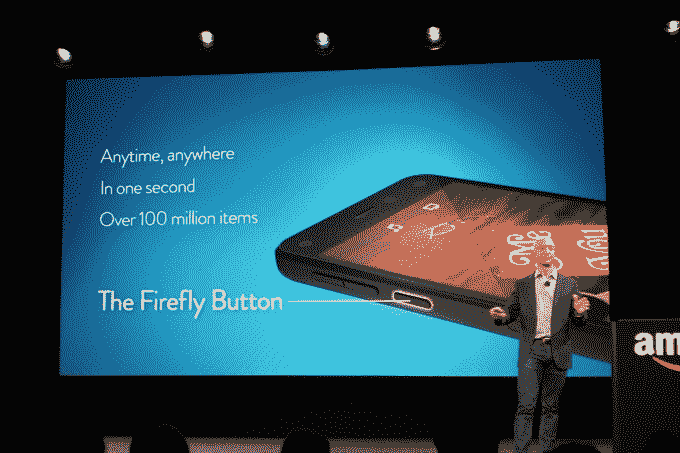

# 亚马逊的 Fire 手机引入了 Firefly，这一功能可以让你识别(并购买！)你在现实世界中看到的东西

> 原文：<https://web.archive.org/web/https://techcrunch.com/2014/06/18/amazons-fire-phone-introduces-firefly-a-feature-that-lets-you-identify-and-buy-things-you-see-the-real-world/>

随着今天下午亚马逊 Fire Phone 的首次亮相，该公司推出了一个名为 Firefly 的新功能，主要是为了让你识别——然后，当然，购买——你在现实世界中看到的东西。Firefly 利用智能手机的摄像头，让你只需将相机对准它们，就可以识别电话号码、电影、书籍、游戏、CD、食物等内容。

事实上，这一功能是新手机的关键部分，因为它甚至在侧面有一个专用按钮——这是一个完美的例子，表明这种新硬件如何将客户带入亚马逊的生态系统，并将他们变成定期的在线购物者。

Firefly 按钮有点像内置在你的设备中的“即时满足”。

在台上演示期间，亚马逊首席执行官杰夫·贝索斯展示了如何使用 Firefly 扫描商品、书籍封面、CD 等的条形码。还有一个类似 Shazam 的音频识别组件。Firefly 可以识别你正在听的歌曲，它甚至可以听一个节目，然后让你访问亚马逊上的特定场景，这是一个聪明的技巧。很自然，你会被引导去购买亚马逊上的歌曲、节目和电影。

## **萤火虫长得像“流”**

在某种程度上，Firefly 看起来像是建立在 Flow 基础上的一项功能，Flow 是亚马逊的视觉识别技术，过去一直存在于它自己的独立移动应用程序中，最近被引入到主要的亚马逊原生应用程序中。

[由亚马逊子公司 A9](https://web.archive.org/web/20230326163228/https://techcrunch.com/2011/11/02/amazons-flow-iphone-app-brings-augmented-reality-to-barcode-scanning/) (亚马逊的搜索和广告部门)运营的 Flow 于两年前首次推出。这个应用程序，现在是亚马逊的旗舰应用程序，通过识别媒体包装封面，标志，艺术作品和其他独特的视觉特征来工作。

因此，根据亚马逊对 Firefly 的描述，它显然是 Flow 的扩展，尽管没有明说。(不清楚公司为什么决定改名。但是“萤火虫”听起来确实更酷。)

Firefly 还可以识别艺术，然后拉起关联的 Wikpedia 词条，这是苹果的 Siri 和 Google Now 目前还做不到的。

贝佐斯说，Firefly 在推出时能够识别超过 1 亿件商品。这包括 245，000 部电影和电视剧，160 个直播电视频道，3，500 万首歌曲和 7，000 万种产品。

值得注意的是，Firefly 的功能不仅仅是*寻找你可以购买的东西，尽管这显然是它更大的目标。*

贝佐斯继续说，在引擎盖下，正在使用的技术包括“语义增强”，这是一种巧妙的方式，可以根据上下文智能地识别和理解文本。它可以使用图像到文本的转换来识别电话号码，并可以确定电话号码是否不存在。这个功能是通过将手机指向一家馅饼店的标志来演示的，这样你就可以给这家店打电话了。

该功能适用于标志、海报、杂志或名片，它可以让你发送电子邮件、保存为联系人或访问网站，而无需键入 URL。

## **开发者的萤火虫**

此外，开发人员将能够利用 Firefly，这使得该功能更有前途。

SDK 将允许第三方访问 Firefly 本身的所有功能。一家专注于健康的公司 MyFitnessPal 已经利用这一功能开发了一款应用程序，可以从你的相机看到的食物中确定营养信息。如今，用户必须手动输入这些数据，或者从一组搜索结果中选择一种食物。萤火虫让 MyFitnessPal 的美食日记“指指点点”

SDK 中包括文本、音频和图像识别器、内容数据库和对自定义操作的支持，允许开发人员根据自己的个人需求修改 Firefly。

在另一个例子中，Vivino 发布了一个应用程序，它可以提供你扫描的葡萄酒瓶的信息。其他早期采用者包括 iHeartRadio 和 StubHub。

虽然 Flow 功能有时可能看起来像是噱头——毕竟，输入搜索查询并不困难——向更广泛的开发者受众开放 Flow(通过 Firefly)实际上创造了一个新的应用类别，而且至少目前是亚马逊平台独有的。

虽然谷歌过去也试验过视觉识别技术([还记得“谷歌眼镜”吗？](https://web.archive.org/web/20230326163228/https://techcrunch.com/2009/12/07/google-goggles/)”)，这并不是该公司真正关注的焦点。与此同时，亚马逊追求这一功能是有意义的，因为该公司将身份识别视为购买过程的第一步，而不仅仅是你可以用手机做的另一个很酷的把戏。

贝佐斯说，Firefly SDK 今天发布。