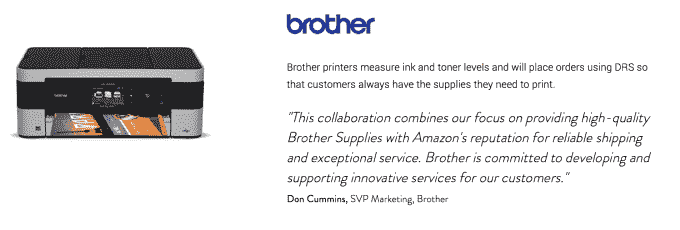

# 亚马逊新的 Dash Button 硬件为主要产品提供即时订单 

> 原文：<https://web.archive.org/web/https://techcrunch.com/2015/03/31/amazons-new-dash-button-hardware-offers-instant-orders-for-staple-products/>

亚马逊推出了名为 [Dash Button](https://web.archive.org/web/20221204202910/https://www.amazon.com/oc/dash-button) 的新硬件，可以一键订购你可能想要定期更换的产品。Dash 按钮有许多不同的品牌版本，具体取决于它的订购编码，包括一个粘合衬背和挂钩皮套，让您可以将它贴在最方便的地方。

破折号按钮是亚马逊在网上一键订购功能的自然延伸，但它变成了一个硬件小工具，例如，让订购洗衣液像实际启动洗衣周期一样简单。亚马逊显然希望，如果你在实际消费这些消费品的地方附近有一个实体的一键式设备，你就更有可能在用完之前通过其服务订购它们，那时去街角商店可能比送货上门更方便。

你使用亚马逊移动应用程序设置亚马逊的 Dash 按钮，然后连接到你的 Wi-Fi 网络，通过一次按压来分配你希望 Dash 按钮订购的产品(显然受到发布时硬件上图片的品牌限制)。配置完成后，该按钮将自动触发一个订单，使用默认的亚马逊支付订单发送到您的默认地址，如果您有其他想法，可以通过手机取消订单。该公司指出，在第一个订单交付之前，亚马逊不会触发通过后续按钮发出的另一个订单，除非你手动覆盖它。

【YouTube https://www.youtube.com/watch?v=NMacTuHPWFI&w=640&h=390]

发布时，Dash 按钮的[合格产品](https://web.archive.org/web/20221204202910/http://www.amazon.com/b/?ie=UTF8&node=11267118011)包括卫生纸、清洁产品、果汁、个人美容产品、狗粮等等。

Dash 按钮与亚马逊的 Dash 补货服务相关，该服务将同类服务直接集成到设备本身。例如，想象一下，一台咖啡机有一个按钮，可以自动重新订购咖啡豆或过滤器，或者一台洗衣机有一个内置按钮，可以订购洗涤剂。亚马逊已经与许多公司合作实现这一目标，并将于今年秋天推出首批此类设备。一些产品甚至会自动检测何时需要更换耗材，如果消费者启用该功能，就会立即订购。

目前，Dash 按钮是消费者最简单的上船方式，但你必须成为 Prime 会员并请求邀请才能上船。然而，硬件本身是免费的，因为亚马逊显然希望尽可能简化购买过程，以便在未来销售更多的消耗品。