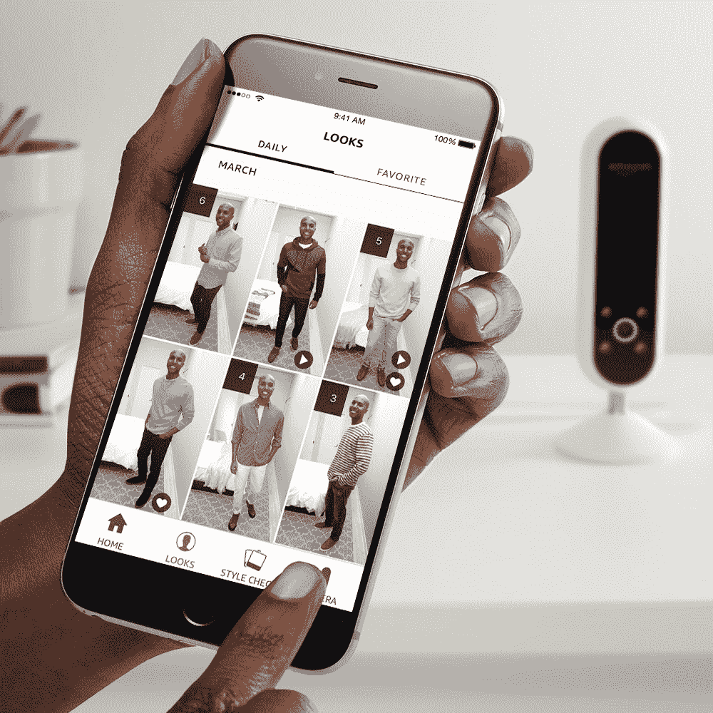

# 亚马逊新推出的 Echo Look 内置了一个摄像头，可以进行时尚自拍 

> 原文：<https://web.archive.org/web/https://techcrunch.com/2017/04/26/amazons-new-echo-look-has-a-built-in-camera-for-style-selfies/>

随着摄像头的加入，[亚马逊的新 Echo Look 设备](https://web.archive.org/web/20221207202412/https://www.amazon.com/dp/B0186JAEWK?enableAutoPlay=1&ref=pr_shrturl_1_ods_aucc_hx)现在可以看到和听到一切。这款设备是一种独立的自拍机器，用户可以拍摄全身照片和视频，专门用于早上检查自己的时尚选择。

新的家庭助手会回答“Alexa，拍照”和“Alexa，拍视频”等命令——对于后者，用户可以相应地旋转，从各个角度拍照，自拍的同时保持双手自由。用免提自拍杆拍摄的视频可以实时录制或观看。至少，它会让你在离开家之前确定没有人在你背上贴上踢我的标志。

这是该公司大获成功的产品线中一个有趣且出人意料的新成员。这里没有内置显示器，但用户可以在手机上看到它看到的内容。该设备还与该公司的风格检查(Echo Look 应用程序的一项功能)配合使用，该应用程序使用机器学习来比较不同的服装选择，给他们一个整体风格评级。

这款应用结合了机器学习和风格领域专家的建议。让人工智能在早上为你挑选衣服应该是一个非常有趣的实验。

该应用程序还会向用户推荐款式，这在硬件售出后为公司带来了相当清晰的收入流。毕竟，这一直是亚马逊发布硬件的惯用伎俩——低价出售，吸引人们通过你的服务购买更多东西。该公司显然一直在采取措施，通过其 [AmazonFashion vertical](https://web.archive.org/web/20221207202412/https://www.amazon.com/b/ref=fs_xg_xgl_lp_surl?node=7141123011) 增加款式销售，对于那些对此感兴趣的人来说，这是一个相当不错的硬件挂钩。

[https://web.archive.org/web/20221207202412if_/https://www.youtube.com/embed/9X_fP4pPWPw?feature=oembed](https://web.archive.org/web/20221207202412if_/https://www.youtube.com/embed/9X_fP4pPWPw?feature=oembed)

视频

这款设备看起来有点像最新一代智能家庭安全摄像头[中的一款](https://web.archive.org/web/20221207202412/https://beta.techcrunch.com/2016/12/22/canary-flex-2/)，长方形，底部有摄像头、麦克风和 LED 阵列。这款相机有一个内置的深度传感器，可以模糊照片中的所有内容，只保留主体。

谢天谢地，设备侧面还有一个大麦克风和摄像头关闭按钮，所以它不会记录你醒着的每一个时刻，[这是围绕这些越来越受欢迎的设备的越来越多的安全问题的一个大问题](https://web.archive.org/web/20221207202412/https://beta.techcrunch.com/2017/03/12/alexa-privacy/)。但是现在，视频被加入到这种永远在线的设备中，一系列新的担忧可能会在那些已经持谨慎态度的人中增加。

当然，这个东西也有 Alexa 功能的标准基础，所以用户也可以检查天气，以确保他们在这个场合穿着合适。风格功能感觉有点小众，但我意识到这个产品是为像我这样每天都穿差不多一样衣服的人设计的。

鉴于 Echo 不断更新的事实，在未来的几个月或几周内，我不会对看到更多相机特有的功能感到惊讶。目前，它的售价为 200 美元，比标准的 Echo 高出 20 美元。