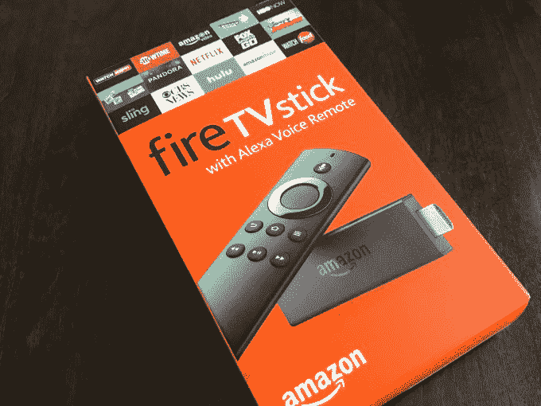
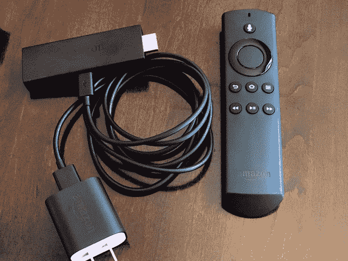
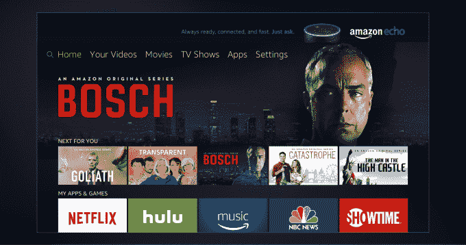
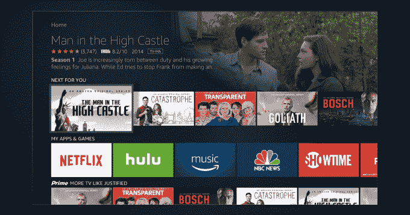

# 亚马逊的新 Fire 电视棒是将 Alexa 带回家最实惠的方式 

> 原文：<https://web.archive.org/web/https://techcrunch.com/2016/10/20/amazons-new-fire-tv-stick-is-the-most-affordable-way-to-bring-alexa-home/>

亚马逊今天正式推出了其 40 美元的 Fire 电视棒的更新版本，由于包含了语音控制遥控器，它现在包括了 Alexa 的功能。这是新的流媒体电视加密狗最引人注目的新增功能，它也拥有升级的内部功能，如四核处理器和更快的 Wi-Fi。

有了 Alexa 的内置，你不仅可以搜索亚马逊自己的视频库，还可以搜索第三方服务，如网飞、HBO Now 和 Hulu，以及控制亚马逊视频内容的播放。

**规格:**

*   四核处理器(比原来快 30%)
*   802.11ac Wi-Fi(高于上一代的 802.11n Wi-Fi)
*   支持高效视频编解码器(HEVC)(以更低的带宽获得更高的分辨率)
*   通过 VoiceView 屏幕阅读器提高可访问性
*   分辨率高达 1080p
*   1 GB 内存
*   8 GB 内部存储

**Alexa 外面的回声**

在 Fire TV Stick 上，你还可以像在 Echo 扬声器上一样使用 Alexa 也就是说，你可以向她询问新闻和体育更新、天气、创建待办事项列表，或者利用她的附加技能，例如称你为优步或阅读你的推文。

这使得 Fire TV Stick 现在成为将 Alexa 带入家庭的最实惠的方式，因为最便宜的亚马逊扬声器 Echo Dot 的价格要高出 10 美元左右。

当然，Alexa 在 Fire 电视棒上表现出色，可以帮助你搜索和浏览多媒体内容。Alexa 可以搜索亚马逊视频和第三方服务，如网飞、Hulu、HBO Now 等。该公司表示，Alexa 总共可以接入 90 多个应用和频道。

这意味着你可以让她播放你最喜欢的节目，即使该节目不在亚马逊上。例如，你也可以问她看什么节目的建议，比如说“找浪漫喜剧”，或者要求看所有那些有某个特定演员的节目。

当一个电视节目或电影可以在多个应用程序上观看时，Fire TV Stick 会显示所有的观看选项，包括“观看”、“租赁”或“购买”，这样你就不会最终购买一些可以通过订阅免费观看的东西。

对于亚马逊来说，这是一个有趣的举动，因为出售自己视频目录中的内容是亚马逊通过将 Fire TV 棒带入消费者家中来赚钱的主要方式之一。但看起来加密狗正朝着 Roku 的方向发展，Roku 采取了一种更不可知的方式来推广其平台上的内容。

话虽如此，Alexa 在亚马逊自己的内容上仍然表现最佳。当播放亚马逊视频时，你可以使用语音命令来回放、快进、播放和暂停你的节目。

Alexa 还可以从 Pandora、Amazon Music 和 iHeartRadio 播放音乐，启动应用程序，进入下一集等等。

**新的用户界面**

Fire 电视棒也将很快推出新的用户界面，亚马逊今天展示了这一界面。这将在今年晚些时候的空中更新中实现，在 Fire TV 之前实现。

亚马逊表示，更新后的界面旨在提供“更具影院效果的体验”，因为它包括视频预告片和内容截图等内容，以及个性化体验的新方法。

例如，亚马逊现在正与网飞和 HBO 等第三方内容合作伙伴合作，从这些服务中获取你自己的推荐，然后在新界面中给它们自己的行。

从纯粹的可用性角度来看，作为一个曾经玩过几乎所有 streamers 的人，这可能是最令人兴奋的变化之一。在苹果电视上，没有这样的；在 Roku 上，该公司通过一个新闻订阅式的“主页订阅”解决了个性化问题，它可以从你最喜欢的节目中获取更新。

Fire TV Stick 和 Fire TV 将会把你所有的推荐整合在一起。这意味着，你的 Fire TV 主屏幕将显示你喜欢看的所有内容，而不是在应用程序和它们各自的观看列表之间来回移动。

亚马逊告诉我们，它计划在“未来几个月”增加更多的合作伙伴推荐行

当然，亚马逊自己的内容在这里仍然会变得更大、更好，但这是朝着正确方向迈出的一步，它看起来更像是同类最佳的网飞界面，但特色内容仅来自一个服务之外。

总体而言，结合 Alexa、新界面、速度提升和 Fire TV 对第三方应用程序的持续支持——包括流行的“越狱”应用程序[Kodi](https://web.archive.org/web/20221209035230/https://kodi.tv/)—[Fire TV Stick](https://web.archive.org/web/20221209035230/https://www.amazon.com/gp/product/B00ZV9RDKK)将是一个令人信服的选择，因为它的价格较低。