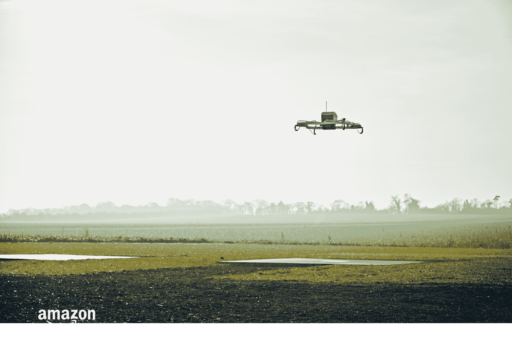

# 亚马逊在英国开始 Prime Air 无人机送货试验——但只有两名测试用户

> 原文：<https://web.archive.org/web/https://techcrunch.com/2016/12/14/amazons-prime-air-delivery-uk/>

# 亚马逊在英国开始 Prime Air 无人机送货试验——但只有两名测试用户

亚马逊今天[宣布](https://web.archive.org/web/20230322163744/https://www.amazon.com/b?node=8037720011)已经开始在英国进行小型私人无人机送货试验。它目前只与两家可以通过无人机订购商品的购物者合作。随着时间的推移，亚马逊计划将这一试验扩大到几十名——后来扩大到数百名——购物者，他们居住在英国剑桥周围第一个 Prime Air fulfillment 中心的几英里范围内。

第一次交付是在 12 月 7 日，没有飞太远，但这仍然是 Prime Air 的一个重要步骤，当亚马逊首次宣布这个项目时，它看起来只不过是一个早期的愚人节玩笑。无人机被装载在一个履行中心，然后在轨道上滚出大厅，之后起飞。整个飞行都是自动进行的，包括着陆，这个想法是为了确保所有的交付都在 30 分钟内到达。

无人机交付的第一个产品是一台亚马逊 Fire 电视和一袋爆米花。从客户输入订单到包裹送达，整个过程耗时 13 分钟。这些无人机将能够携带重达 5 磅的包裹。

亚马逊告诉我们，目前这批客户将可以一周七天订购，但只能在白天和天气适合飞行的时候订购。

从亚马逊今天发布的视频来看，客户必须在后院铺开一个小垫子，无人机才能看到并降落在上面。

亚马逊在这些试验中使用的无人机与之前展示的不同。与去年展示的混合飞机/四轴飞行器相比，这是一种更传统的四轴飞行器设计。这可能意味着它没有亚马逊长期以来所希望的全部功能，但它也是一个经过尝试和测试的设计。亚马逊也一直表示，它正在研究各种类型的无人机。

Prime Air 已经在世界各地测试其无人机，亚马逊最近也在 T2 建立了一个实验室，几十名计算机科学家正在研究基于计算机视觉的感知和规避技术。

传统上，Prime Air 总是在美国感恩节前后大出风头。这个[始于 2013 年](https://web.archive.org/web/20230322163744/https://techcrunch.com/2013/12/01/amazon-is-experimenting-with-autonomous-flying-delivery-drones/)，当时哥伦比亚广播公司(CBS)著名的 [60 分钟节目](https://web.archive.org/web/20230322163744/http://www.cbsnews.com/news/amazon-unveils-futuristic-plan-delivery-by-drone/)将无人机常规送货的想法推向了主流。去年，在 Top Gear/Grand Tour 明星杰瑞米·克拉克森的帮助下，[首次展示了其无人机的最新混合模型](https://web.archive.org/web/20230322163744/https://techcrunch.com/2015/11/29/amazon-shows-off-new-prime-air-drone-with-hybrid-design/)。然而，今年，围绕 Prime Air 的事情在感恩节期间保持平静(我的猜测是，亚马逊不想把注意力从盛大旅游的推出上转移开)。

只有不到几个测试者，这显然是一个非常小的测试，但它确实表明了亚马逊对这个项目的认真程度，很可能只有几个月的时间，剑桥周围就会有更多的人能够通过 Prime Air 订购他们的茶和饼干。不过，不要指望很快会在美国看到类似的服务。亚马逊能够在英国做到这一点，因为它去年 7 月获得了在英国经营超视距飞行的许可。为此，其无人机必须通过广泛的安全测试。亚马逊还需要一段时间才能将这项测试扩展到它现在工作的农村环境之外。城市无人机送货远比飞到农村的大后院困难。这也是该公司目前正在努力解决的问题。