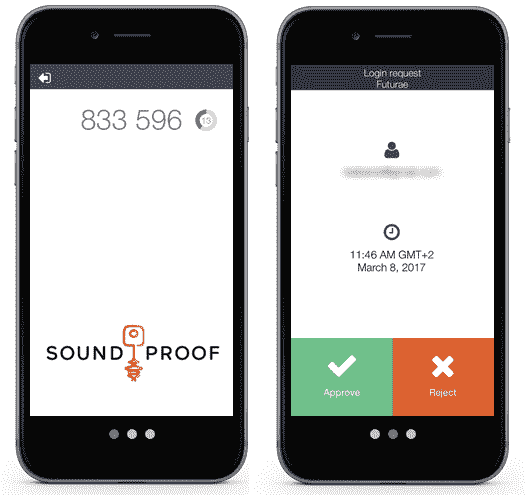

# 环境噪声可能是您的下一个多因素身份认证令牌 

> 原文：<https://web.archive.org/web/https://techcrunch.com/2017/04/20/ambient-noise-could-be-your-next-multi-factor-authentication-token/>

# 环境噪声可能是您的下一个多因素身份认证令牌

我们现在都非常习惯双因素身份验证，当您从一个新的位置登录时，必须键入一个四位数字的代码并不是很不方便。但是一些瑞士安全研究人员想出了一个聪明的方法来验证 T1，甚至不需要做那么一点点工作:环境噪音。

多因素身份认证背后的想法基本上是确保登录是由实际用户进行的，而不是由冒充者或黑客进行的。向用户拥有的第二个设备发送代码是一种检查方法，但这远不是唯一的选择。

[Futurae](https://web.archive.org/web/20221210001822/https://futurae.com/) 是一家从瑞士苏黎世联邦理工学院(瑞士的 ETHZ)分离出来的公司，它使用环境本身作为一款软件的认证令牌，该软件被称为隔音软件。

 当服务想要进行认证检查时，它查询试图登录的设备和用户的个人设备，可能是智能手机。它在每台机器上录制 3 秒钟的音频并进行比较；如果两者基本相似，则结论是用户与登录的设备在同一个地方，因此它必须是合法的，并且登录继续进行。

例如，如果同一首歌的同一部分在两个设备的背景中播放，或者语音具有相同的峰值或词，那就没问题。但是如果手机只听到鸟鸣声，而笔记本电脑听到一大群声音，那就不行了。该公司声称，如果你的手机在你的口袋里，你的包里，甚至是隔壁的房间里，它就能工作。

如果完全安静，超声波可以用来代替背景噪音，请求登录的设备发出一系列人耳听不到的啁啾声，但可以被手机上的应用程序接收到。

自然，所有这些都是在波形水平上严格比较的，采样的声音不会离开设备。

当然，它不会完全取代数字令牌或加密狗，但它可以作为一个额外的因素或风险评估技术。

Futurae 最近从当地的 [Venture Kick](https://web.archive.org/web/20221210001822/http://www.venturekick.ch/index.cfm) 比赛中赢得了 13 万瑞士法郎(几乎正好相当于现在的美元);该公司计划用这笔钱将隔音产品从演示形式推向商业产品。