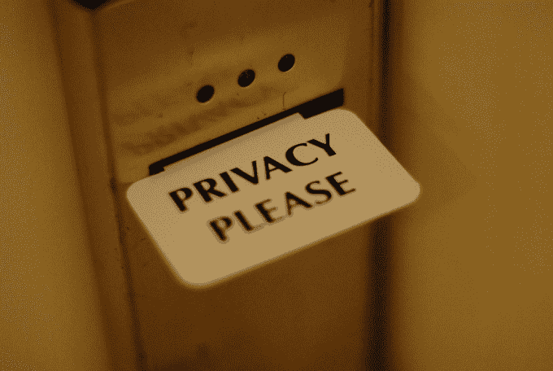

# 数字时代的美国隐私不应出售 

> 原文：<https://web.archive.org/web/https://techcrunch.com/2016/03/29/american-privacy-in-the-digital-era-should-not-be-for-sale/>

达拉斯哈里斯撰稿人

3 月 31 日日，联邦通信委员会[将投票](https://web.archive.org/web/20221224194758/https://www.fcc.gov/news-events/events/2016/03/march-2016-open-commission-meeting)开始更新保护我们电话通话隐私的规则，以包括保护我们的宽带连接。

虽然联邦通信委员会对谷歌或脸书等网站没有管辖权，但联邦通信委员会的提案要求康卡斯特和美国电话电报公司等宽带提供商遵循相同的基本安全做法来保护你的在线信息，就像电话公司今天用来保护你的电话信息一样，包括在向他人出售这些信息之前征求你的许可。

不出所料，宽带行业强烈抵制甚至开始更新 FCC 的宽带电话隐私规则。

互联网服务提供商已经竭尽全力淡化联邦通信委员会保护数字隐私的努力。他们没有要求 ISP 尊重用户隐私，而是提议消费者应该为虚拟专用网络(VPN)等“隐私服务”支付额外费用，或者自己学习如何使用加密技术。

没有人会怀疑我们通过完成家庭作业、申请工作、办理银行业务和执行无数其他日常任务在网上暴露了多少自己。

> 有关您的互联网行为的详细信息(例如，您访问了哪些网站，停留了多长时间，以及您是否上传或下载了某些内容)会让 ISP 对您的行为有一个全面的了解。

在“大数据”时代，宽带提供商不需要查看您传输或下载的实际内容来了解您家中每个人的好恶。

有关您的互联网行为的详细信息(例如，您访问了哪些网站，停留了多长时间，以及您是否上传或下载了某些内容)会让 ISP 对您的行为有一个全面的了解。

你的 ISP 收集的关于联网“智能”设备数量的信息，以及这些设备的行为方式，让任何拥有这些信息的人都可以对你的私人生活有一个惊人的准确描述。

普林斯顿大学教授尼克·菲姆斯特在给联邦通信委员会主席汤姆·惠勒的一封信中简明扼要地指出了 ISP 可以看到的所有信息:

> “ISP 可以从这种网关观察到的流量包含大量关于用户行为的隐私信息。2013 年的同一项研究发现，网络流量可以揭示用户活动的重要信息，包括用户何时在家的信息；连接到网络的设备的数量、类型和制造商；并且在某些情况下甚至是用户在家中的醒来和睡眠模式。值得注意的是，即使在加密流量的情况下，我们也可以观察到用户活动的这些特征。”

当 ISP 同时也是客户的有线电视提供商时，ISP 可以访问的信息量会成倍增加。有线电视公司可以也确实从用户的机顶盒中收集信息。你的手机会追踪你的位置信息。

围绕购买所有这些信息，结合从谷歌和脸书等网站收集的信息，一个完整的行业已经发展起来，产生关于你日常习惯的详细信息，以便向你出售更多东西。

业界的反应分为两种，一种是让公众放心，这种数据收集是无害的，另一种是告诉忧心忡忡的消费者，如果他们想要隐私，就必须购买。

在一篇由美国宽带联盟(其成员包括美国电话电报公司、康卡斯特和威瑞森)部分资助的[论文](https://web.archive.org/web/20221224194758/http://peterswire.net/wp-content/uploads/Online-Privacy-and-ISPs.pdf)中，彼得·斯瓦尔声称用户可以通过使用加密或虚拟专用网来保护自己免受 ISP 的窥探。

但是这些服务需要额外的费用，不是每个人都能支付的。

"[生命线](https://web.archive.org/web/20221224194758/https://www.fcc.gov/general/lifeline-program-low-income-consumers)"用户——联邦电话补贴计划的消费者部分，联邦通信委员会可能会将其扩展到宽带——可能会很难负担得起 VPN。即使在联邦通信委员会辩论生命线的现代化时，一些团体抗议该机构保护生命线用户隐私，这可能会在保护在线隐私方面产生严重后果。

换句话说，如果你买不起 VPN 或者不知道如何自己建一个，你就不值得保护。

付费隐私绝不是国会想要的。隐私是你在交流中的一项权利。自从国会建立了邮电部(现在的美国邮政署​)以来，强有力的通信隐私保护一直是标准。)

电话通信有很强的隐私保护。宽带是当今占主导地位的通信形式，消费者在 21 世纪应该获得与 19 世纪相同的隐私通信水平。作为电信领域的主要“巡逻警察”，FCC 需要加强消费者早已确立的隐私权。

随着联邦通信委员会准备在 3 月 31 日发布通知，我们面临一个根本性的问题:数字隐私是属于那些有能力支付费用并能加密其流量的人的，还是像国会打算的那样，隐私是一种权利？

联邦通信委员会应该遵循法律，并提出规则，承认消费者在访问网站时和打电话时一样享有隐私权。隐私不仅仅是那些负担得起的人的事。