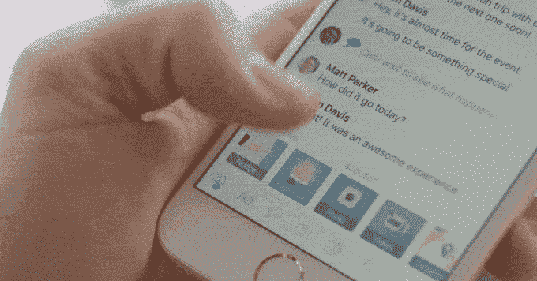

# Amity 的互动消息应用 one-ups iOS 10 的 iMessage，也可以在 Android 上运行 

> 原文：<https://web.archive.org/web/https://techcrunch.com/2016/09/02/amitys-interactive-messaging-app-one-ups-ios-10s-imessage-and-works-on-android-too/>

随着 iOS 10 的即将到来，iMessage 终于得到了急需的改进，将会看到它[融入第三方应用](https://web.archive.org/web/20221208143722/https://beta.techcrunch.com/2016/06/13/apple-launches-imessage-apps-so-third-party-devs-can-get-join-your-convos/)，以及[更具吸引力和互动性的功能](https://web.archive.org/web/20221208143722/http://www.apple.com/ios/ios10-preview/)，如消息气泡、动画、手写、点击、隐形墨水等等。但除非你的朋友也在 iOS 10 上，否则你将无法在群聊中使用这些附加功能。然而，一款名为 [Amity](https://web.archive.org/web/20221208143722/https://amity.io/) 的新消息应用程序即将推出，带来类似的——甚至可能是升级的——体验，但它可以跨平台工作。

在过去的两年里，总部位于澳大利亚布里斯班的 Amity 的八人创业团队一直致力于开发这款更具互动性的消息应用。

[gallery ids="1379283，1379282，1379281，1379280，1379279"]

与许多消息客户端一样，Amity 能够在您的聊天中发送富媒体，即照片(自然带有滤镜)、视频、链接、语音消息、表情符号、贴纸、您的位置等内容。但在 Amity 中，你可以通过点击应用程序本身的按钮来添加这些项目——你不必切换到另一个屏幕或应用程序。

此外，Amity 还提供了自己的定制原创贴纸系列供选择，从而消除了对附加键盘的需求。

该应用程序还可以跟踪您在对话中分享的媒体。例如,“回忆”部分将所有照片、视频、链接、新闻文章、YouTube 视频和“明信片”(一项涉及共享位置以及众包照片和其他来自 Foursquare 的信息的功能)存档在一个地方，您可以随时重新访问。

但是使 Amity 真正有趣的是它的交互功能。我不得不承认，今天早上和创始人电话聊天时，我可能花了一半的时间在聊天应用程序上点击按钮，尝试所有不同的选项。

例如，你可以“击掌”一个朋友，这使得这个手势的动画版本出现在你的聊天中，或者你可以“轻推”他们，这实际上使得整个屏幕在你的手机嗡嗡作响时似乎在晃动。

Amity 还能让你让你的朋友给你发送媒体——你只需按下按钮，就可以请求照片、视频或位置。计时器启动，鼓励朋友按下出现的另一个按钮(如“发送位置”)来响应您的请求。

此外，Amity 还推出了一项名为“实时模式”的功能，每当两个或更多人在同一个屏幕上一起聊天时，该功能就会激活。

在这种模式下，你可以发送实时表情符号，实时触摸手势和表情符号脉冲。

你从几个表情符号中选择(例如，笑脸、心形、心形眼睛等。)然后将表情符号拖到屏幕上，几十个表情符号会像爆炸一样“爆炸”。

另一种体验(见下文)类似于你在 Periscope 上向广播公司发送的小“心”，或者在观看脸书直播视频时发送的类似内容——唯一的区别是它是在聊天中，而不是在社交媒体上。

Amity 由 Johnny Cheng(首席执行官)联合创办，他之前创办了一家拥有 300 万用户的移动游戏公司；Nick Pestov(首席技术官)，一家电子商务公司的前工程主管；基兰·哈珀，一位在政府部门工作的程序员；还有杰克森·程，约翰尼的哥哥，也是一名设计师。

虽然只有 1.0 版本，但 Amity 给人的感觉是一款相当完美的应用。(不幸的是它在 iOS 10 开发者版本上崩溃了，但最近的一次更新使我的几个应用程序不稳定；该团队表示，他们在其他版本中没有发现这个问题。)

我们被告知，立即参与和可用是设计出来的。

“我们从第一天开始就以一些完整的、比任何东西都更有说服力的东西作为起点，这对我们来说真的很重要，”Johnny 说。

当然，在 Messenger、WhatsApp、Snapchat 和其他应用程序占据主导地位的世界里，让任何人采用一个新的消息应用程序都是一个挑战，在这个世界里，许多人只需要使用基本的短信测试或 iMessage 就可以了。Amity 的铃声和口哨声令人难以置信和有趣，但最终，我发现自己希望它们只是 Facebook Messenger 的新功能。

更不用说，随着升级到 iOS 10，Amity 将会有来自 iMessage 的激烈竞争。

“这对我们来说是一个惊喜，”当被问及升级后的苹果通讯应用程序时，约翰尼承认。毕竟，Amity 甚至在 WhatsApp 出售给脸书之前就已经开始工作了——它准备提供一些新鲜和新的东西，但现在将不得不在苹果内置的 messenger 面前证明自己。

该公司希望其产品足够有趣，即使在这种竞争环境下也能茁壮成长。为了促进增长，它增加了大量用户添加好友的方式。您可以通过手机号码添加他们，通过您的联系人邀请他们，通过用户名添加他们，通过 Twitter 添加他们，甚至添加附近的朋友(通过 Wi-Fi 和蓝牙检测)。

Amity 现在正准备筹集一轮种子资金。它的第一位投资者是脸书前移动产品总监米克·约翰逊(Mick Johnson)，他向 Amity 提供了 5 位数的投资。

这款应用可以在 iOS 系统和安卓系统上免费下载。

[https://web.archive.org/web/20221208143722if_/https://www.youtube.com/embed/ngBrlY2g0IM?feature=oembed](https://web.archive.org/web/20221208143722if_/https://www.youtube.com/embed/ngBrlY2g0IM?feature=oembed)

视频