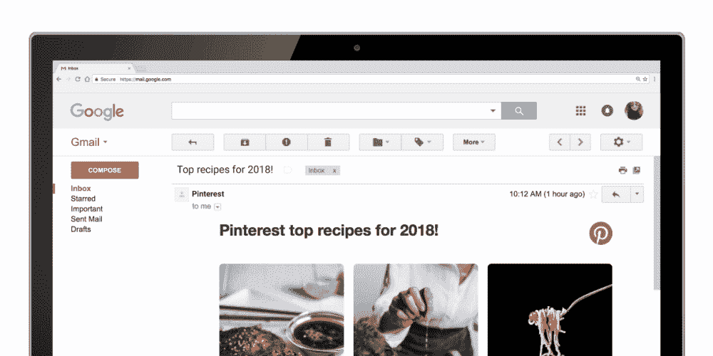

# 电子邮件放大器是个糟糕的主意

> 原文：<https://web.archive.org/web/https://techcrunch.com/2018/02/13/amp-for-email-is-a-terrible-idea/>

谷歌刚刚[宣布了](https://web.archive.org/web/20230330011326/https://techcrunch.com/2018/02/13/google-wants-to-use-amp-to-make-email-more-interactive/) 一项通过其[加速移动页面](https://web.archive.org/web/20230330011326/https://techcrunch.com/2017/05/18/googles-amp-now-powers-2b-mobile-pages-and-900k-domains-loads-2x-faster/)平台“现代化”电子邮件的计划，允许“引人入胜、互动和可操作的电子邮件体验”对其他人来说，这听起来是个糟糕的主意吗？对我来说，这听起来确实是一个糟糕的主意，不仅如此，这是一个基于竞争压力和现有杠杆而不是用户需求的想法。不好，谷歌。发送到垃圾箱。

看，电子邮件属于一个特殊的类别。没有人真的喜欢它，但这就是没有人真的喜欢人行道、电源插座或叉子的方式。这并不是说他们有什么问题。这是因为它们是成熟的、有用的物品，能准确地做它们需要做的事情。他们已经超越了好恶的世界。

作为证据，考虑到除了这些东西的正常版本之外的任何东西的极端稀有性。移动人行道、古怪的商店、运动场所——它们只存在于像机场和快餐店这样的极端环境中。出于一个很好的原因，原始版本保持了千年不变。

电子邮件也很简单。几乎每个公司、家庭和设备都有一个已知的数量。几十年来，实现方式发生了变化，但自 20 世纪 60 年代和 70 年代的第一个电子邮件系统以来，基本思想一直保持不变，当然，自 20 世纪 90 年代的广泛标准化和 21 世纪初向网络平台的转移以来也是如此。与蜗牛邮件的相似之处是有意的(它是一个有效载荷，上面有一个地址)，简单性一直是其设计的一部分(互操作性和隐私是后来才出现的)。

没有公司拥有它。它可以在任何平台、任何操作系统、任何设备上可靠运行。这在今天是罕见的，也是非常珍贵的。

但是科技行业从来不会让优雅、历史或互操作性成为盈利的绊脚石(RIP Google Reader)，所以这没什么好争论的。尽管如此，我还是觉得值得一说。

更重要的是两件事:护城河和动机。

护城河是通信和应用之间的一条河。通信说事情，应用与事情交互。虽然存在交叉领域，但像电子邮件这样的东西被设计并主要用于表达事物，而网站和应用程序被设计并主要用于与事物进行交互。

在这里进行区分是非常有用的，就像区分一本关于火的书和一本火柴的书一样。

电子邮件是静态的，因为信息本来就是静态的。通过互联网进行通信的整个概念是基于用静态有效载荷交换单向数据包的电报模型，就像叉子的整个概念是基于刺穿一块食物，并允许摩擦在传输过程中保持它的位置。

沟通和行动之间的护城河是很重要的，因为它清楚地表明了某些工具的能力，这反过来让它们得到信任和正确使用。

我们知道，电子邮件所能做的就是对你说些什么(尽管有跟踪像素和阅读回执)。它本身不下载任何东西，不运行任何应用程序或脚本，附件是离散的项目，除非它们是 HTML 中的图像，这本身是可选的。最终，整个包将永远只是发送给你的一大块静态文本，偶尔还会附带文件。一年或十年后打开它，还是那封邮件。

这种禁止是双向的。无论你想用电子邮件做什么，你都只能用它说些什么——用另一封电子邮件。

如果你想做某事，你可以把电子邮件留在一边，在壕沟的另一边做。

这是电子邮件的伟大天才和诅咒，你所能做的就是来回发送信息。这不总是最好的选择，但也很少是最差的。如果比这更复杂，你可以使用电子邮件以外的东西:聊天应用、视频电话、文件主机。这些有用的项目通常位于电子邮件的*附近*，有时紧密结合，但它们实际上从来不是电子邮件的一部分。这是一件*好*的事情。最接近的是一些小事情，比如自动添加一些东西到你的日历或者从旅程中抓取航班信息。最终它仍然只是在读一些东西。

谷歌想要做的是跨越那条护城河，本质上是允许应用程序在电子邮件中运行，当然是有限的，但根据定义，这种东西属于护城河的另一边。

 为什么要这样做？我们的标签用完了吗？人们抱怨点击回复邮件上的“是”会把他们带到邀请网站吗？他们是否要求在带有链接的电子邮件中打开视频聊天窗口？不。没人在乎。没有人会因为电子邮件的这一方面而感到不便(收件箱超载是另一个问题)，也没有人会因为改变它而获得任何好处。

嗯，*几乎*没有人。这就引出了动机。

首先，AMP 是谷歌利用其市场力量来扩大对他人内容的控制。脸书正在这么做，所以谷歌必须这么做。谷歌利用其特权地位作为人们寻找大量内容的手段，试图让内容本身也成为它所定义的系统的一部分。

“AMP 最初是为了帮助出版商，但随着时间的推移，它的功能得到了扩展，现在它是构建丰富网页的最佳方式之一，”它在宣布 AMP for Gmail 测试的博客文章中写道。不，不是的。AMP 是一种改编和交付的方式，用谷歌的话来说，就是用真正的工具构建真正的网页。

移动网络速度不够快的借口已经过时，而谷歌设计的特殊子网络的解决方案显然是自助式的。这就像卖瓶装水的人告诉你你的水龙头开得太慢了。

电子邮件的 AMP 只是这一原则的延伸。人们总是离开 Gmail 去航空公司网页、在线商店、社交媒体和其他地方。这些地方创造了自己的用户环境，有自己的分析方法，自己的流程，这些对谷歌来说可能是有益的，也可能是不可见的。不能这样。

但是，如果这些日常任务发生在 Gmail 内部，谷歌会对私密细节施加控制，定义其他公司在电子邮件系统内部可以做什么和不可以做什么——而不是利用电子邮件的自然限制，我赶紧重申，这是一个功能，而不是一个漏洞。

似乎这出戏还不够，另一部就像该公司曾经做过的任何事情一样贪婪。邮件中的动态内容。我以前在哪里听过这个？没错:这是谷歌提供免费电子邮件服务的全部商业模式。广告。

网络上绝大多数的“实时”内容是什么，需要呼叫总部并自我更新的东西？不是像这篇文章，或者视频或歌曲，这些只是你需要的资源。不是聊天或者邮件。基于云的生产力工具，比如共享文档，这是理所当然的。但是剩下的——我们这里说的是 99.9%是广告。

广告和追踪器可以根据他们周围的内容、他们了解的关于观众的数据以及最新的定价或促销信息进行调整。这就是谷歌想让你的收件箱“现代化”的方式。

“吸引人的、互动的、可操作的电子邮件体验”现在听起来有所不同吗？

不要用这个。不要鼓励。AMP 和其他类似的倡议已经是网络上的一个败笔，它们对电子邮件也同样不利。