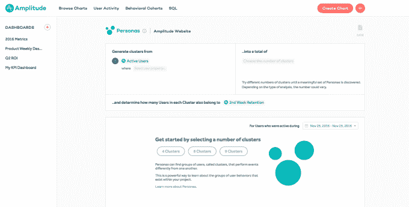

# Amplitude 为其专注于产品的分析工具 TechCrunch 再融资 3000 万美元

> 原文：<https://web.archive.org/web/https://techcrunch.com/2017/08/10/amplitude-series-c/>

# Amplitude 为其专注于产品的分析工具又筹集了 3000 万美元

已经筹集了 3000 万美元来资助首席执行官 Spenser Skates 所说的“帮助产品人员制造更好的产品”的使命

这不完全是 Amplitude 最初的定位，它更多的是关于[在价格上削弱其他分析公司](https://web.archive.org/web/20230209092559/https://techcrunch.com/2014/07/11/amplitude-the-analytics-startup-undercutting-mixpanel-raises-2-million-seed-round/)。Skates(上图为他与联合创始人柯蒂斯·刘的合影)表示，这与其说是公司方向的改变，不如说是对“我们所擅长的东西”的新表述

他补充说，Amplitude“在过去不敢这么说”，部分原因是它害怕疏远市场营销人员——这个群体现在很乐意坚持 Amplitude 是为*而不是*打造的。相反，他说他专注于为产品团队创造分析工具。

有什么区别？Skates 表示，当营销人员研究分析时，他们基本上是在研究访问者来自哪里，然后这些访问者如何转化为付费客户:“每一步都是最后一步的子集。”另一方面，产品团队正试图回答更难的问题，比如不同的功能如何影响长期记忆。

“你的用户可以做任何事情，”Skates 说。“你试图回答的问题要复杂得多。”

Amplitude 表示，它拥有超过 5000 名客户，在过去的 12 个月里，它签下了一些新的大客户，包括微软、Capital One 和 Twitter。

事实上，在资金公告中，微软的 Gooi Chungheong 说，“Amplitude为我们节省了几个月的工程投资，以了解我们产品中的用户行为。”

新的 C 轮融资由 IVP 牵头，现有投资者 Benchmark Capital 和 Battery Ventures 也参与其中。IVP 的 Somesh Dash 将成为董事会观察员。

Amplitude 现在已经筹集了 5900 万美元。