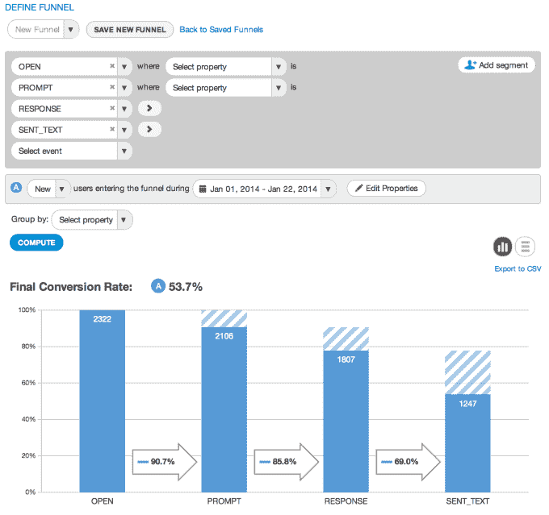
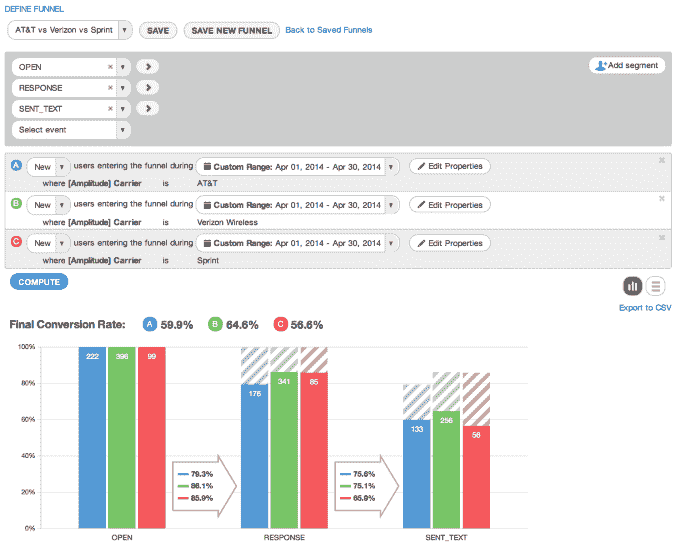
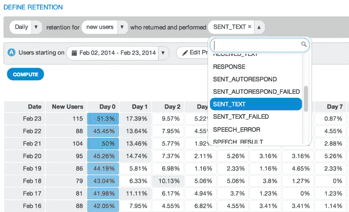

# 分析初创公司 Amplitude 低于 Mixpanel，融资 200 万美元种子轮 

> 原文：<https://web.archive.org/web/https://techcrunch.com/2014/07/11/amplitude-the-analytics-startup-undercutting-mixpanel-raises-2-million-seed-round/>

Y Combinator 支持的振幅公司(Amplitude)已经从许多投资者那里筹集了 197.5 万美元的种子资金，其中包括 SV Angel、Charlie Cheever、Dave Morin、Quest Venture Partners、Data Collective、Merus Capital、BoxGroup、Adam Draper 和其他一些投资者。

联合创始人 Spenser Skates 表示，这笔资金是在 Amplitude 的企业客户群增长一段时间后获得的，自该服务推出以来，企业客户群增长了 400%，其中很大一部分人在分析方面“尝试了一切”。

该公司最初是由创始人在 Y Combinator 时开发的一个工具发展而来的。他们正在开发一款名为 Sonalight 的语音文本移动应用，但也花了大量时间创建自己的分析工具，以定制的方式检查他们的数据。很快，其他 YC 开发商也要求访问。该团队很快就意识到，真正的业务是分析，而不是应用。

Skates 表示，使 Amplitude 脱颖而出的是其顶级的工程人才，这有助于开发该公司的基础设施，并使其能够扩大规模。他补充说，现在的 11 人团队包括塔夫茨大学的一名经济学教授，一名代表斯坦福大学参加 ACM 编程竞赛和 Putnam 的工程副总裁，以及几名麻省理工学院最大的编程竞赛的获胜者。

“我们在工程方面有强大的火力，”Skates 解释道。“我们围绕预计算数据和预计算您看到的结果做了许多聪明的事情。”

[正如该公司在 2 月份告诉我们的那样，](https://web.archive.org/web/20230124210359/https://techcrunch.com/2014/02/20/real-time-mobile-analytics-platform-amplitude-takes-on-flurry-mixpanel/)预处理的困难部分是能够预测客户将要查询什么，这是 Amplitude 声称已经解决的问题，以及节省空间和内存计算的其他技巧，以便廉价地提供服务。

Amplitude 提供免费增值服务，每月为客户提供多达 500 万次免费活动。相比之下，Mixpanel [对](https://web.archive.org/web/20230124210359/https://mixpanel.com/pricing/)每月 400 万个数据点收费 600 美元。Amplitude 还为每月多达 5000 万次的活动提供每月 299 美元的计划，这将成为 Mixpanel 的定制定价领域。除此之外，Amplitude 还提供企业计划，如今它的客户包括狩猎、鼎盛、KeepSafe 和其他仍在 NDA 旗下的大客户。

此外，Amplitude 还集成了 Tableau、Chartio 和 Looker 等数据可视化工具，最近它推出了对将其数据导出到亚马逊红移的支持——这是另一个使其独一无二的功能。

“我们已经开始看到许多团队在内部建立自己的分析时，使用亚马逊的数据仓库作为服务来查询大量数据，”Skates 说。“任何人都不可能提前 100%确定他们需要的指标；不管你的分析平台有多灵活，获取原始数据都是非常强大的。”

Amplitude 没有透露它目前有多少客户，只是说有“数百个应用程序”在向它发送数据，其中一部分是付费的。然而，它的大多数付费客户都是企业计划，其中一半人正在利用亚马逊红移支持。

种子基金将帮助该公司继续发展其销售和工程业务，并进一步开发其产品。

正在开发的一个功能与基于行为的协同分类有关，它允许客户根据用户在应用程序中采取的具体行动来划分用户群。“我们现在有一个非常基本的版本，但我们正在努力开发更全功能的版本……我们希望向您提供答案，我们希望这更加自动化，”Skates 调侃道。

该公司的其他投资者还包括:Anil Dhami、、Michael Katz、Matt Huang、腾讯、Klaus von Sayn-Wittgenstein、Alex Lin、Hossein Eslambolchi、、Jeffrey Skates、Greg Chang、、Todd L. Corenson、Steve Bartel、Jared Kopf、Roy Sehgal、Silicon Badia、Anton Bernstein、Start Fund 和 Y Combinator (W2012)。