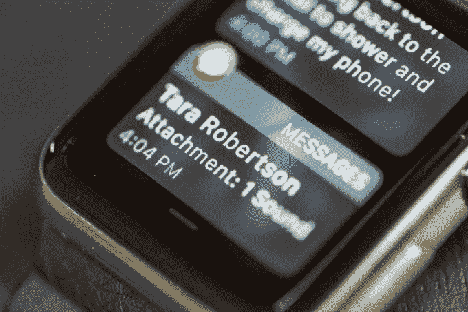
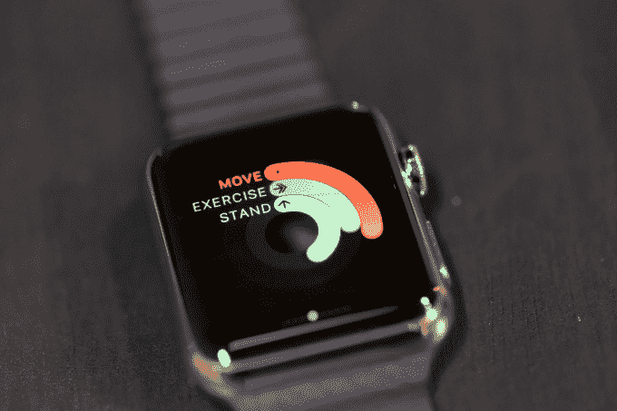
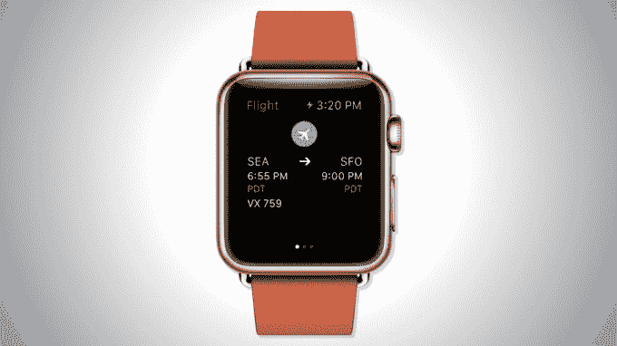

# 美国中部的苹果手表 

> 原文：<https://web.archive.org/web/https://techcrunch.com/2015/05/10/an-apple-watch-in-middle-america/>

好吧，从地理上来说，从技术上来说，它不是“中部”美国，但它是一个更小的城市中心外围的一小块郊区。一个人们不会仅仅因为最新的小玩意的存在就冲出去买它的地方。在那里，人们甚至不会注意到你升级后的迪克·特雷西风格的苹果手表，除非你发现自己不得不指出来。然后，耸耸肩，他们会说类似于*“嗯，我不知道我是否真的需要那个，”*或者*“你为什么买了一个？”*或者，充其量，带着一丝怀疑，*“你真的喜欢它吗？”*

在这里，你可以诚实地回答他们最后一个问题，比如，“嗯，我不知道。算是吧？”

抱怨苹果手表似乎是不对的。如果有奢侈品的话。毕竟，如果你打算花几百美元或更多的钱买一台一个月前还不需要的高级腕式电脑，你肯定已经接受了这样一个事实:你愿意充当苹果的试验品兼早期采用者。你知道你在为自己未来的角色做准备，你可能是苹果手表的传播者，也可能是苹果手表的反对者。

但问题是，今天的 Apple Watch 更多的是一种承诺，而不是一个你可以完全推荐的平台。其中有一些关于被动计算未来的好想法，但它们存在于一个已经混乱的生态系统中，该生态系统包含大约 3500 个新奇的应用程序，这些应用程序有时更令人讨厌，而不是实用。

毕竟，Apple Watch 最擅长的是它最基本的功能:那些利用其小屏幕外形的功能，这意味着每次只需看一眼就可以使用。不是那种你花几分钟盯着你的手腕而不是盯着智能手机。这些是具有主流吸引力的特征，包括在郊区。

这让我想到了我最喜欢的 Apple Watch 功能:信息、紧急情况下接电话的功能和地图。(当地图决定实际工作时。)

我会把 Apple Pay 加到这个列表中，但是我的*哦，如此创新的*银行——初创公司 [Simple](https://web.archive.org/web/20221007032207/https://www.simple.com/) ，在[卖给 BBVA](https://web.archive.org/web/20221007032207/https://beta.techcrunch.com/2014/02/20/simple-acquired-for-117m-will-continue-to-operate-separately-under-its-own-brand/) 之前试图扰乱银行业——直到几个小时前才懒得支持 Apple Pay。所以到目前为止，我对这个神奇的敲东西付款的世界已经失去了兴趣。取而代之的是，我不得不像那些不想在每个销售点通过展示技术的未来来给后面排队的人留下深刻印象的人一样刷卡。(诚然，我现在很期待成为那些讨厌的人之一。)

但这意味着，到目前为止，我一只手就能数清自己想了多少次*“哇，刚才有一块苹果手表真的很有用！”*因为大多数情况下，它并不真正*有用*。很好玩。很整洁，当然。但是，总的来说，这并不重要。

也就是说，我仍然可以看到潜力。

## 内置应用是最好的

第一个哈哈的时刻是当我双手各牵着一条狗绳，手里握着一个门把手，一个 5 岁的孩子在我腿上跑来跑去。与此同时，我的 iPhone 在房子后面的某个地方。然后电话响了。我知道这是那种简短的电话——老一套，“嘿，我在路上”——但在过去的日子里(你知道，就像今年早些时候)——我不得不错过它。或者绝望地爬回去，可能以某种喜剧的方式把自己缠在狗链里。相反，我只是用空闲的手指敲了敲手表，说了声“你好”[这款手表的免提通话功能](https://web.archive.org/web/20221007032207/https://www.apple.com/watch/built-in-apps/)让我进行简短的对话，然后回到手头的任务:带狗去撒尿。

另一个值得注意的功能是当我的手机不在身边时能够查看和回复短信(T2)——不管是因为它被藏在我的钱包里(终于！我能做到！)，或者当我在健身房漫步时锁在一个柜子里——打破 iPhone 的习惯令人耳目一新。手机放好了，但我什么都没错过。

[活动应用](https://web.archive.org/web/20221007032207/https://www.apple.com/watch/built-in-apps/)也是 Apple Watch 的较好功能之一，因为它允许你更被动地评估你的日常运动和锻炼。对于我拥有的其他健身追踪器，我往往会忘记充电(比如 FitBit ),或者在电池没电时把它们塞在抽屉里(比如 Misfit Shine)。)然而，这款手表通常在晚上就在 iPhone 旁边充电。因为除了运动跟踪之外，你可能还有其他原因戴着它，所以你不必提醒自己戴上它。

该应用程序的活动图表简单易读，但更好的是，苹果在 iPhone 上的健康应用程序会提取数据进行更详细的分析。然而，我还没有决定是喜欢还是讨厌手表不断提醒我站立。(*站住！它宣称。但是请注意，我正在写东西呢！)*

最后，也是最有前景的功能是通过 Apple Watch 的行走方向进行导航。作为一个方向感差的人，他的驾驶主要是往返于目标，而不是穿越城市街区，这在旅行时最方便。然而，很难说这在郊区会是一个普遍的使用案例。

长按地图应用程序，我可以说出我的目的地，以便获得路线指引。作为一个倾向于转动我的手机来定位屏幕上显示的街道的人(哦，来吧，我知道你也这样做)——能够简单地被告知走这条路或转那条路是一种天赐的能力。

这个功能最聪明的地方是手表提供的触觉反馈。有两种不同的脉冲模式可以告诉你下一次转弯是右转还是左转。换句话说，你可以跟着手腕上的小蜂鸣器走来走去，就像你知道要去哪里一样。我不会说哪个是哪个是立即明显的，但这是你在使用几次后应该学会的东西。如果需要，你可以简单地看一眼你的手腕，快速更新你离下一个转弯还有多少英尺，它会随着你的移动而不断更新。

当地图起作用时，那简直太棒了。不幸的是，在我尝试的近六次中，有四分之三都是故障。有一次，这个应用程序在“加载”屏幕上卡了很长时间(事实上，在我覆盖非常好的区域)，我不得不强制关闭这个应用程序，重新开始。

另一个时间地图只是超级滞后加载时。不止一次，它只是慢了下来，没有在下一个转弯时更新，或者直到下一个转弯时才更新剩余的脚，这可能会让你朝着错误的方向前进。显然，这些小故障损害了你对地图应用程序的信任度，有时会让你掏出 iPhone，通过谷歌地图来核实事实。

## 许多第三方应用令人失望

除此之外，目前大多数第三方应用程序充其量是不必要的，在最坏的情况下几乎是无用的。目前，我想不出有哪一款第三方应用能让一个郊区居民相信苹果手表是必需品。

我的意思是，我想不用把手机带在身上就能在浴室里阅读头条新闻是件好事？老实说，我不在乎我的朋友只是在脸书上分享了一些愚蠢的病毒链接或喜欢我的 Instagram 照片。我发现我也不需要知道我被转发的时刻。

也许是因为我仍然习惯于在我的手腕上有一个可以进行这种互动的屏幕，或者也许是因为这种互动在智能手机上效果更好。

我确实调出了我的 TripIt 行程几次，但你已经可以在你的手机上这样做了。各航空公司的手表应用程序也是如此。他们的手表应用程序当然很好用——尤其是在安检线的那个恐慌时刻，就在我必须向 TSA 工作人员出示手机登机牌之前，我的 iPhone 随机重启了。*咻！*但他们并不挑剔。一部电话一般就够了。

然而，我真的很喜欢优步的应用程序，当我的车到达时，它会发出嗡嗡声，但同样，这是一个不会经常在我们通常自己开车的郊区使用的应用程序。

我认为今天最有价值的第三方应用是那些专注于利用手表的[传感器阵列](https://web.archive.org/web/20221007032207/https://www.apple.com/watch/health-and-fitness/)(心率监视器，加速度计)和小屏幕的应用。也就是健身和公交类 app 最好。对于健康跟踪来说，虽然能够开始跟踪跑步会话是有意义的，但这令人沮丧，因为[苹果手表接入你 iPhone 的 GPS](https://web.archive.org/web/20221007032207/https://www.apple.com/watch/health-and-fitness/) ，而不是接入它自己的 GPS。这意味着你[仍然必须在跑步时携带你的 iPhone](https://web.archive.org/web/20221007032207/http://running.competitor.com/2015/03/shoes-and-gear/what-will-the-new-apple-watch-mean-for-runners_124247) 来追踪你的路线(尽管不是你的活动，它[估计](https://web.archive.org/web/20221007032207/http://www.cultofmac.com/317172/joggers-dont-need-an-iphone-to-track-their-running-with-apple-watch/))。).据推测，如果苹果选择在以后的几代产品中为手表添加 GPS，这可能是一种改进的体验。

虽然像 CityMapper 这样的交通应用程序在美国中部不太适用，但至少值得承认它们对当今许多人的重要性。去往大城市的通勤者肯定会发现它很有用。

## 承诺:你的生活，回来了

在美国小镇，Apple Watch 最棒的一点就是它让我回到了自己的生活。我可能过着双重生活，既是科技迷，又是足球妈妈，但这款手表让我可以休息一下，不会觉得自己错过了什么。我可以在我们聊生活的时候全神贯注地关注我的朋友，而不需要拿着我的 iPhone 或不时拿出来查看。我可以把我的手机放在我的钱包、运动包或游泳池手提包里，仍然感觉与外界联系，就像承诺的那样。

这里的生活节奏较慢，但科技带来的干扰同样影响了郊区居民和城市居民。家长会的妈妈们和烧烤爸爸们最初可能会认为 Apple Watch 是迫使我们保持联系的又一个工具，但实际上，情况恰恰相反。

像城市里的同龄人一样，我们也花太多时间在小屏幕上，而忽略了我们面前的远景。我们也一样，带着错过时刻的罪恶感，同时忘记了我们面前的人。我们在餐桌上通过电话施加压力。过度关注数字对话，而不是口语对话。

Apple Watch 的承诺是打破这种循环的能力。多讽刺啊。我们曾经一次又一次地向苹果支付费用，以获得使用其众多设备的特权。现在——*哦，多聪明啊，苹果！*–我们必须再次为能够停下来的特权付费。