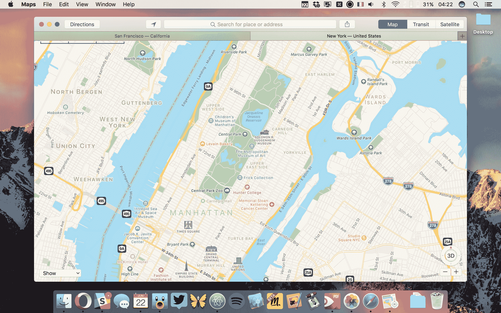
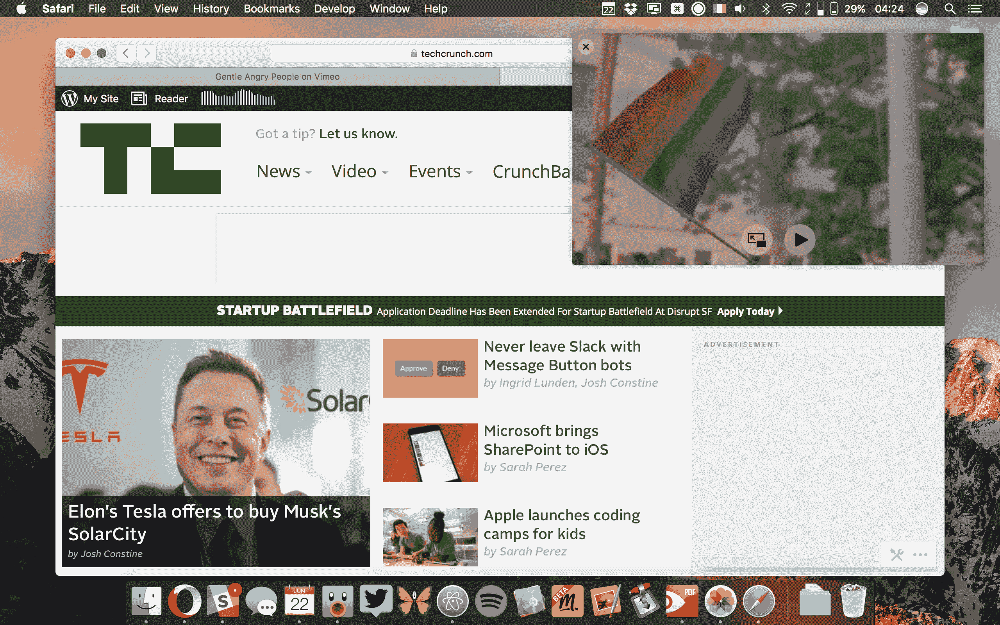

# MAC OS Sierra TechCrunch 的早期研究

> 原文：<https://web.archive.org/web/https://techcrunch.com/2016/06/22/an-early-look-at-macos-sierra/>

macOS Sierra 是苹果最新版本的 Mac 操作系统。虽然最终版本将在秋季推出，但在过去的几天里，我一直在玩第一个测试版。除了将操作系统的名字从 OS X 改为 macOS，苹果还引入了一些漂亮的功能。所以让我们来看看它们。

先说名字。我的理论是，苹果将其新版本命名为“Sierra”，因为它听起来有点像“Siri”。没错，新版本的一大重磅功能就是 Siri。苹果的个人助理第一次走向了 Mac。

Siri 位于菜单栏和 dock 中。为了触发它，你必须点击 dock 图标或菜单栏图标。你不能只是对你的 Mac 说“嘿 Siri”，什么都不会发生。不过好消息是你可以设置一个键盘快捷键(比如 Fn + Space)来像 Spotlight 一样触发它。

两个图标看起来有点多余，但是你可以从你的 dock、菜单栏或者两者中删除图标。在我的测试中，Siri 就像你预期的那样工作。你可以询问天气，NBA 比分，发一条短信或者一个单词的翻译。

除了这些熟悉的功能，苹果还在中加入了一些漂亮的功能。Siri 可以取代 Spotlight 的一堆功能。例如，如果你在找一个文件，你可以用你的声音来搜索。Siri 结果可以钉在通知中心的今日视图上。您还可以使用 Siri 停用 Wi-Fi、调高音量并获取有关 Mac 的信息。

macOS Sierra 的第二个重大变化是照片应用程序，还有一个特别的功能:记忆。Memories 会自动将您的照片流编译成相册。例如，一张专辑可以是在世界另一端的一周假期。苹果使用地理定位、计算机视觉和日期来生成这些相册。

然后，照片应用程序会向您显示相册中的所有人，一张地图和相关的回忆。这在理论上听起来很棒，但在我的照片库和第一个测试版上无法正常工作——毕竟这是一个测试版。记忆的另一个奇妙的副作用是你可以搜索物品和人。搜索“海”会从我的库中返回一些海的照片，但不是全部。

多年来，苹果已经为各种应用添加了标签。Safari、Finder、终端都支持标签页。今年，苹果将全力以赴，为所有允许你打开多个窗口的应用程序增加多标签支持。例如，在“文本编辑”、“页面”、“邮件”或“地图”中，你现在可以打开多个标签页。其他没什么好说的；它像预期的那样工作。标签的行为与 Safari 中的标签完全一样。

如果你使用 Safari 或在 iTunes 中观看大量视频，你会很高兴知道苹果还为视频添加了画中画。我已经在我的 iPad 上使用这个功能很多次了，我很高兴看到它正在向 Mac 进军。Safari 并不是第一个提供这一功能的浏览器，因为 Opera 已经有了几个月的画中画模式。

那么它是如何工作的呢？假设你正在 Vimeo 上看一个视频。现在，您可以弹出视频并将其放在屏幕的一角。此视频可调整大小，并将显示在其他窗口的顶部。例如，如果你想在屏幕的角落里浏览网页和观看音乐会视频，它是完美的。这个功能在屏幕空间有限的笔记本电脑上很有意义，苹果公司销售的笔记本电脑比台式电脑多得多。

在 iOS 10 上,“信息”正在接受巨大的升级。虽然 Mac 上的“信息”会显示这些信息，但你不能使用 macOS 的所有新的高级信息功能，如贴纸、数字触摸、隐形墨水等。至少在 macOS 上，类似 Slack 的信息反馈方式出现了。但我对一个期待已久的功能感到非常兴奋:链接预览。当您发送 URL 时，“信息”会抓取页面的标题，以便您知道您点按的是什么。

让我们快速介绍一下将于秋季发布的所有其他功能。你可以用 Apple Watch 解锁你的 Mac，但这项功能没有进入第一个测试版。同样，电子商务网站也必须添加 Apple Pay 支持，我才能尝试。我还没有安装 iOS 10 测试版，所以无法测试通用剪贴板。有了这个功能，你可以从 Mac 上拷贝一些东西，然后粘贴到 iPhone 上。它对地址、联系信息甚至照片和文件都很有用。

最后，iCloud 现在可以同步您的桌面和文档文件。它还可以通过将旧文件上传到云中来优化您的存储。今年夏天，我将不得不长期测试这个特性。

基于这个第一个测试版，苹果对 macOS 进行了一些非常务实的改变，从 Siri、许多应用程序中的标签和一个更加智能的照片应用程序开始。除此之外，在有意义的时候，苹果会将许多 iOS 功能移植到 macOS 上——画中画视频、Safari 中的 Apple Pay 以及对 iOS 10 消息的支持。

现在，让我们后退一步，花一分钟思考一下这个版本。如你所见，macOS Sierra 没有太多新功能。但是你可能记得埃尔卡皮坦已经是优胜美地的一个演变。在很多方面，埃尔卡皮坦让 macOS 比约塞米蒂更稳定。

再说一次，Sierra 并没有革新 macOS。这背后有两个原因。首先，在软件方面，苹果被摊得太薄了。公司准备今年秋天更新 iOS、tvOS、watchOS 和 macOS。这是一个不小的壮举，你可以看到苹果正在为 [watchOS 3](https://web.archive.org/web/20221216204215/https://techcrunch.com/2016/06/13/apple-overhauls-watchos-with-new-ui-and-faster-app-launching/) 和 [iOS 10](https://web.archive.org/web/20221216204215/https://techcrunch.com/2016/06/13/apple-announces-ios-10/) 投入大量精力。

其次，有趣的是 macOS 不再是 WWDC 最重要的新闻了。人们想知道他们的 iPhone 有什么新功能。在某些方面，Mac 已经成为一个无聊的平台，这不是一件坏事。

当每个人都在睁一只眼闭一只眼的时候，苹果正在处理复杂的功能，比如即将推出的[苹果文件系统](https://web.archive.org/web/20221216204215/https://en.wikipedia.org/wiki/Apple_File_System)。开发像新文件系统这样的东西需要几年时间。现在，苹果愿意在 macOS 更新中打包更少的功能，以应对这些大功能。

在 2001 年 Mac OS X 首次发布 15 年后，Mac 已经是一个成熟的平台。忠实的 Mac 用户不再需要新的铃铛和口哨来让他们对自己的电脑感到兴奋。他们需要一个强大而稳定的操作系统，让他们尽可能高效地工作。macOS Sierra 只需增加一些不那么雄心勃勃的功能，就可以做到这一点。你必须在秋季阅读我们的完整评论，看看是否是这样。

*更新了文章，以反映 SiriKit 将不可用于 macOS Sierra。*