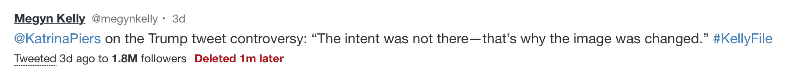
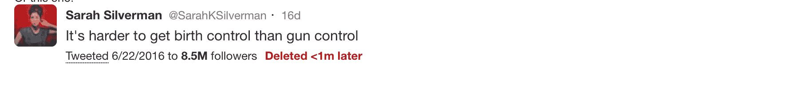
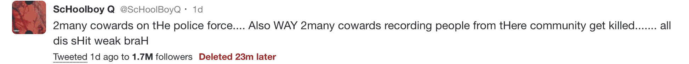
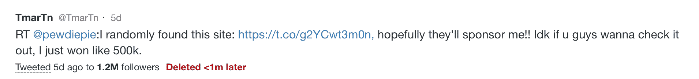
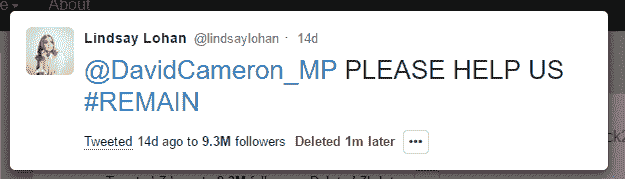
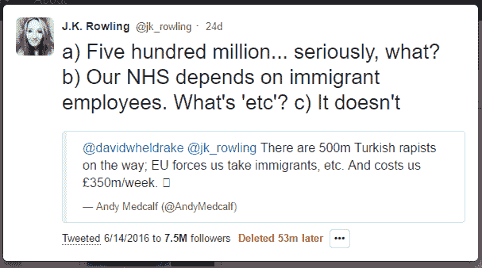
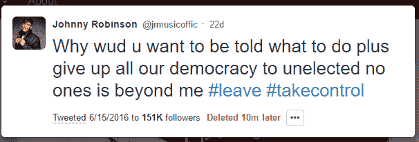

# 采访 postgost TechCrunch 的匿名创始人

> 原文：<https://web.archive.org/web/https://techcrunch.com/2016/07/12/an-interview-with-the-anonymous-founder-of-postghost/>

PostGhost 是一种存储和显示名人和政治家被删除的推文的服务。作为一种保持公共话语诚实的方式， [Twitter 关闭了它，并发出停止警告](https://web.archive.org/web/20230130002245/https://techcrunch.com/2016/07/09/deleted-tweet-archive-postghost-shut-down-after-twitter-cease-and-desist/)，称其未能遵守 API 规则。由此引发的骚动让我找到了这位匿名创始人，并向他或她询问了一些关于所发生事情的问题。

**TC:你是谁？多少人参与了这个项目？花了多长时间？这主要是一个人几个月的项目。我宁愿不说出自己的名字，因为我更喜欢把焦点放在网站上。**

**TC:为什么这么快就关了？PG:我的 API feed 一直在运行，从 2 月份开始记录被删除的推文，该网站从 4 月份左右开始运行，但当 Twitter 看到该网站正在迅速传播，人们可以公开让经过验证的高级用户为他们被删除的推文负责时，他们就关闭了它。**

**TC:你为什么这么做？PG:在冬天的秋天，我注意到推特将会成为 2016 年总统选举的决定性因素，而且可能是决定性因素，并且每天都会对全国的谈话产生巨大的影响。Twitter 重新授权了 Politwoops，它可以跟踪政治家删除的推文。然而，除了政客之外，许多公众人物也在 Twitter 上发表政治言论，他们自己并不是政客，比如记者。例如，梅根·凯利的影响力远远超过几乎所有的政治家，然而，我现在被禁止显示以下被删除的推文:**

或者这个:

或者这个:

这些账户不是政客，但都是非常引人注目的公众人物，拥有比大多数政客更多的追随者，因此有巨大的能力让他们的声音在网上被听到。PostGhost 的创建是为了对如此重要的推文进行公开记录。我认为，在今年秋天的选举中，对这些强有力的声音承担全部责任非常重要。

**TC:你认为 Twitter 为什么会关闭你？PG:我还没有得到一个具体的原因——事实上我现在只看到了 postghost.com 上自动生成的消息。Twitter 很可能担心用户隐私，我理解并尊重这一点。在 4 亿多个 Twitter 账户中，99%或更多是拥有隐私权的个人。然而，Twitter 自己维护着一份经过验证的用户名单，这些用户是“高度寻求的用户”和“关键个人和品牌”——这些用户平均拥有 123，000 名粉丝。据 Medium 称，这份名单包括记者、媒体、政治家、政府、非政府组织、演员等。随便举几个例子:法里德·扎卡利亚、芒福德父子公司、诺德斯特龙公司，当然还有《连线》。这些账户存在于公共领域，仅仅通过推特就有巨大的能力影响公共话语。PostGhost 只报告拥有 10，000 或更多粉丝的公共验证用户删除的推文，以确保它无法捕捉任何私人推文。当然，这也是 Twitter 用来创建其最有价值内容的用户群，所以很明显为什么他们对他们和对政客适用不同的规则，尽管这两个群体都是由公众人物组成的。**

Twitter 甚至不显示特殊用户广告。

他们让你关门可以吗？

加兰:他们给了自己关闭任何他们选择的 API 用户的权利——法律上，他们当然可以关闭我们。然而，我认为公众没有完全意识到的是，在 2016 年的大规模网络言论的主导平台中缺乏问责制。在任何其他媒体中——广播、电视、博客——都没有撤销按钮。如果一个公众人物在电视直播中失言，说了一些暴露的话，任何个人或公众成员都可以自由转载该声明，随意评论和讨论——第一修正案确保了这一点。然而，现在大量的公共话语发生在网上，在 Twitter 上，因为他们控制了这个平台，他们可以决定规则，没有任何责任或监督。

**TC:Twitter 是公益吗？私人公司？寄生虫？
**

PG:推特一直是在全世界传播言论自由的巨大力量。但正如你所暗示的，推特是一家私人公司，正日益成为一种公益。因此，公众有权像对待其他任何地方的公开演讲一样对待推特上的公开演讲，并对其进行评论、分享和批评——即使演讲者后来后悔了。

**TC:这个项目的下一步是什么？你会重新开始吗？** 

PG:我很想去，但是我在等待推特的回应，我必须从那里开始。推特上的公众压力——至少让他们对删除推特的规定更加透明和公平——会有所帮助，但这并不是一个通常会引起太多关注的问题。我认为推特有责任解释为什么他们允许波尔蒂沃普斯记录该组织认为有价值的账户中删除的推特，但不会为任何人提供这种选择——尤其是考虑到推特账户拥有巨大的影响力，拥有数十万或数百万粉丝。他们需要认识到，政治演讲并不仅限于政治家的活动，公众应该可以自由讨论有影响力的名人、记者和媒体删除的推特，就像他们可以自由讨论政治家一样。

**TC:有多少人阅读您删除的推特？** 

PG:该网站在一个非常受欢迎的优酷网站[“未能披露他们拥有皮肤赌博网站 CSGO 乐透，尽管制作了大量视频显示他们在该网站上赢钱”后迅速走红](https://web.archive.org/web/20230130002245/http://www.forbes.com/sites/insertcoin/2016/07/05/cs-go-lotto-controversy-raises-issues-about-youtuber-disclosure-valves-indifference/#14b975da4500)

因为账户(@tmartn)已经过验证，并且有 120 万关注者，所以 PostGhost 覆盖了它，但是没有其他网站覆盖。以下是我们从他那里录制的一条被删除的推特:

换句话说，当人们意识到这是一种让他们关注的有影响力的账户负责的新方式时，这个网站就流行起来了。我不想给出确切的数字，但在推特关闭之前，我们已经有一周的流量了。

**TC:如果您在推特上发神经，有人把您的推特永远留在身边，您会有什么感觉？** 

PG:这种情况每天都在发生——谷歌“删除推特”，你会发现成千上万条被公众人物删除的文章被用户截图并发送进来。虽然截图很容易伪造(见 http://simitator.com/generator/twitter)，所以目前还无法确定你在网上看到的删除的推特是否是真的。本周,《卫报》链接到了《T4 邮报》,以证明安德里亚·利德索姆转发的英国“外国人泛滥”的说法是真实的。

我认为人们不应该去猜测一条被删除的推文是否合法，尤其是当我们在英国退出欧盟看到的，他们的投票可能取决于此的时候。也就是说——以下是一些在英国退出欧盟投票之前和投票期间发布但很快被删除的推文:这些推文有足够的影响力来影响投票，但事后无法找到它们，因为发布它们的名人很快删除了它们:

这些应该是英国退出欧盟公共记录的重要组成部分，但是除了碰巧截屏的网站之外，它们在网上找不到。