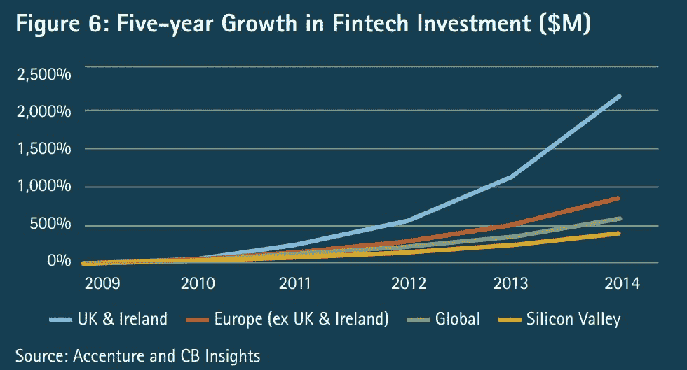

# 一场模糊的监管辩论让整个美国金融科技界紧张不安 

> 原文：<https://web.archive.org/web/https://techcrunch.com/2017/04/24/an-obscure-regulatory-debate-has-put-the-entire-u-s-fintech-community-on-edge/>

尼克·米拉诺维奇撰稿人

Nik Milanovic 是一名金融科技和金融包容性爱好者，在移动支付、在线贷款、信贷和小额信贷领域工作了十年。他在文章中表达的观点并不反映他的雇主的观点。

More posts by this contributor

美国金融科技的未来可能取决于过去四个月来愈演愈烈的一场激战。货币监理署(OCC)去年 3 月发布了一个关于监管标准的模糊请求，此后演变成了各州和 DC 之间复杂的地盘之争。

夹在中间的是整个在线金融行业，这提出了一个问题，即“金融科技”业务到底是什么。尽管这场斗争没有成为多少全国性的头条新闻，但它可能会决定金融科技世界创新、竞争和生存的未来。

争论围绕着货币监理署署长托马斯·j·库里(Thomas J. Curry)去年 12 月提出的一项提案展开，在该提案中，OCC 详细介绍了一项金融科技公司申请成为“特殊目的国家银行”的计划对于金融科技公司来说，这是一个可选的章程，意在向公司提供一个 OCC 的认可印章，以证明它们普遍具有强有力的合规实践。对于华盛顿来说，这基本上是一种将世界上运营良好的“安全”金融科技企业(如 PayPal)与可疑的剥削性企业(如支票兑现者和发薪日贷款者)区分开来的方式。)

理论上，这个想法有很多优点。尽管金融科技仍然可以被认为是一个相对年轻的行业，但它的增长速度非常快，可能很快就会决定大多数人如何储蓄、兑换和投资他们的资金。这个提议是在世界——从英国开始。到[德](https://web.archive.org/web/20221230125433/http://www.reuters.com/article/us-fintech-bundesbank-idUSKBN1591LV?utm_source=Contacts+%E2%80%93+Industry+Newsletter&utm_campaign=f4ba33579b-2017_01_27_Weekly_Online_Lending_Snapshot&utm_medium=email&utm_term=0_47eb6edd14-f4ba33579b-295759957)到[印](https://web.archive.org/web/20221230125433/http://www.medianama.com/2016/11/223-p2p-lending-probir-roy/)到[韩](https://web.archive.org/web/20221230125433/http://koreajoongangdaily.joins.com/news/article/article.aspx?aid=3025732&cloc=joongangdaily%7Chome%7Cnewslist1)——正在评估金融科技领域需要什么样的护栏。

当这个行业完全成熟时，消费者会希望保护到位，以防止坏人误导他们，滥用他们的私人信息或窃取他们的钱。即使单个金融科技企业看起来自己合规，也可能需要一些国家监管，以先于导致 2007 年金融危机的同类集体行为。

考虑到这一点，OCC 希望迈出第一步，为金融科技制定一套统一的全国性标准。但本应是毫无争议的第一步，却遭到了复杂的利益相关者网络的大量反对。这些政党很快提出了对扼杀创新、超越联邦权限和理解金融科技细微差别等问题的担忧。这场斗争的核心是金融科技到底是什么的问题。正如这场辩论所证明的那样，这个问题比看起来要难回答得多。

## 金融、技术、OCC 的历史以及监管的必要性

金融科技监管的想法并不新奇。OCC 本身是由美国政府于[年建立的，是创建标准国家银行业务的首批努力之一。在内战和 1863 年国家银行法案之前，各州可以自由发行自己的法定货币。通常，这意味着某人在一个州获得的美元在下一个州不会被接受，或者如果发行国的货币储备破产，美元将一文不值。一些州，如威斯康星州，完全取缔了银行，而其他州，如密歇根州，允许任何人开设银行，因此遭受了大规模的欺诈。](https://web.archive.org/web/20221230125433/http://www.investopedia.com/articles/investing/011916/brief-history-us-banking-regulation.asp)

早期金融技术:美联储出现之前的田纳西州地区两美元纸币。(来源:[弗恩波特币](https://web.archive.org/web/20221230125433/http://vernpotter.com/VernPotter/Tennessee.htm)。)

只是在内战结束后，华盛顿才开始实施全国财政一致性，此举在当时引起了各州的大规模抗议，他们认为此举是联邦政府为了巩固对地方政府的权力而进行的过度扩张。

如今，在许多科技领域，随着行业的发展，关于监管的问题也在增加。“Airbnb 的主人是否应该受到酒店法律的约束”或“优步司机是雇员还是承包商”的问题，只是科技法律辩论漫长历史中的两个显著例子。金融科技处于金融和科技的交汇点，显然比大多数科技更容易受到监管讨论。

很容易理解为什么金融科技让监管者和公众都感到担忧。只要金融存在，就有坏人想利用粗心的对手。朱利叶斯·凯撒为罗马帝国设定了第一个[利率上限](https://web.archive.org/web/20221230125433/http://www.alastairmcintosh.com/articles/1998_usury.htm)——12%——以打击高利贷。

早期的《古兰经》仍然为许多伊斯兰银行设定了标准，这些银行必须开展符合伊斯兰教法的金融业务。在战前的美国，由于缺乏银行和政府监管，私人贷款机构向借款人收取高达 500%的利息。

今天，金融舞弊同样有害。在 2011 年至 2016 年的前五年里，新成立的消费者金融保护局(CFPB)收到了超过 90 万份关于金融服务提供商的消费者投诉。

金融科技公司本身也没有摆脱欺诈和丑闻。总部位于瑞典的上市公司 [TrustBuddy](https://web.archive.org/web/20221230125433/https://www.crowdfundinsider.com/2016/01/80598-trustbuddy-bankruptcy-lenders-to-pay-25-on-recovered-claims/) 因大量挪用投资者资金而被迫破产。总部位于辛辛那提的 SoMoLend 因误导投资者而受到[类似的攻击](https://web.archive.org/web/20221230125433/http://www.inc.com/eric-markowitz/trouble-ahead-for-crowdfunders.html)。中国的个人对个人贷款行业已经花了数年时间努力走出玷污该行业的大规模欺诈的阴影。

金融科技在全球发展迅速。(来源: [CB Insights](https://web.archive.org/web/20221230125433/https://www.cbinsights.com/blog/fintech-and-banking-accenture/) )

考虑到肆无忌惮的行为者利用金融监管漏洞的自然趋势，难怪 OCC 想要先发制人，以防止下一次金融灾难。这就是为什么在去年 3 月，它发布了一份关于金融服务创新的白皮书,详细阐述了它将用来促进健康的金融科技行业的八项“指导原则”,其中包括:

*   鼓励负责任的创新，提供公平获得金融服务和公平对待消费者的机会。

*   鼓励各种规模的银行将负责任的创新纳入其战略规划。

*   与其他监管机构合作。

然而在 11 月，当托马斯·j·库里宣布 OCC 的国家宪章计划时，所有的混乱都爆发了。

## 争议:地盘之争、反竞争和解决不存在的问题

至少可以说，OCC 呼吁制定国家宪章是有争议的。该提案本身[只有 16 页长](https://web.archive.org/web/20221230125433/https://www.occ.treas.gov/topics/responsible-innovation/comments/special-purpose-national-bank-charters-for-fintech.pdf)，将金融科技公司指定为“特殊目的银行”，这些公司将遵守关于治理结构、资本、流动性、合规性、金融包容性和连续性战略的最低要求。这听起来很好——谁会愿意把钱给一家没有这些安全措施的公司呢？

事实证明，该提议在众多金融科技行业利益相关者中引起了轩然大波。奇怪的是，金融科技公司——可以说是受宪章影响最大的——一直相对平静。该宪章的强烈反对者一直是[州监管者](https://web.archive.org/web/20221230125433/https://www.wsj.com/articles/states-to-feds-back-off-on-new-fintech-bank-plan-1484132401?utm_source=Contacts+%E2%80%93+Industry+Newsletter&utm_campaign=b2c5d24d93-2016_11_Online_Lending_Update&utm_medium=email&utm_term=0_47eb6edd14-b2c5d24d93-295759957)的字母汤，他们认为此举是对联邦权力的过度扩张:

*   纽约州:一月份，DFS 负责人 Maria T. Vullo 向 OCC 发布了一封措辞严厉的公开[评论信](https://web.archive.org/web/20221230125433/https://www.crowdfundinsider.com/2017/01/94867-turf-war-new-york-state-department-financial-services-tells-occ-back-off-fintech-charter/)。在这篇文章中，她认为拥有国家特许的银行不必遵守一些州贷款规则，这种特许可以允许发薪日贷款人签署旨在保护科技公司的协议。正如她所评论的，“金融科技可能是一个朗朗上口的新词，但在线金融的概念并不新鲜。”纽约计划推进自己针对金融科技企业的规则提案。

*   佛罗里达州:OFRC 专员德鲁·布雷斯皮尔称该宪章是“对一个不存在的问题的解决方案”

*   俄亥俄州和俄勒冈州:参议员写信给 OCC，称这将使现有的州金融科技法律和倡议复杂化。

*   加利福尼亚州:加州 DBO 专员简·林恩·欧文(Jan Lynn Owen)认为，该提案将使 DBO 收集在线市场贷款人数据的工作复杂化，这些贷款人包括金融科技公司 SoFi、Lending Club、Funding Circle 和 Prosper，以便将他们与发薪日贷款人区分开来。

这样的国家不胜枚举。公平地说，他们对拟议中的章程对其权威的影响感到威胁。但这只是一场领土争端，一场争夺金融科技行业监管权的地盘之战吗？布莱恩·奈特为《美国银行家》撰稿，他出色地总结并反驳了各州的立场:

*   “危险”的观点是:联邦法律将剥夺各州在其境内监管金融科技的能力。

    *   正如奈特指出的，“国家银行仍然受许多州消费者保护法以及联邦消费者保护法的约束。欺诈、歧视以及不公平和欺骗性做法都是被禁止的，OCC 将对国家银行进行定期检查。”

*   “不必要”的观点:各州已经可以制定更好的法律来监管金融科技，因此 OCC 在这一问题上的权力是多余和不必要的。

    *   按照 Knight 的说法，“这些法律仍然是一个不断变化的迷宫，需要对 50 多套不同的规则进行持续监控。相反，商业银行的情况更好；联邦法律和州法律之间有更大的一致性，因此国家银行和州特许银行之间也有更大的一致性。”(晨间咨询[还指出](https://web.archive.org/web/20221230125433/https://morningconsult.com/2016/11/07/states-take-action-fintech-rules-awaiting-guidance-washington/)在北卡罗来纳州等州对金融科技公司非常友好的情况下，纽约州和康涅狄格州等州就要强硬得多——这一特点使得金融科技公司可以跨州进行监管套利。)

*   “国家主权”的论点:OCC 超越了他们的权力，否决了应该能够自由实施自己的法规的国家。

各州监管机构的拼凑是如此支离破碎，以至于你需要一张地图来导航。来源:[费萨尔汗](https://web.archive.org/web/20221230125433/https://faisalkhan.com/interactive-map-us-state-financial-regulators/)。

奈特的分析揭示了各州的论点:对 OCC 感知的领土侵犯的自卫。即便如此，监管机构仍有一些非常现实的理由，认为这一章程可能会在许多方面轻易伤害不新生但尚未成熟的金融科技行业:

1.  官僚作风:在过去的六年里，OCC 只授予了一家国家银行执照。启用金融科技会更快吗？很难想象会怎样。

2.  一刀切:金融科技太多样化了，无法被纳入一个通常用来使存款持有机构合法化的章程。正如[《国会山报》](https://web.archive.org/web/20221230125433/http://thehill.com/blogs/ballot-box/314181-occ-must-slow-role-in-trying-to-grant-charters-to-fintech-lenders)所指出的，这一章程可以将“发薪日贷款人、市场贷款人和点对点支付公司”与机器人顾问、银行服务提供商、保险技术、股票市场应用等合二为一……它们应该被视为银行吗？

3.  竞争护城河:虽然该章程可以缩小金融科技公司和银行之间的差距，允许金融科技公司在全国范围内竞争，而不是申请各州的许可证，但它也可能导致“T4”羊群的减少，因为对年轻公司来说过于繁琐或昂贵。这很容易扼杀创新。

4.  更多的合规风险:金融科技公司可能会发现自己陷入了越来越窄的[监管框](https://web.archive.org/web/20221230125433/https://www.crowdfundinsider.com/2016/12/93571-moodys-marketplace-lending-will-benefit-occ-fintech-bank-charter/)，增加了他们因良性合规失误而被关闭的几率。

5.  分裂的监管机构:[类似于](https://web.archive.org/web/20221230125433/https://www.wsj.com/articles/top-national-bank-regulator-says-he-wont-be-lenient-with-fintech-firms-1478204866?mg=id-wsj)CFPB 的“不采取行动信”，承诺该局不会对符合其标准的公司采取行动，从 OCC 获得特许仍然不会保护金融科技公司免受其他可能有不同规则的监管机构的影响。

根据《OCC 宪章》,这些种类繁多的企业都可以归为“银行”。来源: [CB Insights](https://web.archive.org/web/20221230125433/https://www.cbinsights.com/blog/disrupting-banking-fintech-startups/) 。

可以预见的是，像穆迪这样的国家监管机构似乎支持这一章程。[信用合作社](https://web.archive.org/web/20221230125433/http://www.natlawreview.com/article/fintech-banks-new-uber?utm_source=Contacts+%E2%80%93+Industry+Newsletter&utm_campaign=f4ba33579b-2017_01_27_Weekly_Online_Lending_Snapshot&utm_medium=email&utm_term=0_47eb6edd14-f4ba33579b-295759957)，他们将该宪章视为与金融科技公司公平竞争的一种方式，也表示支持。国有银行监管者会议[反对](https://web.archive.org/web/20221230125433/https://buckleysandler.com/blog/2017-03-22/conference-state-bank-supervisors-releases-statement-congress-occ-fintech-charters)。似乎除了 fintechs 自己，每个人都对宪章有自己的看法。

鉴于围绕建立国家金融科技宪章的所有争议，能达成妥协吗？

## 前进之路:一份好的金融科技章程应该是什么样的？

尽管 OCC 的特许计划遭到激烈反对，但仍有很好的理由对金融科技行业进行集中、一致的国家监管。正如前财政部长蒂姆·盖特纳(Tim Geithner)在他关于金融危机的出色回忆录《压力测试》(Stress Test)中所指出的，大衰退如此严重的原因之一是“对传统银行的保护措施不够强硬[……]但让我们的风暴成为完美风暴的是没有银行监管或银行保护的非银行行为。”

如果金融科技行业像其领导人预计的那样继续增长，有一天它可能会影响大多数美国人的生活。重要的是现在就把护栏放好，以确保系统性冲击不会让那些美国人买单。

OCC 的提议可能是错误的解决方案。但是，与佛罗里达州 OFRC 专员 Breakspear 的说法相反，这并不意味着问题不存在。通过发起对国家宪章的讨论，OCC 已经迈出了重要的第一步。

一个州接一个州的体制以前让我们失望过。正如盖特纳所指出的，它“导致了场地购物和其他形式的监管套利，以及盲人摸象的问题，即没有监管者真正全面地了解一个机构或监督它的责任。”它的割据削弱了联邦监管的力度，而这种监管是发现全国性趋势所必需的:加州的信用违约可能会影响德克萨斯州的消费者，佛罗里达州的数字货币诈骗可能会通知纽约的监管机构，等等…

那么一套好的国家金融科技法规会是什么样的呢？

1.  它将设定基本的潜在消费者保护。例如，任何金融科技公司都不应被允许虚报其费用——这一点不应因州而异。

2.  它将维护国家主权。各州不必都同意一个高利贷限额。但他们可以就如何设定高利贷限制、防止放贷者跨境监管套利的框架达成一致。

3.  它将认识到金融科技的异质性。大多数金融科技公司将银行服务脱媒，每家公司只经营一系列服务中的一种。最重要的是，一些金融科技公司(Zopa，SoFi)自己开始建立银行，而其他公司(Moven，Monzo，Atom)则希望成为“银行精英”。银行章程有过于宽泛(和薄弱)或过于狭窄(和不灵活)的风险。监管应该足够灵活，能够在新的金融科技模式发展的过程中涵盖它们，而不会有失去牙齿的风险。

4.  它将促进创新，同时遵循希波克拉底誓言，首先不造成伤害。这可能意味着消除金融科技公司目前面临的必须申请 50 个州许可证的负担，同时不给他们带来繁重的联邦许可成本和负担。

不清楚 OCC 是否是这项工作的最佳组织。许多其他联邦机构，如 SEC、FINRA 和陷入困境的 CFPB，在金融科技行业也有重叠的利益。正如布莱恩·奈特(Brian Knight)建议的那样，或许各州可以采取主动，联合起来制定一套国家规则，或者或许它们可以与国会合作，建立一个独立于 OCC 的新金融科技监管机构。国会山[指出](https://web.archive.org/web/20221230125433/http://thehill.com/blogs/ballot-box/314181-occ-must-slow-role-in-trying-to-grant-charters-to-fintech-lenders)一个值得效仿的好例子是美联储对支付行业的研究。

与此同时，值得注意的是，在这场辩论中最少出现的声音之一是金融科技公司自己的声音。虽然我不会声称对这个问题有任何更全面的看法，但我的背景来自于在金融科技行业的五年时间(因为在此之前，“金融科技”是一个常用短语)。令我感到惊讶的是，评论人士没有注意到金融科技行业已经树立的一些很好的指导性例子:

[市场借贷协会](https://web.archive.org/web/20221230125433/http://www.marketplacelendingassociation.org/)和[小企业借款人权利法案](https://web.archive.org/web/20221230125433/http://www.responsiblebusinesslending.org/)是两个行业组织，旨在通过坚持透明度、公平性和消费者保护的高标准，让在线贷款人进行自我监管。(充分披露:这些组织的创始人之一是我的前雇主，Funding Circle。)[英国](https://web.archive.org/web/20221230125433/https://support.fundingcircle.com/hc/en-us/articles/214640826-Is-the-peer-to-peer-lending-industry-regulated-)。，在线贷款机构(包括 Funding Circle)向金融行为监管局(Financial Conduct Authority)申请监管该行业，该机构于 2014 年 4 月开始这么做。这些例子对寻求控制庞大而混乱的行业的美国监管者来说可能具有启发意义。

本月，托马斯·j·库里将辞去他负责 OCC 的职务。CFPB 受到共和党人和特朗普政府的抨击，可能撑不了多久了。目前尚不清楚推动联邦监管金融科技的努力是会在这场辩论中幸存下来，还是会干脆消失，但打击联邦监管的尝试最终会使非法性合法化。

就像许多黑市一样，如果将替代金融和影子银行曝光并加以监控，它们会更加安全。正如盖特纳所说，在银行业危机期间，“金融警察没有被授权巡逻系统中最糟糕的街区。”我们今天可以防止下一次金融危机……但我们需要愿意迈出第一步。