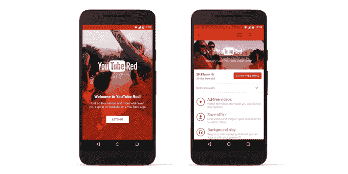
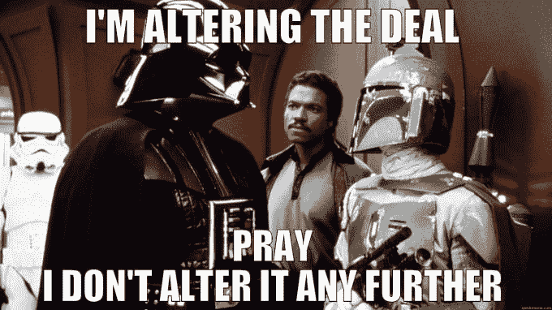

# YouTube 将完全删除没有签署红色订阅协议的创作者的视频

> 原文：<https://web.archive.org/web/http://techcrunch.com/2015/10/21/an-offer-creators-cant-refuse/>

YouTube 向其顶级视频创作者提出了一个他们无法拒绝的提议，否则他们的内容就会消失。今天，YouTube 证实，任何赚取广告收入分成但不同意签署其新的[YouTube Red 9.99 美元无广告订阅](https://web.archive.org/web/20230405153304/https://techcrunch.com/2015/10/21/youtube-red/)的收入分成协议的“合作伙伴”创作者，将在广告支持和无广告层隐藏他们的视频。这包括受欢迎的喜剧演员、音乐家、游戏评论员和 DIY 教练的视频，但不是上传剪辑的普通人。

这是一颗难以下咽的药丸，让 YouTube 看起来像一个恶霸。尽管将现有粉丝转化为付费用户而非免费观众可以为创作者带来比广告收入更多的收入，但强迫他们参与这项交易似乎有些粗暴。

【2015 年 10 月 23 日更新:批斗已经开始。今天 [ESPN 不得不从美国所有版本的 YouTube](https://web.archive.org/web/20230405153304/https://techcrunch.com/2015/10/23/youtube-red-creators/) 上移除大部分视频。由于其其他合同阻止其使用 Red 等订阅服务，ESPN 的视频现在正在从美国 YouTube 的广告支持层消失。]

谷歌表示，目标是提供一致性，因此考虑订阅 Red 的人不必担心他们最喜欢的内容在无广告服务中不可用。但没有解释为什么它不能把那些不签署协议的视频标记为“不在红色”，而是必须采取“签署或消失”的策略。

在今天的 YouTube Red [发布会](https://web.archive.org/web/20230405153304/https://sites.google.com/site/ytredpress/home/youtube-red-blogpost)上，首席商务官 Robert Kyncl 表示，YouTube 上 99%的内容仍然可用，并指出绝大多数创作者都签署了协议。但他们没有太多的选择，否则他们将失去之前的广告收入、新的订阅收入以及与粉丝的联系。

金克尔表示，YouTube 将向创作者支付“绝大部分的收入”，但他一再拒绝透露具体比例。订阅音乐服务 Spotify 支付 70%，Apple Music 支付 71.5%。今年早些时候，[YouTube 合作伙伴计划条款的变化](https://web.archive.org/web/20230405153304/https://techcrunch.com/2015/04/08/youtube-confirms-plans-for-an-ad-free-subscription-based-service/)表示，创作者将只获得收入的 55%。这将是相对较低的。

这笔钱将根据观看时间进行分配，因此拥有较长视频的创作者可能比快速剪辑制作人受益更多。需要澄清的是，删除的情况和协议仅适用于 YouTube 合作伙伴——非常受欢迎的创作者，他们已经达成协议，从他们的视频中赚取 55%的广告收入。正常人上传家庭视频到 YouTube 就不用担心这些了。

目前还不清楚 Google Play 音乐版权持有人会受到怎样的影响。如果音乐制作人和 YouTubers 分享相同比例或更低比例的订阅收入，双方的收入都会减少。然而，我从 YouTube 上收到了未经证实的消息，这并不完全是如何工作的，所以袖手旁观认为这对 Play 音乐版权所有者意味着什么。

【太平洋标准时间 2015 年 10 月 22 日上午 11:15 更新:谷歌向我提供了以下声明:

> 创作者和用户都要求 YouTube 提供订阅服务，这就是我们创建 YouTube Red 的原因。今天，我们绝大多数的合作伙伴，代表了 YouTube 上近 99%的观看内容，都已经注册了。没有更新条款的合作伙伴的视频将被设为私有，但我们仍致力于与这些合作伙伴密切合作，目标是让他们加入进来。

虽然 Red 可能会为创作者提供更多的每用户收入，并且对他们中的大多数人都有好处，但他们仍然被迫达成交易。]

理论上，如果 YouTube 提出一个提议，让创作者赚更多的钱，同时又不会明显失去控制权，他们会很乐意自愿。但它所涉及的强制为 YouTube 和谷歌未来可能如何与创作者合作树立了一个令人担忧的先例。作为互联网事实上的视频平台，如果他们不合作，它就威胁删除他们的内容，这背后有着巨大的力量。那么，怎样才能阻止它进一步改变交易呢？

谷歌之前曾因不当使用其庞大的影响力而受到批评，尤其是围绕 Google+和 Google Places 如何在搜索结果中获得优先权。现在很明显，YouTube 正在优先考虑它所谓的“一致”用户体验，即内容总是可以在其免费和付费服务中获得，而不是内容所有者自己的意愿。