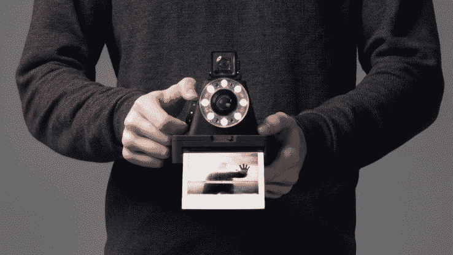
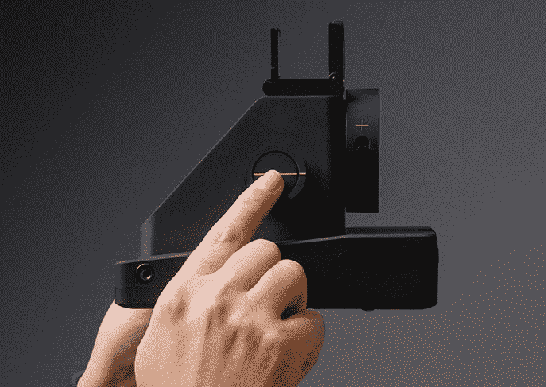
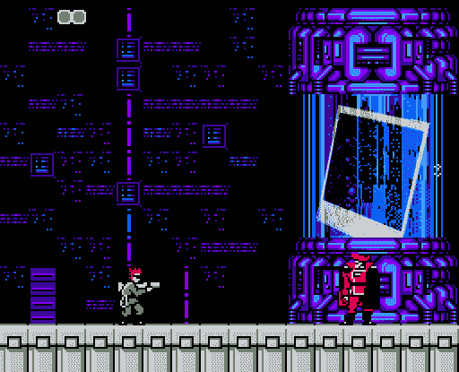

# 模拟摄影生活！不可能的项目为宝丽来 600 型电影首次推出 I-1 相机 

> 原文：<https://web.archive.org/web/https://techcrunch.com/2016/04/11/analog-photography-lives-the-impossible-project-debuts-i-1-camera-for-polaroid-600-type-film/>

# 模拟摄影生活！不可能的项目首次推出宝丽来 600 型电影的 I-1 相机

谁不喜欢瞬间胶卷？*滚。*剩下的人，留下来惊叹吧。这个不可能的项目，7 年前开始了，嗯，几乎不可能的逆向工程宝丽来即时电影制造过程的项目，已经升级到[制造自己的宝丽来式相机](https://web.archive.org/web/20221207230926/https://us.impossible-project.com/pages/impossible-i-1-analog-instant-camera)。I-1 的照片本质上是模拟的——内部没有微型热敏打印机——但这款相机对数字时代做出了一些让步。

像过去的大众市场宝丽来系统一样，I-1 很少包括摄像头控制。有一个快门按钮，一个曝光补偿转盘，和一个非常近似的对焦选择器。构图是通过把你的眼睛放在一个迷人的老式方形框架上来实现的。内置的环形闪光灯使用环境光传感器和焦距来照亮对象。

然而，自然地，必须有一个应用程序参与其中。这款相机可以让你对设置进行更精细的调整，远距离按快门，或者管理多重曝光拍摄。我们已经要求更多的信息(和截图),如果有回音，我们会更新帖子。

另一个现代化的让步是通过 USB 给相机充电的能力。感谢上帝，尽管如果你必须给闪光灯上发条的话，那也是很棒的。

你将拍摄不可能的项目类型 600 电影，[，它有许多品种，都很贵](https://web.archive.org/web/20221207230926/https://us.impossible-project.com/collections/film-for-polaroid-600-cameras)。但如果你想体验全尺寸的宝丽来，又不想去老式相机店寻找冰箱里的旧胶卷，这是一个不错的选择。

I-1 将在 5 月 10 日上市，价格为 300 美元，与更好的即时系统一致。不过，要做好准备，这些年来至少要在电影上再花那么多钱。嘿，我只是说 analog 还活着，并不是说它很便宜。

额外收获:这是我在 2009 年为庆祝宝丽来电影的复兴而做的 photoshop。你能说出这个游戏的名字吗？

