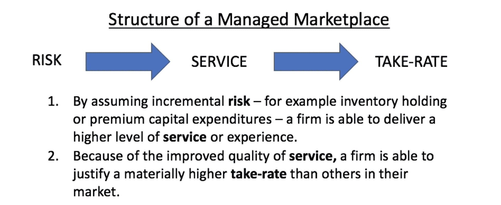
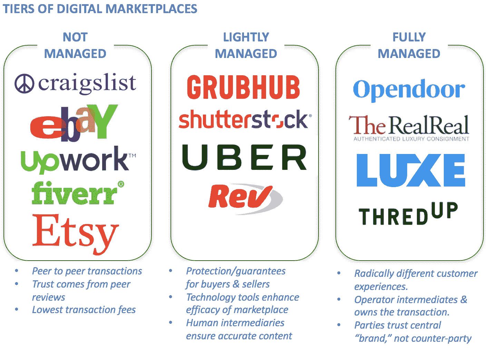
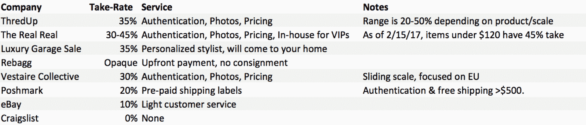
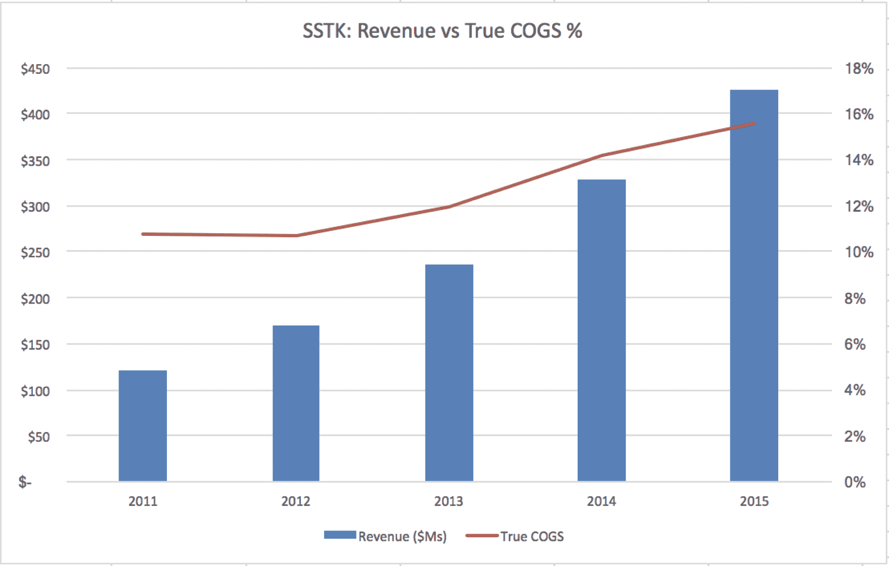

# 剖析受管理的市场

> 原文：<https://web.archive.org/web/https://techcrunch.com/2017/05/25/anatomy-of-a-managed-marketplace/>

More posts by this contributor

托管市场(也称为端到端或全栈市场)是过去几年风险投资的热门类别之一。最近的成功管理市场的例子包括 RealReal、Opendoor、Beepi、Luxe 和 thredUP，它们总共筹集了近 10 亿美元。他们获得了大量的媒体报道，因为消费者的体验通常与之前市场上的体验截然不同。

但对于什么是真正的“受管理的”市场，人们存在困惑。如果你知道自己在寻找什么，那么发现一个真正的管理市场是相当容易的。受管理的市场通常遵循以下特征:

*   一种增值中介(“管理”或“服务”)，提供优于更传统的点对点市场、实体市场甚至传统服务提供商的体验。
*   在业务模式中引入额外风险；例子可能包括预先购买和持有库存，或者通过投资于与买方/卖方相关的服务，这些服务是在实现任何利润之前的增量、可变成本(钱在进来之前就花掉了)。
*   相对于市场上的其他买入/卖出期权而言有显著溢价的接受率(毛利润),以抵消溢价服务水平或已发生的风险转移。

值得注意的是，如今许多无处不在的市场公司，如优步、Airbnb、Grubhub 和其他公司都是“轻度”管理的，我的意思是他们在质量保证、背景调查和核实审查方面投入资源。但这些服务在公司的整体运营成本结构中通常是微不足道的费用——甚至经常被视为客户(或商家)收购成本的一部分——因此不属于完全管理的服务。

对于 Airbnb 来说，这些“轻”成本可能包括与核实用户家庭地址相关的成本，或者解决纠纷的客户服务成本。对于 Grubhub 而言，轻管理可能包括与更新菜单相关的成本，但他们没有得到充分的管理，因为他们自己没有获得食物或食物准备的所有权(尽管 Grubhub 已经开始推出交付，这将有资格成为管理服务)。该信息图显示了主要的市场分类:

为了建立一个成功的、可持续的管理市场，接受率利润必须足够高，以支持增值中介以及市场提供的后续服务和风险。让这些市场如此强大的是，它们可以将相当数量的边际贡献降至底线，同时将较高的利率收入投入到客户体验中，减少摩擦和产品改进。

此外，如果随着时间的推移，这些市场能够开发出能够显著降低或消除提供这些增值托管服务的成本的技术，它们就可以继续证明更高的接受率是合理的，并建立高利润的业务，这些业务相对于其传统服务提供商可比业务或对等业务来说是值得溢价的。

作为入门，这里有一张在管理市场和传统市场中的电子商务行业的快速图表。你能猜出哪些是主动管理的吗？ 

## 价值创新和风险

既然我们已经认识到托管市场是有效的商业模式创新，那么在个案的基础上进行一些研究来识别每一种创新，并能够在未来正确识别托管市场是很有用的。

[Opendoor](https://web.archive.org/web/20230327090157/https://www.opendoor.com/) 是房地产行业中的一个管理市场，是一个出售房屋的按需工具。他们利用大量的数据源来提供实时的房屋报价，通常不需要踏足其中。基本上: *点个鼠标，卖个房子* 。他们收取典型的 6%经纪佣金，外加风险调整服务费(平均约 2-3%的额外费用，最高可达 6%)。

增值创新:消费者不再需要等待出售他们的房子。他们甚至不需要雇佣房地产经纪人。Opendoor 将卖房的摩擦从可能的几个月(和多次看房)减少到几分钟。该公司还将执行持证检查员要求的所有维护/变更。

:与 RE/MAX 或 21 世纪等经纪公司不同，这些公司在交易中承担零资本风险，但从交易的买/卖双方收取 3%的费用，Opendoor 购买库存并将其保留在他们的账面上。这样做的效果是，他们可以向传统上依赖点对点市场(典型的大联盟上市，有房地产经纪人提供咨询)的国内卖家提供非常差异化的体验。

:为了证明这种风险水平(持有库存)和服务(管理维护)的合理性，Opendoor 收取的佣金平均比传统房地产交易高出 50%。鉴于其他类别的增量，50%的溢价可能看起来微不足道，但房地产的大交易规模意味着 50 万美元的房子的溢价是 1.5 万美元的增量毛利润。这是管理维护和一些风险的一大笔钱。

一个恰当的例子是以下对 Opendoor 的收入和成本结构的估计，平均价格为 220，000 美元的房屋(他们的最佳选择), 9%的经纪费，市场价格的 50%溢价:

对于 Opendoor 来说，说到底，他们的平均净利润是 8320 美元，相当于房屋原始售价的 3.8%，仍然高于传统经纪公司代理人的 3%。此外，它们还能提供与众不同的体验。这是一个强大的模型。

[RealReal](https://web.archive.org/web/20230327090157/https://www.therealreal.com/)是奢侈品寄售领域中的一个受管理的市场，专注于服装、珠宝、手袋，甚至艺术品。这种体验与易贝不同，例如，卖家只需将商品送到 TRR 的仓库(没有照片、没有描述、没有客户互动)，无需任何努力，买家对 real real 的质量和认证服务感到放心，他们完全保证这一点。

:real 不需要在网上发布商品清单和照片，也不需要支付第三方认证费用，甚至不需要处理运输事宜，它只需从发货人那里收集商品，并在商品售出后寄给他们一张支票。对于卖家来说，这是一种真正的“一劳永逸”的体验，比处理网上拍卖(甚至是当地旧货店之间的价格比较)要方便得多。

*风险创新* :为了给卖家*提供一种无摩擦的体验，给买家*一种美观、值得信赖的体验，Real 被迫将所有这些成本预先计入自己的开销。在一件商品售出之前，他们会支付每件商品的摄影、文案撰写和物流费用。如果商品卖不出去，RealReal 就被迫吃掉这些间接成本。因此，如果他们对某些商品的需求预测不准确，他们最终可能会烧掉比他们能够从销售中收回的更多的钱。

:为了证明其成本结构的合理性，RealReal(以及其他类似的市场)收取 30%的佣金，实际上是无管理的 P2P 市场向卖家收取的佣金的三倍。

[Luxe](https://web.archive.org/web/20230327090157/http://luxe.com/) 作为一种有效的始终在线的移动代客服务，司机会在他们的目的地遇到一个豪华代理人，他拿着钥匙，停着司机的车。在离开时，司机在应用程序中请求他们的汽车，并在他们的出口点遇到了一个豪华代理人，他将他们的汽车送过来。

*增值创新* : Luxe 从根本上重新定义了停车，为任何司机提供按需代客服务，在主要城市的大范围内满足他们的需求。不同于传统停车甚至移动停车市场，如[spot hero](https://web.archive.org/web/20230327090157/http://www.spothero.com/)*(需要司机自己停车)，Luxe 重新想象驾驶是以目的地为中心的:开到你的最终目的地，而不是停车场。理论上，它的产品可以节省司机的时间，使他们能够避开恶劣的天气。

*风险创新* :为了提供不间断的、随需应变的服务，Luxe 被迫在其运营的每个地区雇佣大量服务员。不管这些服务员的实际工资是多少，在任何实现的需求之前，这都是 Luxe 被迫承担的一笔可观的人力资本成本。这与共享经济市场模式形成鲜明对比，如 Airbnb 或优步，它们没有人力资本成本负担，而是向任何特定的房主或司机支付交易佣金。

*因此，令人惊讶的是，他们宣传他们的服务平均每小时 5 美元，特别是当纽约市的平均每小时收费是 11-15 美元的时候。几个月前，来自旧金山的报告表明，以前每小时 5 美元的费用现在已经增加到每小时 15 美元或每天最高 45 美元，并且从这个月起，他们已经暂停了代客服务。鉴于不同社区的停车费用差异很大，很难评估它们的确切收费溢价，但我估计它必须是传统停车收费的 200%左右才能盈利。*

所有这些公司都建立在这样一个愿景之上，即技术最终将能够提高自动化程度和利润率。例如，有一天 RealReal 的物品认证将完全通过算法实现，或者 Luxe 将能够预测司机的实时流量，从而降低其人力资本成本。因为这些有代表性的公司都还是相对年轻的初创公司，那些技术驱动的故事大多才刚刚开始上演。

## Beepi 对 Carmax

二手车管理市场 Beepi 最近关门了，因为它在两年内耗费了近 3 亿美元。与易贝汽车不同，Beepi 是一个点对点的体验，不提供礼宾服务(尽管它确实提供一些自助服务选项，如免费的 Carfax 报告)，Beepi 是一个全方位服务平台，承诺对汽车进行严格的检查，对购买的汽车实行 10 天无疑问退货政策，对卖家来说，如果一辆车在 30 天内没有卖出，Beepi 将按照评估价值直接购买。

这种无风险服务的卖家费用？Beepi 的费用大约是 9 %,而易贝汽车公司的费用是 125 美元，一辆 1 万美元的汽车的费用大约是 1.25 %,两者相差近 800%。

那么，在溢价 9%的情况下，Beepi 怎么会倒闭呢？

对他们失败的最佳洞察可能来自一个相当成功的类似模式。原来，美国最大的二手车零售商也可以说是世界上最受认可的管理市场之一: [Carmax](https://web.archive.org/web/20230327090157/https://www.carmax.com/) 。给 Carmax 30 分钟的时间检查你的车，他们会买下它，即使你不买他们的车，也不会讨价还价。30 分钟是非常有效的，非常接近按需分配。

Carmax 的非凡之处在于，即使在任何一年每辆车的年平均销售价格上下浮动 5%，该公司每辆二手车的毛利基本上也不会变化。这意味着 Carmax 实际上更少关注他们每辆车的，而是关注他们每辆车的；他们的佣金是他们期望获得的利润的函数。

理性地说，这也是有道理的——消费者重视便利，但有一个认知美元限制，他们愿意为这种便利而交易。通过将他们的接受率转化为他们的利润预期的函数，Carmax 能够为更高端的汽车提供更多的，如果汽车的蓝皮书价值和 Carmax 的报价之间存在 10%的差异，客户可能会难以接受。对于高价资产，统一税基本上不太可能奏效。

二手车是一种奇怪的资产，因为它贬值如此之快，即使 60 天也能对价值产生明显的影响。这就是 Carmax 的过人之处。在他们最近的年度报告中，Carmax 指出，上一年销售了超过 60 万辆汽车，目前库存约为 5.5 万辆。这是一个大约 11 的零售周期，这意味着每 35 天左右就有一辆汽车离开 Carmax 的停车场，使他们能够更准确地为汽车 *和* 定价，提供更高的报价，更少地受到更难预测的贬值波动的影响。

在对 Beepi 的一次事后分析中，Carlypso 创始人克里斯·科尔曼指出，除了上述原因(贬值效应和认知定价差异)，从获取客户的角度来看，这种方法存在固有缺陷。具体来说，虽然有客户希望简单地出售他们的汽车以获得现金， *大多数* 车主希望以旧换新，因为他们仍然需要汽车，而且这样做有税收优惠；一个必须为所有交易中的买方和卖方支付营销成本的平台处于非常不利的地位。

归根结底，二手车的管理市场模式确实有效。Carmax 只是数千个证据中的一个:全国成千上万的经销商持有库存，检查汽车并获得利润。Beepi 的失败似乎是执行不力、定价失误，甚至可能是某次融资失败带来的运气不佳的结果。

## 自动化和快门架

由于托管市场涉及大量“服务”组件来改善整体体验，该行业的一个预期是，随着人工智能和自动化的不断发展，如果软件能够承担更多这些责任，提供服务的人力资本成本将会降低。

但托管市场面临的一个难题是，很少有数字托管市场是真正的上市公司，这降低了对其整体经济和流程的可见性，也使得很难检验服务成本应该随着时间推移而下降的假设。幸运的是，至少有一个:Shutterstock(纽约证券交易所代码:SSTK)，一个供摄影师出售照片的市场，标榜自己是“值得信赖的， *积极管理的市场* ，”因为“每张照片都由训练有素的审查人员团队单独审查。”

在管理市场的范围内，Shutterstock 无疑处于较轻的一端——其主动管理带来的财务风险只是其 QA 审查人员的人力资本成本。尽管如此，这一假设似乎是在 Shutterstock 等公司身上进行测试的理想假设，Shutterstock 不依赖无人驾驶汽车等未经证实的技术来降低服务成本，但可能会利用经过验证的廉价图像识别技术来完成人工审查人员所做的大量质量保证、版权检测和标记工作。

然而，Shutterstock 的财务数据似乎并没有证实这一点。为了测试自动化假说，我决定对比公司的收入和产生收入的成本。Shutterstock 将其收入成本定义为“支付给贡献者的版税、信用卡处理费、内容审查费用、客户服务费用、基础设施和托管费用……以及相关的员工薪酬。”我假设信用卡处理费占收入的百分比相对稳定(如果不是逐年减少的话)，云托管费也与需求(收入)成比例。我将下面的“真正的齿轮”定义为提供服务的上述费用，减去贡献者版税:

令人惊讶的是，这些真实的 COG 成本非但没有随着时间的推移而减少，反而似乎在增加。这意味着，过去需要 10.5%的收入来处理的同一张图片，现在需要将近 15%的成本。

这里有许多可能的解释。这些增加的成本当然有可能是因为该公司在自动化方面投入了大量资金，其效果在他们简化 QA 流程时还没有得到证实。出于各种各样的原因，该公司维护的照片数量也可能使处理每张增量照片的成本更高。

从这个 Shutterstock 公司的案例研究中，我们了解到，简单地假设管理市场在早期阶段产生的大量服务相关成本将随着“规模”而降低是不合适的，无论是通过执行还是软件自动化。与任何公司一样，总有改进的空间，但对 Shutterstock 的上述分析表明，这远没有扳动开关那么容易。

## 外卖食品

托管市场是一种典型的风险投资，允许企业家重塑消费者体验，同时利用风险资本补贴来承担这些托管模式中固有的大部分风险。

从单位经济的角度来看，进入这些平台的大部分服务劳动力的潜在自动化可能是巨大的。投资者和运营商需要保持敏感，最终是技术，而不是繁重的服务，将长期培养高度期望的商业模式和利润。但是，未来的自动化也可以降低这些公司的壁垒和防御能力，允许点对点玩家用类似的软件推出类似的产品。

在我看来，可持续管理的市场不仅会重新想象他们正在接近的体验，而且会从一开始就专注于围绕他们的产品构建一个数据护城河，从而确保他们仍然是首选平台，即使软件创新开始平衡整体竞争环境。

特别感谢 Josh Breinlinger 和 Rebecca Kaden 对本文的反馈。

* *芝加哥风险投资公司是 SpotHero 的投资者。*