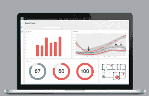

# Ancera 筹集 890 万美元用于预防食物中毒和召回技术 

> 原文：<https://web.archive.org/web/https://techcrunch.com/2016/06/28/ancera-raises-8-9-million-for-tech-to-prevent-food-poisoning-and-recalls/>

总部位于康涅狄格州布兰福德的初创公司 [Ancera Inc.](https://web.archive.org/web/20221209130328/http://www.ancera.com/) 已经筹集了 890 万美元的首轮融资，用于帮助食品生产商以比其他方法更快的速度检测污染物的技术。

该公司的使命是防止食物浪费，召回或更糟的是，食源性疾病的传播，安塞拉首席执行官和创始人 Arjun Ganesan 说。

这笔交易的投资者包括:总部位于佛罗里达州的家族基金 Glass Capital Management 以及企业战略支持者[包装工环卫服务](https://web.archive.org/web/20221209130328/http://www.pssi.co/)(PSSI)[梅塔博泰](https://web.archive.org/web/20221209130328/http://metabiota.com/)等未透露姓名的投资者。

新一轮融资将该公司的总资本提高到 1230 万美元。

对于陌生人来说，PSSI 和 Metabiota 是食品安全领域的响当当的名字。PSSI 为北美的食品加工商提供清洁和卫生服务。Metabiota 为国际上的公司和政府机构进行风险评估和数据分析，重点是发现和减轻生物威胁。

食品工业中常见的生物威胁包括:沙门氏菌、大肠杆菌、李斯特菌和其他污染物，这些污染物会使人生病，甚至会导致死亡。

根据疾病控制和预防中心的数据，每年每六个人中就有一个人食物中毒，这代表了大约 4800 万人——包括 128000 人需要住院治疗，3000 人死亡。

Ancera 的第一款硬件产品将于下月推出，是一款名为 Piper 的小型打印机大小的仪器，使用智能手机大小的一次性墨盒，也是由这家初创公司制造的。

Piper 允许没有接受过生物学培训的质量控制专业人员在供应链的不同检查点对他们公司的产品、家禽或其他食品进行精确检测。

Piper 可以在一至八小时内检测并量化样本中的沙门氏菌。它与 Ancera 的分析软件配合使用，该软件存储数据并提供从原材料到出货产品的所有状态报告。

食品工业中使用的现有测试方法包括收集样品并在琼脂等培养基上培养细菌，然后将其送到实验室，通过一系列清洗来量化有害生物的水平，这些清洗会降低测试结果中数据的产量和质量。这些测试通常需要 30-50 个小时，或者长达五天。

根据 Ganesan 的说法，Ancera 将食物样本中的微生物分类，并将它们推向一个传感器代理，然后对微生物拍照，计算样本中的微生物数量。这就减少了等待细胞生长到足够大的数量让传感器检测到它们的需要。

Ancera 的数据分析平台告知食品公司其供应链中何时存在污染物。

这位首席执行官解释说，细胞分选还有另一个好处:“市场上所有其他平台都会在测试过程中破坏细胞。我们收集细胞，但不破坏它们，这意味着你可以立即将它们用于测序，并找出问题的根本原因，也就是说沙门氏菌在你的供应链中的确切来源。”

Glass Capital Management 的 Carl Zwerner 表示，投资者预计该公司将主要将资金用于招聘，并转向测试仪器和墨盒的商业生产和分销。

兹沃纳指出，该公司此前已经吸引了联邦政府的拨款，获得了专利，并获得了两家主要食品行业参与者(一家鸡肉企业和一家农产品企业)的承诺，即将开始使用其技术进行沙门氏菌测试。

“我们想资助这一切，这样 Arjun 就可以专注于扩大规模，”他说。“如果你自己曾经食物中毒过，你就很容易看出社会需要这样的东西。”

Ganesan 说，Ancera 还将利用这笔资金进行研发，调整其系统以检测其他食品污染物，如大肠杆菌。