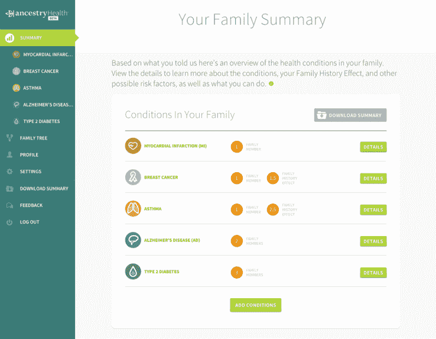

# AncestryHealth 欢迎祖先健康进入家庭

> 原文：<https://web.archive.org/web/https://techcrunch.com/2015/07/16/ancestry-com-welcomes-ancestryhealth-to-the-family/>

家族史网站 Ancestry 今天推出了一个名为 [AncestryHealth](https://web.archive.org/web/20220807234937/https://health.ancestry.com/) 的新一代健康数据库。这一消息传出之际，Ancestry DNA——Ancestry 的基因网站将平台上的人与远亲联系起来——宣布它现在已经对超过 100 万名客户进行了基因分型。

Ancestry.com 于 80 年代初推出，2009 年上市。它现在是世界上最大的家谱数据库，拥有来自世界各地的超过 160 亿份家族历史记录和超过 7000 万用户创建的家谱。

该公司在三年前看到了与 23andMe 类似的消费者基因检测机会，并成立了作为 AncestryDNA 子公司的 [AncestryDNA](https://web.archive.org/web/20220807234937/http://dna.ancestry.com/) 。早在 18 世纪，Ancestry 的专利算法就开始将用户与亲属匹配，以及将 DNA 与祖先匹配。

该公司现在通过引入代际健康信息，将这些家庭联系向前推进了一步。

> 结合祖先数据的广度和规模，我们预计祖先健康将是我们试图了解健康如何代代相传的一个关键部分。血统 CEO 蒂姆·沙利文

AncestryHealth 是一个免费的平台，允许那些有或没有祖先档案的人记录他们的家族健康史，可以追溯到几代人之前。网站上的人可以创建一个家谱，然后填写与每个家庭成员相关的健康信息，无论是活着的还是死去的。然后，可以用健康和遗传数据填充家谱，以帮助个人和他们的家庭保持记录，与他们的医生和后代分享。

AncestryHealth 只能追溯到几代人以前，并询问医生可能会询问的关于您父母或祖父母健康状况的相同信息。你也不需要通过 AncestryDNA 提供基因测试，但那些经历过这一过程的人可以在 AncestryHealth 个人资料中自动填充该信息，以使事情变得更容易。

我没有 AncestryDNA 的个人资料，也没有接受过 AncestryDNA 测试，但我可以在几分钟内进入 AncestryHealth 网站，建立自己的健康家谱。我已经知道了我家的一些情况，但是不确定两边的爷爷奶奶是怎么去世的。老年？我记得我的曾祖母在 90 多岁时死于中风，但仅此而已。

祖先健康与祖先 DNA 信息相结合可能更有用。我的父亲是一个狂热的系谱学家和严格的工程师，他把他的测试加入到了混合测试中，对我们的家族历史记录做出了很大的贡献。所以我问他对新的健康状况有什么看法。他是这么说的:

> 追踪 20 世纪的祖先，也许还有一些 19 世纪的祖先的健康状况是很重要的。很难获得 1800 年以前的健康信息，除非有一个或多个祖先感染了麻风病、肺结核、西班牙流感或黄热病，以及无数其他传染病，这些都不会影响我们的健康，因为它们是细菌或病毒造成的。癌症、心脏病、痴呆症和镰状细胞性贫血的趋势可能不会早于 19 世纪，因为在此之前医学非常原始。
> 
> 然而，对于过去 200 年来拥有祖先健康信息的人来说，祖先健康可能是非常宝贵的。

对我来说，这里没有什么惊天动地的见解，尤其是对几代人来说，但我可以把它视为未来健康记录的有用工具。

Ancestry 首席执行官蒂姆·沙利文说:“结合祖先数据的广度和规模，我们预计祖先健康将是这个难题的关键部分，因为我们希望了解健康是如何代代相传的。”。

Cathy A. Petti 博士加入 Ancestry，担任新网站的首席健康官。佩蒂来自生命科学研究和投资公司 HealthSpring Global。