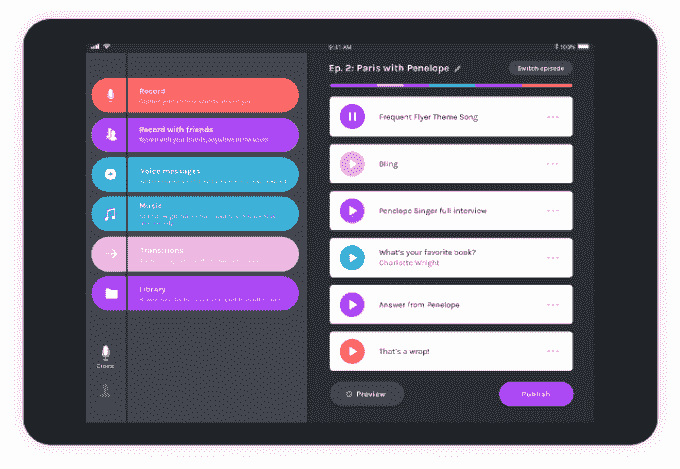
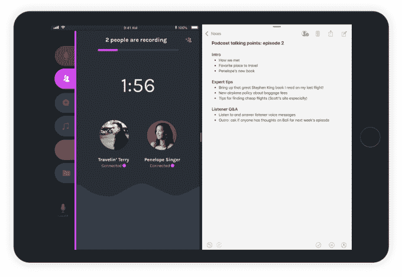
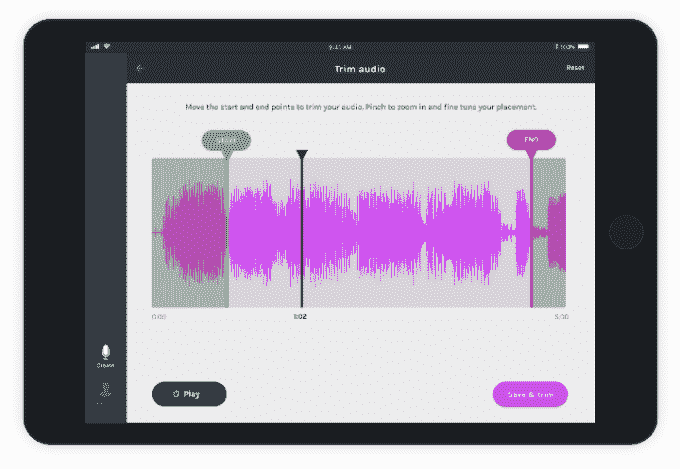

# Anchor 将播客创作和编辑引入 iPad 

> 原文：<https://web.archive.org/web/https://techcrunch.com/2018/06/19/anchor-brings-podcast-creation-and-editing-to-the-ipad/>

继今年早些时候作为播客创作平台重新推出之后，Anchor today 将其移动播客工具套件引入 iPad。和 iPhone 版一样，iPad 版的 Anchor 可以让你录制、编辑、然后在任何地方发布你的播客，包括 iTunes 和 Google Play 音乐。这款新应用还为基于触摸的编辑进行了定制，它利用了 iPad 的拖放和多任务处理等功能。

该公司最初专注于短格式音频，但最近意识到，通过在移动设备上提供一套易于使用的工具，它可以更好地服务于日益增长的播客观众。

iPhone 版的 Anchor 允许您按一个按钮来录制音频，与朋友一起录制，将语音消息(如来电)插入到您的播客中，并轻松添加音乐和过渡。iPad 应用程序现在提供了一套类似的工具，并进行了一些升级和调整。

对于初学者来说，你可以选择使用一个真正的麦克风，方法是将一个麦克风插入 iPad 的 lightning 端口，或者使用 lightning-to-USB 适配器。

你也可以从其他应用程序上传甚至拖放音频文件到 Anchor 中，以便在它的剧集生成器中使用。例如，您可以从 GarageBand 获取音乐，添加语音备忘录，或者导入存储在 Dropbox 等云存储站点中的其他音频文件。

该应用程序还支持多任务处理，因此你可以将笔记作为记录打开。

你可以直接在 iPad 上使用触摸控制编辑音频文件，任何人都可以轻松使用，即使是新手或业余播客。

这些控制可让您修剪播客的开头和结尾，因此您可以删除错误开头或其他喋喋不休的问题。您还可以拆分音频剪辑，以便插入过渡、语音信息、音乐和其他音频。

当您将播客放在一起时，可以四处移动或删除剪辑。

鉴于今天播客的流行，实际上还没有人推出考虑到播客用户需求的音频编辑工具，这是相当值得注意的。

Anchor 应用程序也是 iPad 如何用于内容创作而不仅仅是消费的另一个例子，具体来说，它可以用作创意项目的编辑工具。

该公司没有分享其用户数量，但 Sensor Tower 报告称，两家应用商店的全球安装量超过 85 万。该公司还表示，自 2 月份转向播客创作以来，Anchor 的月环比增长令人印象深刻，平均增长 40%。

与 iPhone 应用程序一样，iPad 应用程序 Anchor 也可以免费使用，因为该公司目前依靠其资金生存。但更长期的计划是向 Anchor 的播客提供货币化工具，Anchor 本身可能会从收入中提成。