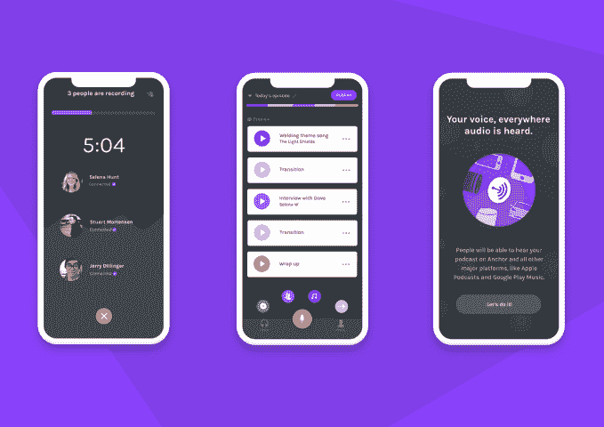
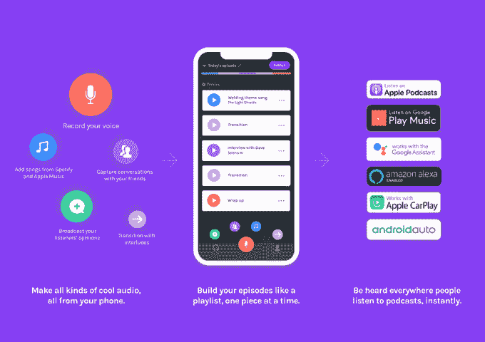
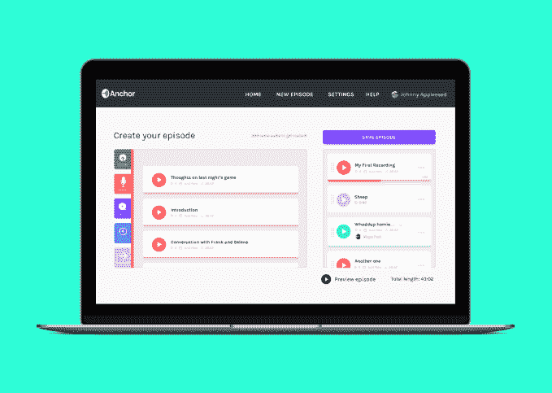
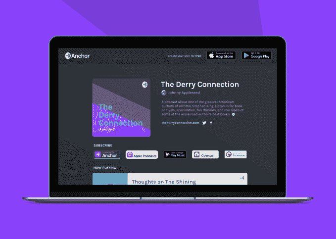

# Anchor 的新应用程序提供了播客所需的一切 

> 原文：<https://web.archive.org/web/https://techcrunch.com/2018/02/22/anchors-new-app-offers-everything-you-need-to-podcast-including-free-hosting/>

广播应用程序 [Anchor](https://web.archive.org/web/20221207130213/https://anchor.fm/) ，帮助任何人录制和分享音频，今天重新推出其应用程序，新的重点是服务更大的播客社区。过去，Anchor 在短格式的社交音频领域为自己开辟了一个利基市场，而新版本 Anchor 3.0 旨在成为你记录、编辑、主持、发布和分发任何长度的播客所需的一切，以及跟踪播客的表现。

去年秋天，Anchor[完成了来自谷歌风投和 Accel 的 1000 万美元 A 轮](https://web.archive.org/web/20221207130213/https://techcrunch.com/2017/09/28/anchor-raises-10-million-for-podcast-platform/)，这些变化出现在人们对播客的兴趣持续增长的时代。尼尔森说，一半的美国家庭现在是播客粉丝，22%的家庭认为自己是“狂热”粉丝。此外，带语音助手的智能扬声器的兴起使得在家里听录音变得更加方便，有助于进一步推动采用。

Anchor 的普遍信念是，任何人都应该能够轻松地录制和分享音频，而不需要特殊的工具或技术知识。新产品代表了对这一信念的加倍下注，因为它旨在消除潜在播客用户面临的许多障碍，从托管费到对特殊编辑软件的需求，以及对播客在听众中的接受程度缺乏了解等。

虽然 Anchor 的目标是短格式音频，但专业播客去年开始大量使用其应用程序，以利用其几个工具。这包括锚视频，它可以将音频转换为可共享的视频剪辑(在以后的版本中会重新添加到新的应用程序中)，以及“来电”功能，允许他们接收听众的语音消息，这些消息可以在以后集成到新的剧集中。

但最重要的是，他们使用了一键式播客功能，任何人只需轻按一个按钮，就可以录制和发布音频。

Anchor 首席执行官 Mike Mignano 解释说:“当闸门打开时，我们看到了围绕播客的所有兴趣，特别是使用 Anchor 工具。

他说，该团队随后研究了如何更好地服务于他们的播客用户群，发现如今创建一个播客仍然出人意料地困难。

“制作一个真正的播客是如此困难，这看起来很疯狂。你必须购买昂贵的麦克风，你必须在电脑上管理和学习复杂的软件。还有上传和付费托管你的音频文件的过程，”他说。还有处理播客的 RSS 提要，这不是每个人都能理解的。

**最新消息**

新应用程序现在将用户直接带入播客创建屏幕，除了红色的大“录制”按钮外，还有颜色编码的按钮，用于使用 Anchor 的各种功能。

有和朋友一起录音的按钮；用于来电(现在称为语音消息，用于直接的私人对话)；用于添加苹果或 Spotify 的音乐；以及从 Anchor 的内置声音库中添加过渡。

当您创建和使用这些组件时，它们在屏幕上的可视编辑器中显示为拖放模块，因此您可以四处移动它们来创建您的 podcast 专题节目。

这些都是彩色编码的，屏幕顶部的一个栏显示了您收集的每个音频片段的长度。主播也取消了 5 分钟录音的限制。

Anchor 现在还将免费托管你的播客，如果你想从你目前的托管提供商那里进行转换，你可以很容易地导入你的备份目录。对于谁可以使用该功能没有限制。

“在 2018 年，这就是应该的方式——不应该有托管费阻止人们这样做，”Mignano 说。

完成编辑后，你可以按一个按钮将播客发布到 Apple Podcasts、Google Play、covery、Pocketcasts、Stitcher、Amazon Alexa 设备、Google Assistant 设备、Apple HomePod、Android Auto、Apple Carplay 以及目前的 Spotify。

此外，在新的应用程序中，以及在更大程度上在网络上，Anchor 现在提供播客分析，显示每集播放量、总播放量、下载量等信息。在网上，这些都可以通过图表和图形获得，还有一个部分显示听众来自哪些平台。

网络版提供了一个更高级的编辑器，能够从你的电脑上传音频文件，并重复使用你的主播历史记录。

当然，对于迁移到 Anchor 平台的专业播客来说，有一个问题值得关注，那就是它是否会长期存在。

就目前而言，该公司没有产生收入，而是依靠其资金生存。付费托管或自主托管的播客通常不必担心是否有一天他们会因为公司关闭或被收购而不得不快速迁移到其他地方——这一直是初创公司的担忧。

Mignano 表示，Anchor 的计划是最终为播客引入货币化工具，这将在 Anchor 的商业模式中发挥作用。(具体细节不得而知，但按照惯例，Anchor 可能会从其帮助创造的收入中提成。)这似乎是一个不错的选择，尤其是考虑到这种格式已经变得如此流行。

[gallery ids="1600980，1600993，1600982，1600981，1600979，1600978，1600968"]

好几个大牌都在主播 3.0 上线了。

这份名单包括:Reshma Saujani & Girls Who Code、BuzzFeed、Relay FM、企鹅兰登书屋作者 Alison Green、Tiffany Zhong 和 Zebra Intelligence、Seeker、Fatherly、Eniac Ventures、Abby Norman、The Outline、Cheddar、The Players 和 Atlantic Records。

除了托管，每个播客都有自己的节目定制 URL，包括订阅托管的任何地方的按钮——如苹果播客、谷歌播放等。

和以前一样，合作伙伴和其他主播将继续在应用程序中看到他们的工作，但在重新设计的“浏览”部分，更像 iTunes 的外观和感觉。

从今天开始，Anchor 3.0 将在 [iOS](https://web.archive.org/web/20221207130213/https://itunes.apple.com/app/apple-store/id1056182234?mt=8) 和 [Android](https://web.archive.org/web/20221207130213/https://play.google.com/store/apps/details?id=fm.anchor.android&referrer=utm_source%3DAnchor%2520Home%26utm_medium%3Dcpc%26utm_campaign%3DAnchor%2520Home%26anid%3Dadmob) 上推出，并在[网络](https://web.archive.org/web/20221207130213/https://anchor.fm/)上发布。