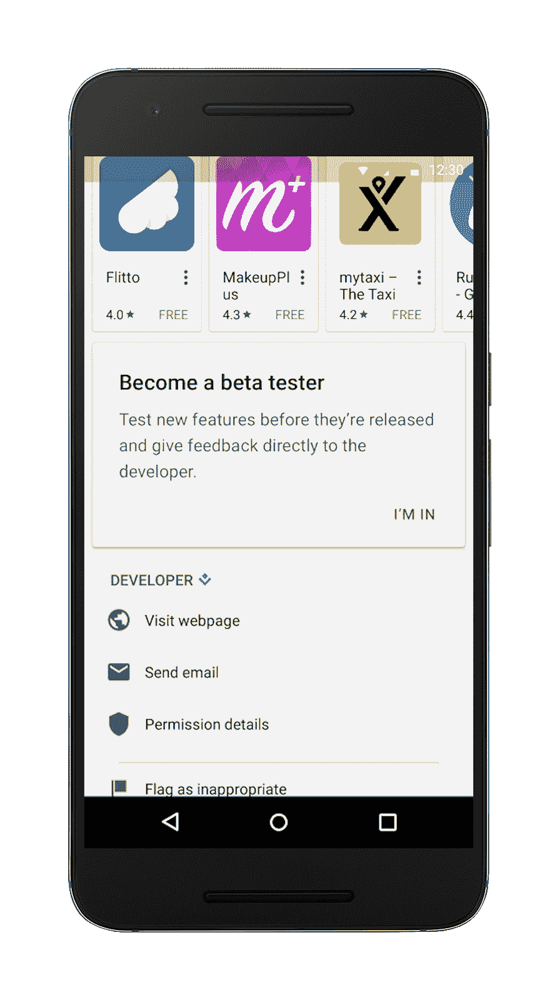
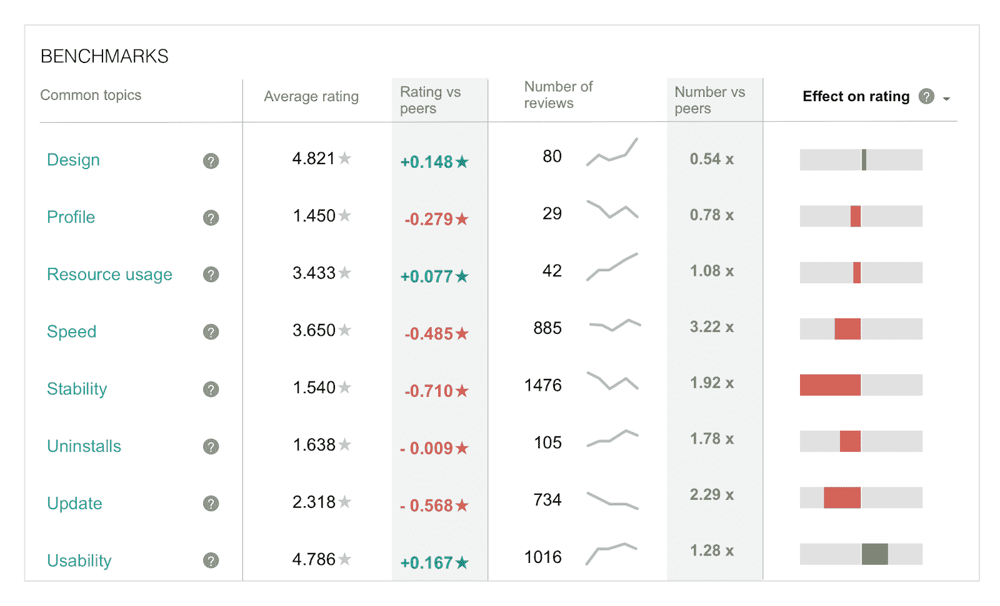
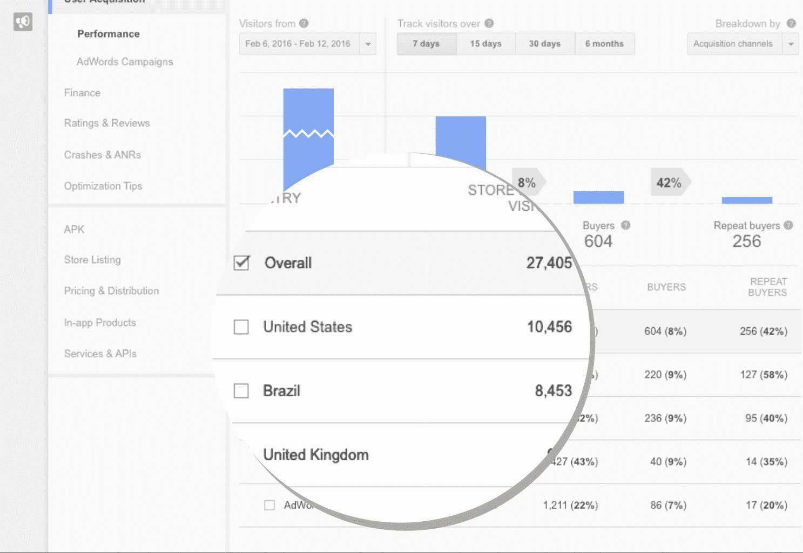

# Android 开发者在 Google Play  获得新的测试、分析和预发布工具

> 原文：<https://web.archive.org/web/https://techcrunch.com/2016/05/18/android-developers-get-new-beta-testing-analytics-and-pre-launch-tools-in-google-play/>

谷歌今天发布了对其 [Play 开发者服务](https://web.archive.org/web/20230308155807/https://developer.android.com/distribute/googleplay/index.html)的重大更新，这应该会让 Android 开发者的生活稍微轻松一些。

2015 年有 650 亿应用安装，谷歌显然知道一点它的开发者想要什么；通过此次更新，该公司专注于在新(或首次)发布之前为开发者提供更多工具来测试他们的应用程序。

 虽然 Google Play 已经为开发者提供了在发布前对其应用进行公开测试或测试更新的能力(最近使用户注册这些测试变得更加容易)，但该团队更进一步，现在允许开发者直接从他们的 Play Store 登录页面注册用户。

不过，这个按钮不会紧挨着通常的“安装”按钮。相反，它会在页面的更下方一点。

对于还没有非常活跃的用户社区的开发者，Google Play 团队现在也将在 Play Store 的新“早期访问”部分突出显示一些仍处于测试阶段的最佳新应用。

正如负责 Google Play 开发工作的 Ellie Powers 告诉我的那样，这个团队将会寻找它所能提供的应用程序，然后精心挑选一些最有前景的。

一旦用户注册了测试版，他们在商店的评分将不会计入应用程序的整体评分。相反，这些用户现在可以通过商店向开发人员提供私人反馈，而不需要开发人员像现在这样设置表单或电子邮件地址。

商店中的另一个新区域将突出用户可能需要执行更复杂任务(比如买房)的应用程序集合。这些收藏将出现在这些列表中包含的其他应用程序的登录页面上。

通过此次更新，谷歌 [Play 开发者控制台](https://web.archive.org/web/20230308155807/https://developer.android.com/distribute/googleplay/developer-console.html)现在还将与 Firebase 测试实验室(之前称为[云测试实验室](https://web.archive.org/web/20230308155807/https://developers.google.com/cloud-test-lab/))进行更新整合，这是谷歌的一项服务，用于在位于其数据中心的真实设备上测试应用程序。Firebase 现在为开发人员提供了一份发布前报告，总结了这些自动化测试发现的所有问题。该报告将显示诊断和截图，以及修复崩溃的提示。

团队改进的另一个领域是分析和响应用户评论的能力。现在，谷歌不会只给你一个商店的评论列表，而是会自动为你总结评论，并突出显示其中最重要的东西。默认情况下，控制台会显示用户对影响应用成功的一些关键领域的看法，包括稳定性和设计，以及它们如何影响应用的整体星级。除了这些通用主题，该服务还将显示您的评论中提到的独特主题的列表。

该列表还会将您的指标与类似应用的指标进行比较。Powers 告诉我，这些基准是开发人员一直要求的特性。

为了让回复评论更容易，谷歌推出了一个新的 API，允许开发者从他们的定制工具和通过 Zendesk 这样的合作伙伴来回复评论，Zendesk 今天推出了它的集成。

Play developer 控制台的其他新功能包括更深入的收购漏斗分析，现在可以按国家和基准细分数字，以及一项自动将价格四舍五入到特定国家有意义的数字的新服务(想想美国的 1.99 美元和日本的 200 日元)。

该团队也第一次为 Play 开发者控制台发布了一款移动应用[。Powers 告诉我，这个应用程序将允许开发人员快速检查统计数据，但不是每个报告都可以在应用程序中使用。该应用程序还将能够向开发者发送通知。](https://web.archive.org/web/20230308155807/http://g.co/play/consoleapp)

为了确保开发者也为新兴市场的用户调整他们的应用程序，谷歌推出了一套[指导方针](https://web.archive.org/web/20230308155807/http://developers.android.com/billions)，其中包含优化应用程序的清单，以及一份更加[深入的指南](https://web.archive.org/web/20230308155807/http://g.co/play/billionsplaybook)，其中包含扩展到这些市场的技巧和最佳实践。

https://www.youtube.com/watch?v=PErnqJT3xjA