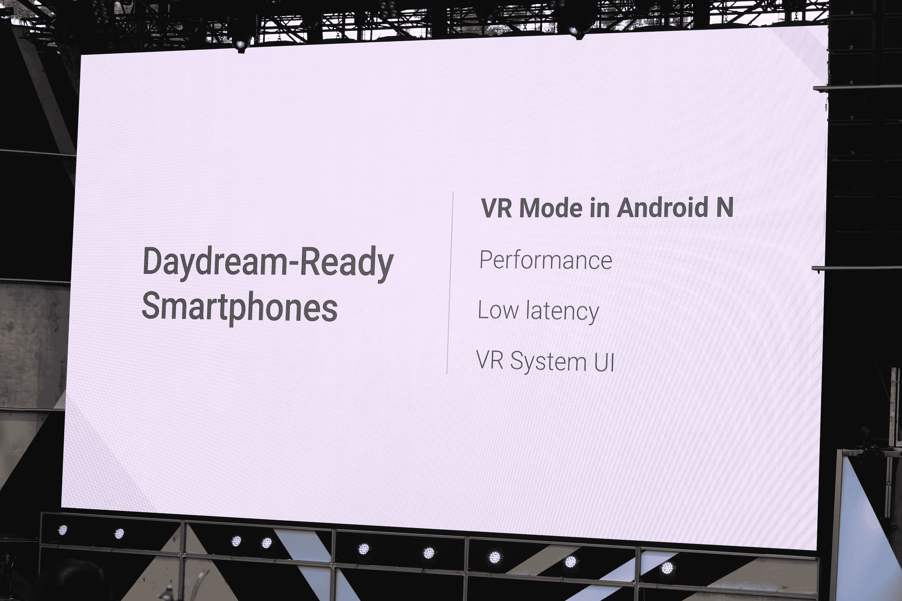
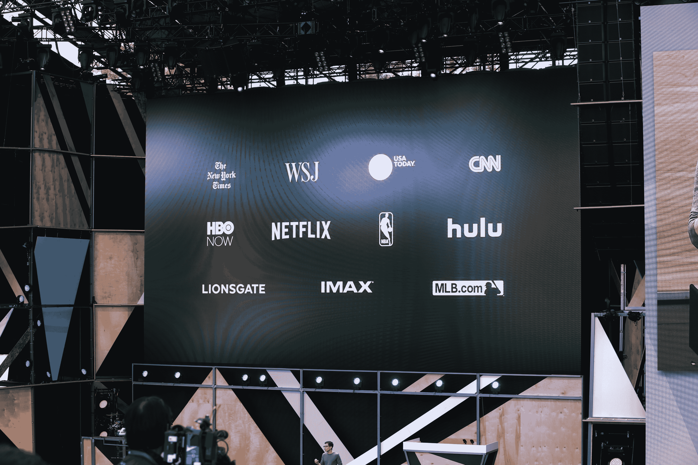
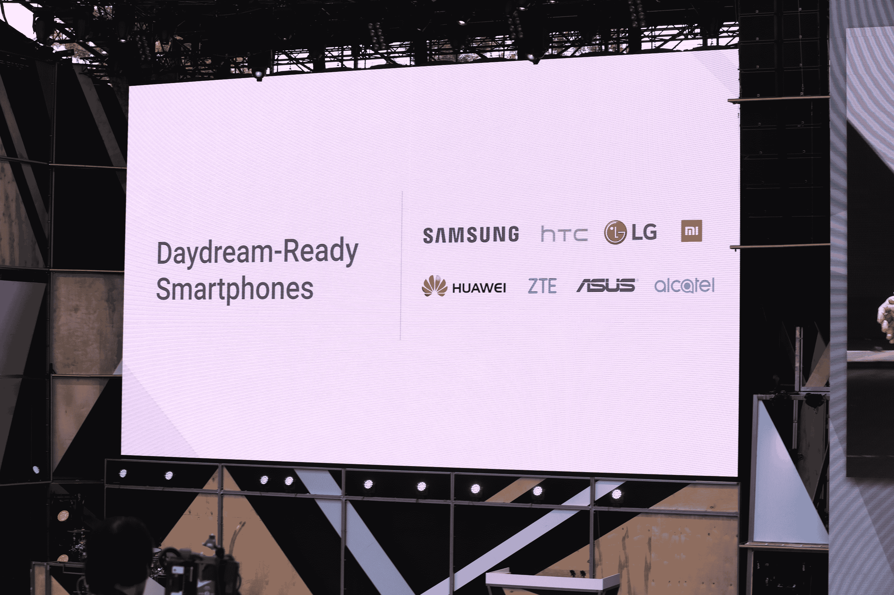

# Android N 获得低延迟 VR 模式 

> 原文：<https://web.archive.org/web/https://techcrunch.com/2016/05/18/android-n-gets-a-low-latency-vr-mode/>

我们不知道谷歌是否会在今年的 I/O 开发者大会上推出自己的虚拟现实耳机，但该公司移动操作系统的下一个版本 Android N 将为 VR 应用程序提供一种特殊模式。

这种新模式使 VR 应用程序在前台时可以独占访问设备的处理器内核。结合改进的传感器管道和谷歌在为 Android 带来对 [Vulkan graphics API](https://web.archive.org/web/20221208105010/https://www.khronos.org/vulkan/) 的支持方面所做的工作，该公司声称，虚拟现实模式可以将 Nexus 6P 的延迟降至约 20 毫秒，这几乎是目前移动虚拟现实的黄金标准(即 Gear VR 的运行速度)。

【T2

“当我们开始使用 Android 时，我们没有预见到许多用例，”Android 工程副总裁大卫·布克告诉我，并补充说，对于 VR，延迟是主要问题之一。伯克称之为“运动光子比”，长期以来一直是虚拟现实耳机的一个问题，特别是移动类型的耳机。当你的头部运动和屏幕上的图像变化之间的等待时间太长时，你根本感觉不到自己在场景中(而且你更容易生病)。

虽然总有改进的空间，但 20 毫秒以下的延迟一直被视为愉快使用的最佳点。Oculus 首席技术官约翰·卡马克曾表示，这一范围内的延迟“一般感觉不到”事实上，即使像 Oculus、HTC 和索尼这样的昂贵的有线耳机也仍然大致在这个范围内，尽管它们有更密集的图形需求。

因此，通过这种新的虚拟现实模式，应用程序现在可以完全访问手机 CPU 和 GPU 的所有功能，以尽可能快地渲染图像。该团队还改变了图形缓冲的工作方式，使用[单个缓冲](https://web.archive.org/web/20221208105010/https://developer.oculus.com/documentation/mobilesdk/latest/concepts/mobile-frontbufferrendering/)，并让应用程序追踪屏幕上的扫描线。

此外，VR 模式还使用了类似于 Oculus 的[时间扭曲](https://web.archive.org/web/20221208105010/http://www.extremetech.com/gaming/181093-oculus-rifts-time-warping-feature-will-make-vr-easier-on-your-stomach)的过程，系统首先根据你的头部运动创建一个图像，然后在显示之前，检查你当前的头部位置，并非常快速地转换它以匹配你当前的头部位置。

然而，如果你的手机没有低余辉显示屏，所有这些工作都可能是徒劳的，因为你最终会因为像素不能足够快地改变颜色而产生大量的运动模糊。

虽然这里的重点显然是性能，但该团队还在该模式中内置了其他功能。例如，你仍然会看到通知、警报和来电——所有这些都将显示在现在以立体 3D 呈现的卡片上。

【T2

谷歌给自己的 VR 平台取的名字是 Daydream。这包括 VR 模式，以及对耳机和控制器的硬件认证和支持。谷歌还建立了一个特殊版本的 Play store，在这种 VR 体验中运行，许多应用程序开发商，如《纽约时报》,网飞和其他人已经在开发 Daydream 应用程序，谷歌正在将自己的 Play 应用程序，StreetView，YouTube 和 Google Photos 引入这个平台。

Daydream 平台将于秋季推出，但软件

谷歌将认证手机为 Android VR 就绪，不出所料，该公司目前的旗舰手机 Nexus 6P 是第一个获得这一标签的手机。谷歌指出，三星、HTC、LG、华为、中兴和其他公司也在发布支持虚拟现实的手机或对旧手机进行认证。

