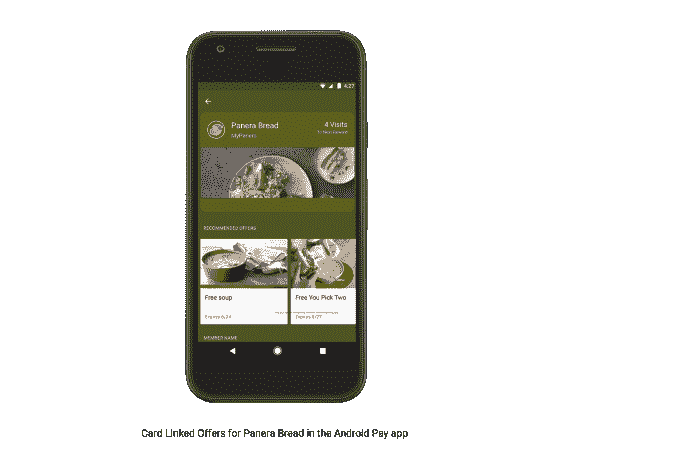

# Android Pay 将拓展新市场，增加改进的积分卡功能 

> 原文：<https://web.archive.org/web/https://techcrunch.com/2017/05/18/android-pay-to-expand-to-new-markets-add-improved-loyalty-card-features/>

# Android Pay 将拓展新市场，增加改进的积分卡功能

昨天在谷歌的开发者大会 I/O 上，该公司[宣布对其支付 API 进行](https://web.archive.org/web/20221025223526/https://beta.techcrunch.com/2017/05/17/google-will-now-let-users-pay-with-any-card-they-have-on-file-not-just-those-saved-in-android-pay/)升级，这将使最终用户在移动网络结账或在应用程序中支付时更容易在多张支付卡之间切换——即使这些卡没有保存在 Android Pay 中。今天，谷歌宣布了其[支付](https://web.archive.org/web/20221025223526/https://developers.google.com/payments)业务的一些新变化——包括 Android pay 的扩展、商户的新忠诚度功能等等。

谷歌表示，Android Pay 已在 10 个市场推出，并将很快加入巴西、加拿大、俄罗斯、西班牙和台湾。该公司还即将为 PayPal 用户部署更流畅的移动结账体验。

另一个重要的新产品是针对商家的 API，他们希望奖励他们最忠诚的客户。

与卡关联的优惠 API 将允许使用 Android Pay 的商家在顾客进入商店之前与他们互动，然后在他们离开后奖励他们。

Panera Bread 是第一批使用 API 的公司之一，它正在与那些将 MyPanera 忠诚度卡保存到 Android Pay 的客户一起使用。这些顾客可以在结账时使用他们的 MyPanera 账户在商店里发现并兑换优惠。

谷歌还让用户更容易向 Android Pay 添加忠诚度计划。例如，Walgreens 将在智能手机上向 Android Pay 用户发送通知，让他们在首次使用 Android Pay 付款后，将 Walgreens 的忠诚卡与 Android Pay 关联，以便在未来的访问中使用，同时在结账时手动提供他们的忠诚账户信息。

谷歌表示，沃尔格林已经在美国 8000 多家商店推出了这一产品。

谷歌已经与第一数据拥有的 [Clover](https://web.archive.org/web/20221025223526/https://www.clover.com/) 合作，将 smart tap 整合到 [Clover 的开发者 API](https://web.archive.org/web/20221025223526/https://www.clover.com/developers)中。这将允许公司为忠诚度、优惠券和礼品卡兑换以及其他功能构建 Android 应用程序，如提前订购和点击提货。