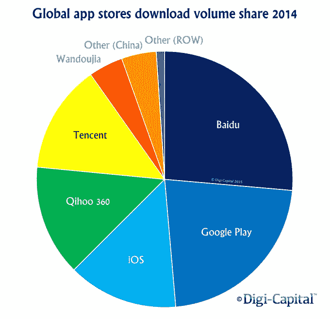
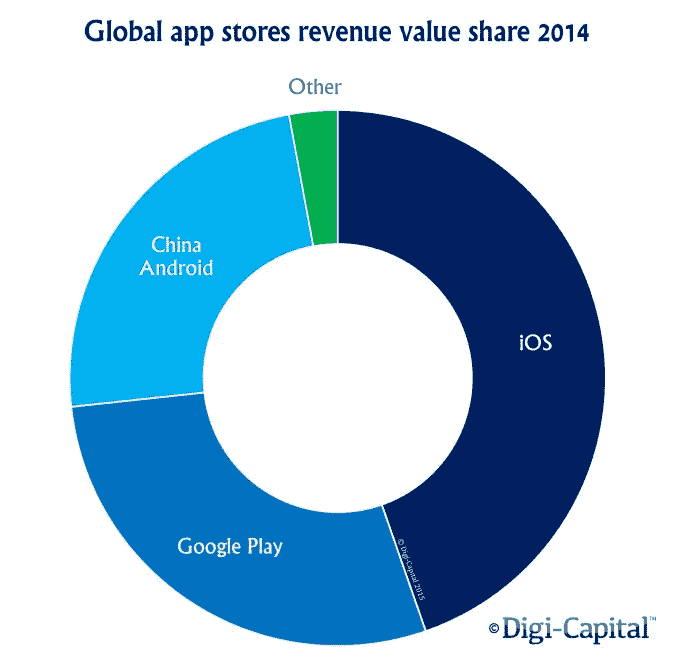
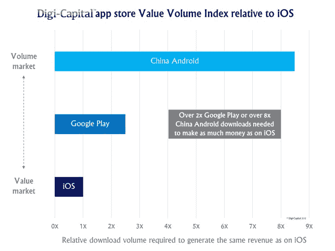

# 安卓收入超过 iOS，如果中国安卓应用商店合并 

> 原文：<https://web.archive.org/web/https://techcrunch.com/2015/04/27/android-surpasses-ios-in-revenue-if-chinas-android-app-stores-are-combined/>

今天早上发布的一项新研究打破了传统的想法，即与运行在 Android 设备上的应用程序相比，iOS 应用程序为移动开发者赚了更多的钱。相反，在考虑了大量非 Google Play 的中国安卓应用商店后，咨询公司 [Digi-Capital 发现](https://web.archive.org/web/20221226133435/http://www.digi-capital.com/reports/#mobile-internet-review)安卓不仅在 2014 年占据下载量的主导地位，去年还比 iOS 赚得更多。

当谈到理解移动应用生态系统的动态时，公认的智慧是 Android 在应用下载方面领先世界，但 iOS 应用为其开发者赚的钱比 Google Play 上出售的更多。根据众多报告，这一点依然正确——包括[本月早些时候来自应用商店分析公司 App Annie 的最新报告](https://web.archive.org/web/20221226133435/https://techcrunch.com/2015/04/14/revenue-gap-between-ios-and-android-apps-grows-thanks-to-china/#.o0tzqc:qdcq)，该报告称，截至 2015 年 Q1，iOS 应用商店全球收入比 Google Play 高出约 70%，高于 2014 年第三季度的 60%。

但在中国，Android 和 iOS 之间的战争并不像 iTunes 和 Google Play 那样是双头垄断。

这就是为什么 Digi-Capital 的分析检查了中国所有主要的应用商店，包括苹果，但也包括百度，奇虎 360，腾讯，豌豆家和其他较小的应用商店。

“苹果和谷歌对中国采取了非常不同的策略。Digi-Capital 董事总经理蒂姆·梅勒尔解释道:“苹果在中国取得了巨大的成功，但谷歌最终退出了。“加上中国固有的优势和商业活力，中国的应用生态系统现在看起来与所有其他市场都有着根本的不同，”他说。

当你考虑到这些其他应用商店时，iOS 和 Google Play 在全球应用下载量中占少数。(见下图)。但下载量本身并不等同于收入，许多其他报告已经表明了这一点。

然而，尽管 iTunes 应用商店仍然是全球单个应用商店中收入最高的——这意味着 iOS 在收入方面确实超过了 Google Play 但如果将 Android 应用商店的长尾理论结合起来考虑，它并没有“击败”Android。

相反，新报告发现，2014 年，安卓应用商店的总收入首次超过了 iOS。

也就是说，对于移动开发者来说，瞄准 iTunes 应用商店在某种程度上是一种更容易产生收入的方式，因为它的应用程序比其他单个应用商店的每次下载赚更多的钱。事实上，在 iTunes 上销售的应用比在下载量相对较低的 Android 上销售的应用赚钱更多——即使它们是通过付费下载而不是应用内购买来创收的。

与此同时，在 Google Play 上，应用程序需要两倍于 iOS 的下载量才能产生相同的收入。这意味着开发者必须达到很高的下载量才能在那里取得成功。

“Google Play 是一个很好的经营场所，但与 iOS 相比，每次下载的收入价值较低的长期趋势似乎将持续下去，”Merel 说。

类似地，中国应用商店(百度、奇虎 360、腾讯、万豆家和其他)也需要高下载量才能产生可观的收入。根据 Digi-Capital 的说法，中国应用程序的平均下载量必须达到 iOS 的八倍以上才能赚到同样多的钱。(报告指出，这是在全球范围内对 iOS 和中国安卓系统的比较，而不仅仅是在中国。)

由于中国应用程序商店的数量性质，分销关系至关重要，因为它们可以帮助应用程序到达更多的客户，从而获得下载量。

报告称，尽管中国安卓应用商店目前在下载量和收入方面占据主导地位，但这种平衡可能会在 2015 年底再次发生变化。苹果通过其设备成功地瞄准了中国市场，由于新的、更大的 iPhone 6 型号使其能够击败小米、华为和三星等竞争对手，销售强劲。就销量而言，苹果在中国 Q1 的智能手机市场份额最高，今年它在中国城市市场智能手机销量中占据了 25%的份额，创下了 T2 的纪录。