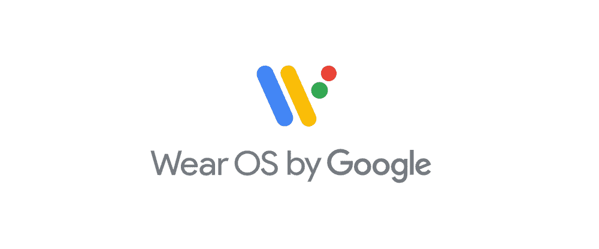

# Android Wear 正在成为“谷歌的 Wear OS”

> 原文：<https://web.archive.org/web/https://techcrunch.com/2018/03/15/android-wear-is-becoming-wear-os-by-google/>

四年前的这个星期，谷歌发布了 Android Wear，它无疑是成功的火箭。

经过缓慢的启动后，该公司[在 2017 年初发布了可穿戴操作系统的 2.0 更新](https://web.archive.org/web/20221208200627/https://techcrunch.com/2017/02/08/android-wear-20-is-an-adequate-update/)——但更新相当小，似乎没有移动指针。新版本发布几个月后， [Tizen 在全球市场份额上超过了 Wear](https://web.archive.org/web/20221208200627/https://9to5mac.com/2017/05/11/samsung-tizen-overtake-android-wear-apple-50-percent/) ，这要归功于三星采用了开放式操作系统。

也许 Wear 需要一层新的油漆——或者至少需要一个新名字。它今天得到的是后者。谷歌通过博文宣布【Android Wear 现为 Wear OS。或者更准确的说是 Google 的 Wear OS 。

Wear OS 产品总监丹尼斯·特罗珀(Dennis Troper)在帖子中表示:“我们将宣布一个新名字，更好地反映我们的技术、愿景，最重要的是——佩戴我们手表的人。”。"我们现在戴的是谷歌的 Wear OS，这是一款面向所有人的可穿戴操作系统."

手表制造集团 Fossil Group 似乎是品牌重塑的精神背后。

“2017 年，Fossil Group 的可穿戴设备业务几乎翻了一番，达到 3 亿多美元，其中包括第四季度手表销售额的 20%，”该公司首席战略兼数字官格雷格·麦凯尔维(Greg McKelvey)在提供给 TechCrunch 的一份声明中说。“我们预计这一类别将继续增长。我们的许多智能手表客户都是 iOS 用户，因此我们有信心并渴望看到随着谷歌 Wear OS 在 2018 年推出，全球 Android 和 iOS 手机用户将体验到的更多好处。”

这一消息是在下周在瑞士举行的大型钟表珠宝展巴塞尔世界(BaselWorld)之前发布的。就目前而言，这一变化似乎只涉及更名，尽管该公司可能会为这场大秀保留更多细节。Android Wear 近年来一直不是谷歌的关注焦点。该公司在 2015 年增加了 iOS 兼容性，比苹果的产品覆盖面更广。虽然已经发布了超过 50 款搭载该操作系统的手表，但它还没有在可穿戴设备领域掀起风暴。

或许更名标志着该公司新发现的焦点，因为它将智能手表视为停滞不前的可穿戴设备类别中罕见的亮点。话又说回来，或许改名只是改名。 据该公司称，Wear OS 的名称将在未来几周内推出应用程序并接受观看。