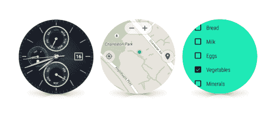

# Android Wear 的第二次重大更新即将到来:手势、WiFi 和未来几周更好的用户界面 

> 原文：<https://web.archive.org/web/https://techcrunch.com/2015/04/20/android-wears-second-big-update-is-coming-gestures-wifi-and-better-ui-coming-in-the-next-few-weeks/>

# Android Wear 的第二次大更新即将到来:手势，WiFi，以及未来几周更好的 UI

传言称 Android Wear 即将进行一次重大更新——果然，这样的更新已经正式开始了。

以下是新内容…

# 手腕轻弹手势:

将您的手腕轻轻移开，以查看下一张卡片或通知；朝你挥挥手回去。

# 表情符号绘画:

想要快速回复通知？如果有一两个表情符号就够了，你现在可以直接画出来。Android Wear 将尝试猜测你正在绘制哪个表情符号，并提供该表情符号作为回应。这似乎是对 Apple Watch 草图功能的一个有趣的、与平台无关的回应。

# 新的接口流程:

到目前为止，启动为 Android Wear 构建的第三方应用程序是一种痛苦——你要么必须通过语音，要么通过滑动和点击一系列菜单来完成。现在他们是焦点。从空闲/观看屏幕向左滑动将调出您的应用程序列表。再次向左滑动将显示联系人。第三次向左滑动会显示一系列操作，如“记笔记”或“设置计时器”，主要是为了提醒你可以通过“Ok，Google”命令用你的声音做些什么。

# 总是在应用程序上:

应用程序现在可以选择只要屏幕打开就让它保持活动状态，这对于健身追踪器之类的东西来说应该特别有用。以前，如果你有一段时间没有与它互动或足够移动你的手腕，屏幕会自动关闭；现在，当它认为你没在看时，屏幕会从彩色渐变为单色，但屏幕会保持打开，应用程序会保持活动状态。

# Wi-Fi 支持:

到目前为止，Android Wear 的通知或语音识别等功能只有在你的手表和手机足够接近蓝牙连接时才能工作。大多数 Android Wear 手表实际上都内置了 Wi-Fi——芯片只是一直处于非活动状态。随着这次更新，它开始运行。你的手机实际上可能在几英里之外——只要你的手机有数据，你的手表连接到 Wi-Fi，你的通知和回复就会在它们之间传递。

虽然我的 Moto 360 最近一直在积灰，但我对这次更新感到非常兴奋。我不确定我有多经常看到自己来回扭动手腕来控制设备——但我喜欢他们对新界面流所做的事情。至少粗略一看，这似乎是朝着让 Android Wear 更加直观和专注于应用的正确方向迈出的一步。

奇怪的是，LG 的手表 Urbane 将是第一款获得此更新的 Android Wear 手表。如果你使用的是不同的 Wear 手表，不用担心:谷歌表示，市场上所有的 Android Wear 手表都应该在“未来几周”内上市。