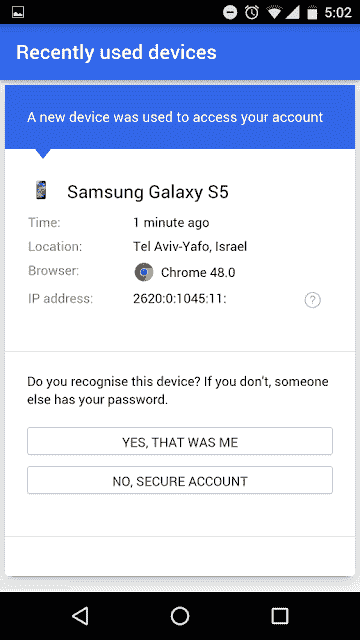

# Android 现在会在新设备添加到您的帐户时发送推送通知 

> 原文：<https://web.archive.org/web/https://techcrunch.com/2016/08/01/android-will-now-send-push-notifications-when-new-devices-are-added-to-your-account/>

# Android 现在会在新设备添加到您的帐户时发送推送通知

谷歌[今天为 Android 用户推出了一项新功能](https://web.archive.org/web/20221007170826/http://googleappsupdates.blogspot.com/2016/08/notifying-android-users-natively-when.html),旨在让他们的账户更加安全:关于新添加设备的通知。也就是说，当一个新设备被添加到你的 Google 账户时，你会在你当前的 Android 设备上收到一个关于安全事件的推送通知。通知会问“你刚签到了吗？”如果活动看起来可疑，你就可以立即采取行动。

为此，用户可以点击通知本身上的“查看帐户活动”选项，进入一个页面，在那里他们可以查看与他们的帐户相关联的最近使用的设备。该屏幕将显示使用的设备类型、时间、位置、IP 地址，甚至使用的浏览器。

在这里，你可以通过选择“是的，是我”来确认设备是否正常，或者如果你认为自己被黑客攻击或其他人正在使用你的密码，你可以点击“不，安全帐户”。

设备通知[于去年推出，](https://web.archive.org/web/20221007170826/http://googlesystem.blogspot.com/2015/05/google-sends-email-notifications-for.html)通过电子邮件通知。然而，根据谷歌的说法，通过推送通知提供这些信息，用户更有可能采取行动。事实上，该公司表示，与电子邮件通知相比，用户查看信息的可能性高达四倍。此外，这些警报将实时发出，因此用户将能够快速阻止他们的帐户受到威胁。

谷歌今天为用户帐户提供了其他安全功能，如两步验证和单点登录，但直到现在，它还没有原生的新设备提醒。然而，苹果多年来一直为[提供类似的新设备通知功能](https://web.archive.org/web/20221007170826/https://support.apple.com/en-us/HT204145)，当用户的 Apple ID 被用于登录他们不认识或最近没有登录的设备时，会通过电子邮件或通知提醒用户。

谷歌表示，新的 Android 功能将在未来两周内逐步向所有终端用户推出。