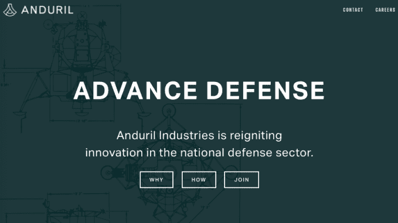
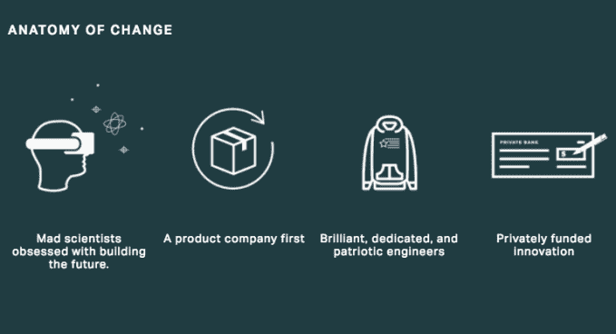

# Palmer Luckey 的新国防公司 Anduril 看起来对战场上的 AR 和 VR 感兴趣

> 原文：<https://web.archive.org/web/https://techcrunch.com/2017/10/19/anduril-trae-stephens-battlefield-vr-ar/>

帕尔默·卢奇的新国防初创公司 Anduril 的抱负远远超出了高科技边境墙。根据该公司网站及其招聘的新信息，Anduril 打算将其虚拟现实谱系应用于“士兵的实时战场意识”，以及其他以国防为中心的专业。

加州记录显示，该公司于今年 6 月注册成立，总部位于欧文市，在搬到脸书位于门洛帕克的家之前，欧文市是 Oculus 的前总部。在经历了[个月的争议](https://web.archive.org/web/20230321025142/https://techcrunch.com/2017/03/30/palmer-luckey-facebook/)后，Luckey 于今年三月离开了他联合创立的 VR 公司。

目前还不清楚 Luckey 将在 Anduril 扮演什么角色，但现在我们对球队有了更多的了解。LinkedIn 将前 Palantir 工程师 Matt Grimm、前 Oculus 制片人和产品负责人 Joseph Chen 以及 Founders Fund 合伙人兼前 Palantir 工程师 Trae Stephens 列为 Anduril 的联合创始人。

前 Oculus 工程师 Torin Herndon 也被列为 Anduril 工程师，于 9 月加入该公司。六月，前 Palantir 董事 Brian W. Schimpf 被 T2 列为 Anduril 的首席执行官。

## 安度瑞的优势

斯蒂芬斯尤其有能力争夺丰厚的政府合同:在被创始人基金管理合伙人彼得·泰尔选中后，他在特朗普政府中发挥了作用，监督国防部的过渡。据[政治](https://web.archive.org/web/20230321025142/http://www.politico.com/story/2017/02/donald-trumps-shadow-president-in-silicon-valley-235372)报道，斯蒂芬斯质疑改变国防部接受投标和授予合同的竞争性采购程序，这显然惹恼了五角大楼。

除了斯蒂芬斯，帕兰蒂尔的所有才华都非常有意义。帕兰提尔是安度瑞防御抱负的天然模型。这家通常行事隐秘的公司潜在价值超过 200 亿美元，拥有大量数据和以监控为重点的政府合同，与从三字母机构到 NYPD 的所有人都有关系。

## 安度瑞的愿景

8 月，Anduril 只有一个占位符网站，列出了一个信息电子邮件地址供查询。当时，Anduril、Luckey 和 Founders Fund 没有回应 TechCrunch 对该公司防御计划的评论请求，也没有就[高科技边境墙提案](https://web.archive.org/web/20230321025142/https://techcrunch.com/2017/07/31/anduril-palmer-luckey-smart-bill-hurd-border/)向立法者提供建议。

现在，网站有了显著的充实，有了一个标志和类似于使命宣言的东西，如果不是存在的理由的话。安杜洛宣称国防创新自冷战以来一直落后，并透露了一些具体目标:

> Anduril 正在私人资助和制造美国及其盟友迫切需要的产品:地面和总部士兵的实时战场意识，使我们在前线的男女士兵免受伤害的技术，以及确保我们领先于对手的许多其他技术。

Anduril 声称它是一家“以产品为中心”的公司，结合羽翼未丰的团队的集体经验，以及 VR 和 Palantir 更多面向数据和监控的产品之间的分裂，Luckey 的新项目的真实情况浮现出来。一幅插图强调了人们对 AR 和 VR 的剩余兴趣，描绘了一个戴着耳机的人，这与 Oculus 自己的产品没有什么不同。

正如一位与该公司创始人交谈过的消息人士告诉 TechCrunch，Luckey 的愿景似乎专注于将增强现实应用于国防。鉴于 Luckey 率先推出的大规模生产的消费级虚拟现实耳机的复杂性，很容易想象在不久的将来，负担得起的 AR 和 VR 会成为美国军方的标准配置。

根据 TechCrunch[7 月份报道的](https://web.archive.org/web/20230321025142/https://techcrunch.com/2017/07/31/anduril-palmer-luckey-smart-bill-hurd-border/)[招聘信息](https://web.archive.org/web/20230321025142/https://boards.greenhouse.io/anduril/jobs/734741)，安度瑞的其他关注领域包括计算机视觉、传感器融合、分布式计算基础设施、光学和摄像系统、激光雷达和雷达系统、机器人、自动化和航空设计。

对于战斗中的士兵来说，AR 可以提供重要的实时信息——或“战场意识”——这种平视显示器在军事视频游戏中随处可见，可以显示弹药、武器选择和目标信息。在战场之外，负担得起、随时可用的虚拟现实设备可以实现从逼真的任务模拟到无人机瞄准的一切。

当然，其中一些正在进行中。就在今年夏天，美国海军炮兵水手测试了用于战斗目的的增强现实耳机。“耳机无线连接到平板电脑，军官用它来引导炮手的注意力转向目标，并开始或停止射击，”[国防一号报道](https://web.archive.org/web/20230321025142/http://www.defenseone.com/technology/2017/07/us-navy-gunners-are-testing-wearable-heads-display/139644/)。线索和其他信息——红外图像、到目标的距离——出现在投射在护目镜上的平视显示器中自 2015 年以来，海军研究办公室在其[混合现实(BEMR)实验室](https://web.archive.org/web/20230321025142/https://www.onr.navy.mil/en/Media-Center/Press-Releases/2015/BEMR-New-Reality-for-Future-Force)中一直在研究消费者虚拟现实，如上图所示，美国军方的其他部门也在开发类似的项目。

## 近期和远期目标

Anduril 与现有军事项目的不同之处在于，该公司由一个人指导，他将虚拟现实设备带入主流，使它们既负担得起，又对消费者友好。当 Anduril 的网站断言该公司“资助和建立我们自己的技术”，并批评“定制技术的缓慢和昂贵的发展”减缓了国防创新时，很难不想到 Luckey 的 Oculus 努力。

脑机接口可能是 Anduril 和其他私人技术防御承包商的另一个巨大机会。今年早些时候在[接受 MoguraVR](https://web.archive.org/web/20230321025142/https://www.roadtovr.com/palmers-post-oculus-interview-part-3-neural-link-recording-memories-revolutionizing-vr/3/) 采访时，Luckey 分享了他自己对可以在人脑和我们控制的设备之间提供直接联系的设备的想法:

> 竞争即将从这项技术开始。许多人将竞相制造 BCI[脑机接口]，让人们只用大脑就能移动虚拟物体。目前可供消费者使用的 BCI 设备不处于可用状态。实验室里的 BCI 装置非常不同。如果有人能制造出一种通用的 BCI 设备来出售，世界将会改变。

当被问及他目前的项目时，Luckey 补充道:

“目前我什么也不能说。我唯一能说的是，我正试图再次改变虚拟现实。”

*更新:Luckey 向 TechCrunch 澄清，他对 MoguraVR 的采访被从英语翻译成日语，然后又翻译回英语，在这个过程中，他丢失了部分原文。他指出，这些引用“接近正确”，但并不准确。*