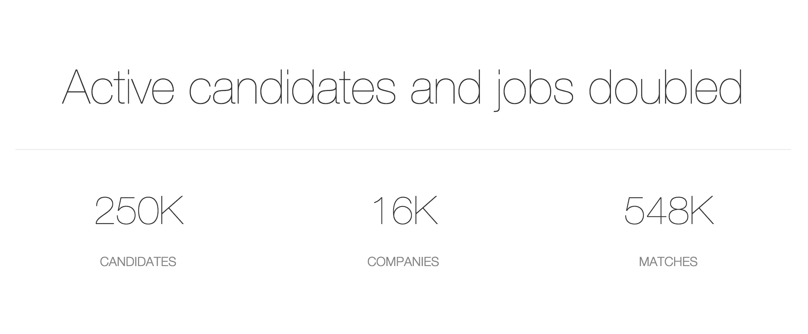

# AngelList 在 2015 年为初创公司筹集了 1 . 63 亿美元，同比增长 56%

> 原文：<https://web.archive.org/web/https://techcrunch.com/2016/02/08/angellist-raised-163m-for-startups-in-2015-up-56-year-over-year/>

# AngelList 在 2015 年为初创公司筹集了 1 . 63 亿美元，同比增长 56%

AngelList 是一个在线平台，对于早期创业公司的融资和招聘来说，它是不可或缺的，[表示，去年它代表 441 家公司在网上筹集了 1.63 亿美元。](https://web.archive.org/web/20221222010212/https://angel.co/2015/)这比 2014 年的[高出了约 56%。](https://web.archive.org/web/20221222010212/https://angel.co/2014)

约 40%的交易是私人融资，机构基金也参与了约 40%的融资。

AngelList 一直在用两种不同的策略培养投资来源。一方面，他们引入了个人投资者的辛迪加，这些投资者可以引入外部资本，就好像他们正在进行更大规模的风险投资公司式的投资一样。今年有 170 个辛迪加，包括像吉尔·潘奇纳和塞米·沙阿这样的天使投资人。

另一方面，AngelList 也一直在开发为其平台定制的基金。最早的是 Maiden Lane，但该公司今年升级了游戏，获得了中国最大的私募股权公司之一的 4 亿美元种子基金 CSC Upshot。

AngelList 产品的另一个关键部分是招聘元素。该公司不仅提供资金，还匹配潜在的雇员。今年，活跃的候选人和职位列表翻了一番，产生了 250，000 个候选人和 548，000 个匹配。

 

对于技术人员来说，Javascript 是最受欢迎的技能，其次是 Java、HTML、Python 和 C++。
