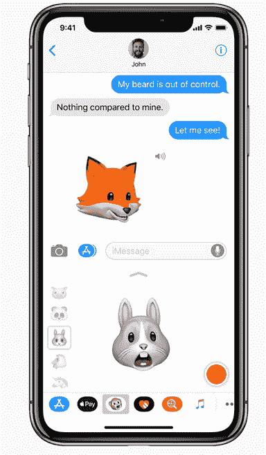
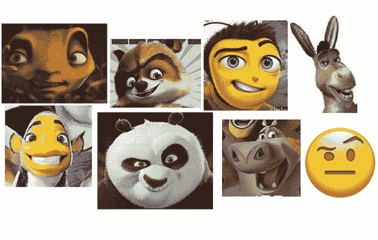

# Animoji 很蠢，我讨厌他们

> 原文：<https://web.archive.org/web/https://techcrunch.com/2017/09/12/animoji-are-dumb-and-i-detest-them/>

苹果公司今天宣布[数字版的歌唱电报](https://web.archive.org/web/20230315095319/https://techcrunch.com/2017/09/12/iphone-x-animoji/)，这是表情符号概念的曲解，体现了该公司最糟糕的排外哲学以及最糟糕的 CG 动物和排泄物。Animoji 是愚蠢的，我讨厌他们。原因如下。

#### 1.表情符号的含义来自上下文，而不是表达

为什么表情符号已经成为数字信息世界的通用语，甚至是国际语言？这并不是因为他们非常情绪化。事实上，剪贴画的风格几乎是平淡无奇的。但正是这种温和赋予了他们多才多艺的力量。

这💁‍♀️女士应该是坐在问讯处的人。但是她空洞的凝视和轻率的手势可能同样容易意味着一百件其他事情，从提供东西到耸肩到问“好吗？!"这取决于用户创造环境，赋予表情符号以意义。即使是特定的面孔和情绪也很大程度上取决于如何使用它们。

3D 狐狸脸做鬼脸就是 3D 狐狸脸做鬼脸。没有潜台词(也许除了~~布莱德利·库珀~~杰森·贝特曼)，没有创造，没有解释。只是一个花哨的面具。

#### 2.表情符号标准给了我们一种共享的视觉语言，而 animoji 没有

但这只在我们都看到同样的东西时有效。苹果似乎并不在乎这些。还记得他们试图杀死🍑把它变成一个奇怪的粉红色椰子？[我没忘记。](https://web.archive.org/web/20230315095319/https://techcrunch.com/2016/11/01/apple-give-me-back-my-emoji/)

《疯狂动物城》是一部好电影，但这救不了 Animoji。

只有当我们确切地知道另一端的人会看到什么时，我们才能成功地赋予这些符号我们想要的含义。这是一种不完美的情况，因为跨平台的表情符号可能会产生问题，但因为苹果采用的表情符号已经成为事实上的标准，所以使用它们通常至少是一种选择。这创建了一个强大而广泛的共享词典，它在大多数平台上的行为是可预测的。

Animoji 在这个平台中并不存在，但是他们模仿它是为了从它身上榨取合法性。但别搞错了，这些不是表情符号。这是苹果的产品，他们不打算分享。这种奇妙的进步将被永远锁定在 iMessage 中。

#### 3.这是有钱精英的玩具

每当你看到一个 animoji，想象一个挂在旁边的 1000 美元的小标签，真实地摇摆着。因为除了四位数俱乐部没人能使用它们。

像往常一样，在消费电子领域，最前沿的技术被用于最琐碎的目的。人们愿意支付如此高的价格来获得如此不起眼的玩具，并渴望展示它们。

当你不可避免地收到 150 兆字节的信息更新时，请记住这一点，并像燃烧的煤炭一样将愤怒藏在心中。

#### 4.他们看起来像世纪之交的坏 CG

 真的有人喜欢安茨吗？对 90 年代末和 21 世纪初说“世纪之交”很奇怪吗？这是不是很奇怪，这个功能的目标人口统计甚至没有出生时，安茨出来了？

#### 5.我讨厌乐趣

不能接受的是，苹果或其他任何人创造了一种表达形式，这种表达形式与我关于人们应该如何交流的僵化观念相冲突。技术是严肃的事情，面部识别技术的这种轻松应用没有它的位置。

你可能已经猜到了，我只是半认真的。我认为数字表达的新形式是有趣和值得称赞的——我是 Snapchat 媒体实验的忠实粉丝，希望其他人也能像它一样冒险。

但我也认为，表情符号的最大价值来自第一条和第二条所述的原因，苹果一直致力于在其他免费、可靠、安全的信息应用面前，巩固其对用户的控制，而不是扩大表情。该公司的理念不是开放，无论我在哪里看到它，我都反对。(我也是看到哪里都反对安茨。)

表情符号是每个人都有的，这就是为什么每个人都使用它们。如果一些表情符号(或类似表情符号)只适用于某些人，那么在我看来这是错误的做法。