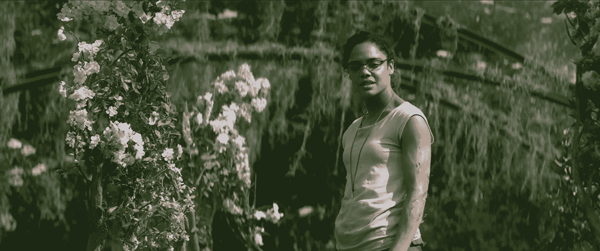

# 《毁灭》是一个令人不安的科幻狂热梦想

> 原文：<https://web.archive.org/web/https://techcrunch.com/2018/02/23/annihilation-review/>

编剧兼导演[亚历克斯·嘉兰](https://web.archive.org/web/20230328183314/https://www.tor.com/2016/07/26/alex-garland-annihilation-movie-interview-adaptation/) 曾表示，他改编的*毁灭*并不是对这本书的直接复述——相反，他将其描述为“忠实于我对这部小说的主观反应。”

这是一个合理的警告:这部电影的细节与杰夫·范德米尔写的书并不相符。然而，随之而来的是恐惧和不安；这部小说的读者和这部电影的观众都会感到一种无处不在的不适，他们无法确切地说出这种不适。

电影开始时，娜塔莉·波特曼扮演的生物学家从 X 区回来了，这是一片隐藏在一道名为微光的屏障后面的神秘荒野。探险队的其他成员还没有回来，生物学家似乎不确定他们是否还活着。

这部电影的其余部分(今天在美国影院上映，然后在网飞国际直播之前)填充了微光之外发生的细节，以及为什么波特曼的角色首先觉得必须加入探险队。

在某些方面，加兰的情节比范德米尔的更直截了当。这部电影的科学家遵循一个更连贯的计划，比他们在书中做的更向前运动，并且猎杀他们的怪物更传统可怕。

但是电影《T2》给人的感觉很少是传统的。故事情节似乎远没有关于自我毁灭和改变的长篇对话重要，倒叙了波特曼与奥斯卡·伊萨克饰演的一名士兵的婚姻，以及光线怪异的棱镜性质。

我承认加兰从来都不是一个特别含蓄的作家。《28 天后》、[、*、*、*德雷德*(所有电影都是他写的)中的角色倾向于相当公开地讨论电影的大创意，就像他们在](https://web.archive.org/web/20230328183314/https://techcrunch.com/2017/09/04/ten-years-later-sunshine-remains-one-of-the-bleakest-and-most-beautiful-sci-fi-movies-ever-made/)[他的导演处女作中所做的那样。在*湮灭*中也是如此，尽管这里的争论少了，沉思多了。](https://web.archive.org/web/20230328183314/https://techcrunch.com/2015/03/16/swipe-right-on-ava/)

让这部电影令人兴奋甚至大胆的是加兰和他的团队为这些想法找到的视觉形式。X 区的植物和动物已经发生了变化，不同的物种和特征混合在一起，有时美丽，有时令人厌恶，通常两者兼而有之——《毁灭》中有相当一部分怪物和尸体，它们是我见过的最好看的怪物和尸体。

【YouTube https://www.youtube.com/watch?v=89OP78l9oF0&w=560&h=315]

在不透露太多的情况下，我可以说，在电影的结尾，我们确实对我们所看到的怪异现象有了一些解释。这些解释很好，但是我们发现它们的方式——走过一片水晶树林，穿过一堆苍白的树枝，潜入一个黑暗的洞，在那里事情变得非常奇怪——更令人难忘。

不是每个人都会喜欢《毁灭战士》，不仅仅是因为这是一部奇怪的电影。它也有一些真正的缺陷。

例如，即使在这本书里，几个探险队成员也觉得自己被勾勒了进去，但我仍然希望他们在这里更令人难忘，而且领导团队的诡计多端的心理学家已经完整地完成了她的故事的过渡。与此同时，艾萨克给了他的角色一种令人信服的闹鬼的特质——但出于某种原因，他试图摆脱一种不稳定的南方口音，这种口音成了一种巨大的干扰。最终，我不确定电影最后一幕的揭露是否合理。

但是当我离开放映的时候，我什么都没想。相反，至少有几分钟，我周围的世界真的感到不安。光线似乎有点暗，我担心在我的地铁乘客同伴的皮肤下潜伏着奇怪的突变。X 区比我想象的要近。

