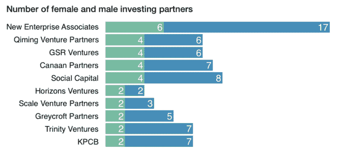
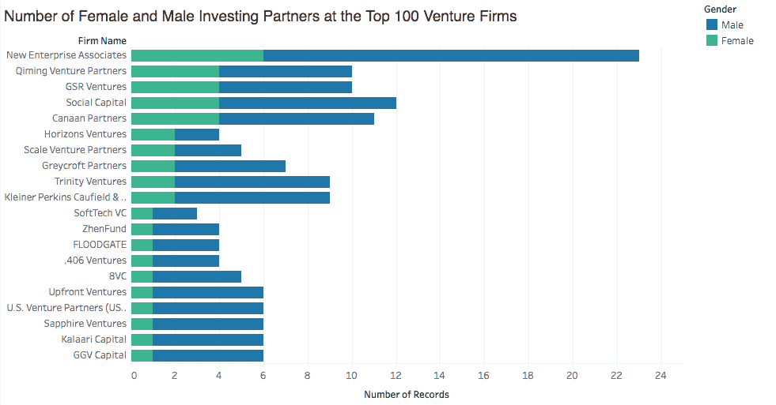
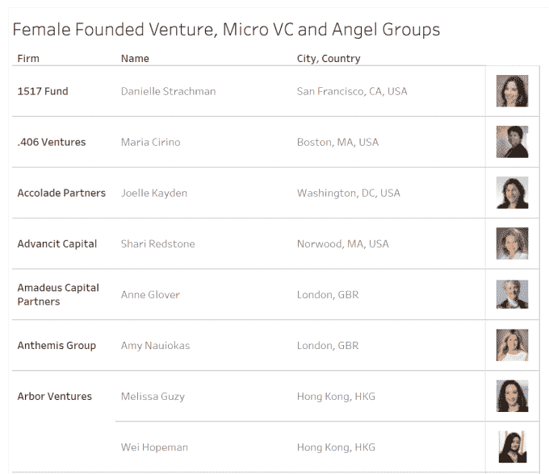
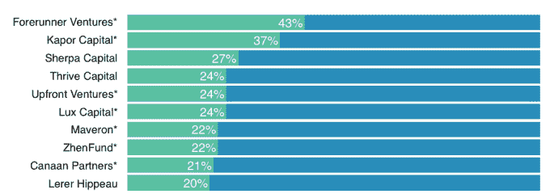
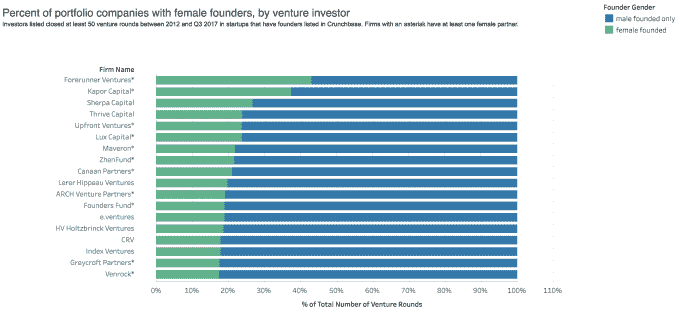
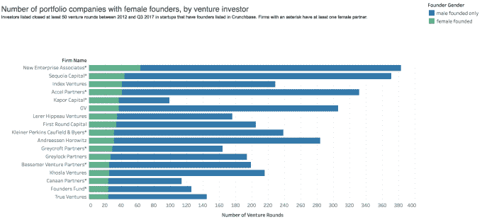
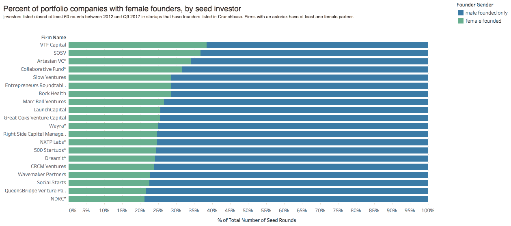

# 宣布 2017 年 Crunchbase 女性创业报告更新

> 原文：<https://web.archive.org/web/https://techcrunch.com/2017/10/04/announcing-the-2017-update-to-the-crunchbase-women-in-venture-report/>

More posts by this contributor

内德·德斯蒙德是 TechCrunch 的首席运营官。从 2012 年 4 月到 2015 年 9 月，他还负责 Crunchbase，当时 Crunchbase 从美国在线/威瑞森剥离出来，成为一家独立的风险投资公司。

More posts by this contributor

在第一份 [Crunchbase 女性风险投资报告](https://web.archive.org/web/20230320185346/https://techcrunch.com/2016/04/19/the-first-comprehensive-study-on-women-in-venture-capital/)(2016 年 4 月)中，我们的目标是建立一个明确的基线，用于衡量女性在风险投资业务中的未来进展。当时的关键发现是，在排名前 100 的风险投资公司中，7%的投资合伙人是女性。

在那份报告发表后的 18 个月里，硅谷经历了前所未有的动荡，此前一系列关于性别歧视、薪酬歧视和对女性性骚扰的公开披露曝光。作为回应，许多投资公司和创业公司已经采取措施改善行为以及员工队伍的多样性。

随着 2017 年接近尾声，Crunchbase 决定重新应用 2016 年报告中的方法，看看有哪些进展(如果有的话)是可以衡量的。接下来是从更新的分析中得到的一些令人鼓舞的结果，以及对在风险投资等式中对女性产生最大影响的公司的详细分析。

以下是一些最值得注意的要点:

*   在排名前 100 的风险投资公司中，女性合伙人的比例从 7%上升到 8%，增幅为 17%。
*   前 100 名中有 8 家公司首次增加了女性合伙人。
*   如今，女性在加速器和企业风险投资公司中占据了 15%的合伙人职位，比 18 个月前提高了 25%。
*   在过去的三年里，女性创建了 16 个微型风险基金，占该类别所有新公司的 21%。
*   2012 年至 2017 年第三季度，全球 10%的风险投资流向了至少有一名女性创始人的创业公司。
*   2012 年至 2017 年第三季度，全球 16%的种子资金流向了至少有一名女性创始人的创业公司。

## 方法学

对于 Crunchbase 的第二份女性创业报告，Crunchbase 分析团队遵循了与最初报告相同的分析思路。

首先，我们开始确定 100 家顶级风险投资和微型风险投资公司中有多少女性投资合伙人。第二，我们研究了哪些风险投资和微型风险投资公司在支持至少有一名女性联合创始人的初创公司方面有着最好的记录。

为了回答第一个问题，我们首先回顾了全球 100 强风险投资公司的名单。我们回顾了我们的 100 强名单，以确保我们代表了近年来引领早期风险投资的更活跃的公司。作为这一分析的结果，21 家新公司加入了本报告的前 100 家公司。 ² 这些公司中的大多数都在美国以外运营，这与我们在欧洲和亚洲看到的风险投资活动的增长是一致的。

接下来，我们查看了这些公司中被列为“合伙人”的所有男性和女性，并对名单进行了筛选，以确保他们是真正的“全职投资合伙人”，在我们的定义中，这意味着有权投资合伙企业的资金。我们排除了许多拥有“合伙人”头衔但不投资的员工。我们排除了高级但不属于投资方的职位，包括首席财务官、首席运营官、法律总顾问和有限合伙人管理人员。我们还排除了人才、规模和投资组合公司营销支持的其他运营角色。

## 主要发现

一旦我们仔细查看了前 100 家风险公司的数据，我们发现 8%的合伙人，即 752 人中的 64 人是女性。这标志着比我们在 2016 年 4 月报告的 54 名女性投资合伙人提高了 17%，这是一个明显的进步，尽管非常温和。在我们更新的名单中，有 58 家风险公司没有女性合伙人，这比 18 个月前的 62 家有所改善。

> 前 100 家风险投资公司中有 8%的合伙人是女性，比 18 个月前增加了 17%。

我们还研究了哪些公司拥有最多的女性风险合伙人。在 42 家公司中排名最高的是 NEA (6 家)、祁鸣风险投资公司(4 家)和 GSR 风险投资公司(4 家)，这三家公司都位于中国，还有迦南风险投资公司(4 家)和社会资本公司(4 家)。另有 5 家公司有两名投资合伙人，32 家公司只有一名女性投资合伙人。

自我们上次报告以来，首次引入女性合伙人的公司包括 Atomico、Benchmark、Bessemer Venture Partners、Lightspeed Venture Partners、Lux Capital、Northzone、Sequoia Capital 的美国团队以及 Versant Ventures。

当我们观察前 100 名投资合伙人中的男女比例时， [Horizons Ventures](https://web.archive.org/web/20230320185346/https://www.crunchbase.com/organization/horizons-ventures) 名列榜首，四名合伙人中有 50%是女性。百强企业中还有 6 家拥有 30%或以上的女性合伙人，包括 [规模创业合伙人](https://web.archive.org/web/20230320185346/https://www.crunchbase.com/organization/scale-venture-partners)[GSR Ventures](https://web.archive.org/web/20230320185346/https://www.crunchbase.com/organization/gsr-ventures-management#/entity)[祁鸣创业合伙人](https://web.archive.org/web/20230320185346/https://www.crunchbase.com/organization/qiming-venture-partners#/entity)[迦南合伙人](https://web.archive.org/web/20230320185346/https://www.crunchbase.com/organization/canaan-partners)[社会资本这七家公司中的两家，Horizons Ventures 和 Scale Venture Partners，是由妇女创办的。女性合伙人比例最高的七家公司中，有三家位于香港或中国内地。](https://web.archive.org/web/20230320185346/https://www.crunchbase.com/organization/social-capital)

下面是根据女性合伙人的数量和女性合伙人的比例对前 100 家公司进行排名的图表。

*此处见互动图[。](https://web.archive.org/web/20230320185346/https://news.crunchbase.com/news/announcing-2017-update-crunchbase-women-venture-report/)*

*此处见互动图[。](https://web.archive.org/web/20230320185346/https://news.crunchbase.com/news/announcing-2017-update-crunchbase-women-venture-report/)*

作为对我们前 100 家公司数据的检查，我们还查看了全球风险和微型风险公司的综合列表，包括 Crunchbase 中所有在 2017 年活跃的公司。当我们将“投资合伙人”标准应用于这 658 家公司时，我们发现 9%的合伙人是女性，比 18 个月前的 8%有所上升。这一结果表明，顶级公司的模式在整个行业都具有代表性。

尽管这种速度的改善可能看起来很缓慢，但有迹象表明，风险世界中一些有趣的领域发生了更快的变化。例如，新公司中女性合伙人的比例要高得多。根据 Crunchbase 的数据，在过去三年中，21%的新成立的风险和微型风险公司，总共 16 家公司，至少有一名女性创始人。这几乎是前 100 家公司的 3 倍。这种趋势在微型风险投资公司中尤为明显，许多都是由著名的女性风险投资人创办的，包括牛仔风险投资公司的[艾琳·李](https://web.archive.org/web/20230320185346/https://www.crunchbase.com/person/aileen-lee#/entity)、珀金斯基金公司的[索尼娅·珀金斯](https://web.archive.org/web/20230320185346/https://www.crunchbase.com/person/sonja-perkins)、T4 的 Theresia Gouw 以及 Aspect Ventures 公司的[詹妮弗·丰斯塔德](https://web.archive.org/web/20230320185346/https://www.crunchbase.com/person/jennifer-scott-fonstad)，她们离开老牌风险投资公司创办自己的公司。反过来，这些女性创始合伙人显然更倾向于雇佣女性合伙人。在至少有一名女性联合创始人的 63 家活跃公司中，平均 44%的投资合伙人是女性。

## 妇女创办的投资公司

*这里见互动图[。](https://web.archive.org/web/20230320185346/https://news.crunchbase.com/news/announcing-2017-update-crunchbase-women-venture-report/)*

我们还重新审视了企业风险场景中的数据。2017 年活跃的 40 家企业风险投资机构和 87 家加速器显示，女性合作伙伴的收益显著增加。在加速器和企业风险投资公司中，女性占合伙人职位的 15%，比我们 2016 年报告中的 12%增加了 25%。

> 在加速器和企业风险投资公司中，女性现在占据了 15%的合伙人职位，在 18 个月内提高了 25%。

最后，我们还审查了 Crunchbase 的 459 家公司的女性就业情况，这些公司拥有庞大的团队并且非常活跃。现在，女性在投资团队的助理、副总裁和负责人级别的职位中占 25%，高于 2016 年的 22%。投资团队中初级职位女性人数的增加预示着行业的良好发展。

#### 女性投资人会投资女性创始人吗？

根据我们最近的分析，Crunchbase 报告称，在 2009 年至 2017 年期间，至少有一名女性创始人的受资助创业公司的比例从 9%增加到 17%。 ³ 我们之前得出结论，女性创始人在融资方面逐渐表现得更好。这些数据也引发了一些相关的问题。例如，一些风险公司是否比其他公司更有可能资助女性企业家？

与这个问题相关的是，风险企业中女性投资伙伴的存在会增加投资女性创始人的可能性吗？由于 Crunchbase 拥有强大的女性创始人和投资合伙人数据集，这些问题的答案触手可及。

### 投资女性创办的创业公司

2012 年至 2017 年第三季度，全球 10%的风险投资，总计 459 亿美元，流向了至少有一名女性创始人的创业公司。这代表了 4600 轮融资，占 Crunchbase 中列出的创始人的所有风险融资轮次的 13%。

在同一时期，全球 16%的种子/天使基金，总计 39 亿美元的基金，报告了至少一名女性创始人。这代表了 7300 轮，占创始人所有种子轮的 18%。

这些数字为未来的分析建立了重要的指导方针，并帮助我们了解哪些公司更倾向于资助女性企业家。

### 对女性领导的创业公司的风险投资

为了更深入地了解投资女性创始人的风险公司，我们编制了一份在 2012 年至 2017 年第三季度期间投资至少 50 家公司的公司名单，以确定哪些公司在对女性创始人的风险投资中超过了前 100 名的 13%。(我们只研究了那些我们能为公司投资组合找到至少 75%创始人的公司。)

名列前茅的是两家拥有女性风险合伙人创始人的公司，分别是 Forerunner Ventures(22 家公司中的 43%)的 Kirsten Green 和 Kapor Capital (37 家公司中的 37%)的 T2 Freada Kapor。其他指数过高的公司包括 Sherpa Capital 27%(23 家)，profront Ventures 24%(20 家)，Thrive Capital 24%(17 家)，Lux Capital 24%(15 家)，Maveron 22%(16 家)，Zhen fund 22%(18 家)，Canaan Partners 21%(24 家)，Lerer Hippeau Ventures 20%(35 家)。在这八家公司中，有五家拥有女性投资合伙人，包括 Lux Capital、Upfront Ventures、Maveron、Canaan Partners 和 ZhenFund。

女性创办的公司数量最多的前六家公司，按降序排列，分别是拥有 63 家投资组合公司的 New Enterprise Associates、拥有 44 家公司的 Sequoia Capital、拥有 41 家公司的 Index Ventures、拥有 41 家公司的 Accel Partners、拥有 37 家公司的 Kapor Capital 和 GV。在这六家公司中，有四家有全职女性投资合伙人，即 New Enterprise Associates、Sequoia Capital、Accel partners 和 Kapor Capital。

虽然这些数字可能表明女性企业的存在与对女性音响师的更多投资之间存在某种关联，但在更大的数据画面中，还没有明确的关联。与有女性合伙人的团队相比，全男性公司为女性创始人提供的融资轮数平均没有区别。然而，有明确的证据表明，拥有女性创始人和/或女性合伙人比例异常高的少数风险企业对女性企业家的投资水平较高。

下面的图表按百分比和轮次排列了投资女性创始人的名人录。根据我们的定义，我们把任何至少有一名女性联合创始人的公司都算作女性创立的公司。

#### 对女性领导的创业公司的风险投资

*这里见互动图[。](https://web.archive.org/web/20230320185346/https://news.crunchbase.com/news/announcing-2017-update-crunchbase-women-venture-report/)*

*这里见互动图[。](https://web.archive.org/web/20230320185346/https://news.crunchbase.com/news/announcing-2017-update-crunchbase-women-venture-report/)*

### 对女性领导的创业公司进行种子投资

我们对种子投资者进行了同样的分析，如上所述，Crunchbase 所有轮次中约有 18%流向了女性创始人的公司。我们研究了在 2012 年至 2017 年第三季度之间完成至少 60 轮融资的公司，这些公司的创始人至少有 75%能够在 Crunchbase 中找到。

指数超过 30%的公司包括拉斯维加斯的 VTF 资本公司(45 家投资公司)，SOSV 公司(174 家)，悉尼的 Artesian VC 公司(28 家)和纽约的 Collaborative Fund 公司(24 家)。指数超过 25%的公司包括 Slow Ventures，29%(49)，Rock Health，29%(18)，Entrepreneurs Round Table，28%(32)，Marc Bell Ventures，27%(36)，Great Oaks Venture Partners，26%(50)，LaunchCapital，25%(23)，Wayra，25%(74)，Right Side Capital Management，25%(49)。如下图所示，这些活跃的种子投资者大多没有女性投资伙伴。

数量最多的公司包括 500 Startups 和 254 家公司，Y Combinator 和 187 家，SOSV 和 174 家，初创公司 Chile 和 94 家，Wayra 和 Startupbootcamp 分别为 74 和 54 家。

在女性创始人的创业公司中，总轮次比例最高的三个轮次中的两个——自动风投和合作基金——都有女性合伙人。另一方面，首轮最活跃的五家种子投资者——500 Startups、Y Combinator、初创企业 Chile、Wayra 和 startup boot camp——都至少有一名女性投资伙伴。

下面的图表按百分比和整数排列了种子公司对女性创业者的投资。上市公司在 2012 年至 2017 年第三季度之间进行了 60 次或更多的投资。

*这里见互动图[。](https://web.archive.org/web/20230320185346/https://news.crunchbase.com/news/announcing-2017-update-crunchbase-women-venture-report/)*

*这里见互动图[。](https://web.archive.org/web/20230320185346/https://news.crunchbase.com/news/announcing-2017-update-crunchbase-women-venture-report/)*

总之，数据显示出一些温和的好消息，即越来越多的女性加入了风险合伙企业的行列，人们强烈感觉到，新的基础，即女性创办风险企业的增加，将在未来几年加速这一趋势。

*插图:[李安妮·迪亚斯](https://web.archive.org/web/20230320185346/https://www.liannedias.com/)。感谢[安吉拉·彭](https://web.archive.org/web/20230320185346/https://www.crunchbase.com/person/angela-peng#/entity)为这篇报道制作了表格。*

这份报告于 10 月 4 日在佛罗里达州奥兰多举行的[格蕾丝·赫柏 2017 大会](https://web.archive.org/web/20230320185346/https://ghc.anitab.org/2017-connect-with-abi/)上发布。

#### 脚注

1.  为了对前 100 家公司进行基准测试，我们审查了以下活动:基金规模、过去五年的投资节奏、领先的早期 A & B 回合数以及 2017 年的活跃程度。
2.  21 家新公司加入了该报告的前 100 家公司。它们包括 406 Ventures、8VC、Alven Capital、Atomico、Creandum、F-Prime Capital Partners、Global Founders Fund、GSR Ventures、高科技 Gruenderfonds、Horizons Ventures、Jerusalem Venture Partners、Kalaari Capital、Legend Capital、Magma Venture Partners、Northern Light Venture Capital、incidence Capital、Pelion Venture Partners、Sapphire Ventures、Seventure Partners、顺为资本和 ZhenFund。基于以下因素，以下公司没有上榜:公司要么在 2017 年没有以同样的速度投资，要么没有领导早期阶段的融资。这些公司包括 Atlas Venture、Avalon Ventures、Azure Capital Partners、BlueRun Ventures、Correlation Ventures、Dag Ventures、Domain Associates、ff Venture Capital、Flagship Ventures、Flybridge Capital Partners、Formation 8、iNovia Capital、InterWest Partners、North Bridge Venture Partners、Oak Investment Partners、Octopus Ventures、Pritzker Group Venture Capital、SV Angel、Technology Crossover Ventures、Ventech 和 Wellington Partners。
3.  对于至少有一名女性创始人的公司，三分之一是由只有女性创始人的团队组成的。另外三分之一是由两位联合创始人组成的团队，其中包括一男一女。最后三分之一代表有 3 名以上联合创始人且至少有一名女性创始人的团队。因此，这些初创企业中有三分之二的女性和男性创始人占多数或比例相等。

*这个故事更新于 2017 年 10 月 4 日，以反映我们错误地计算了迦南的女性投资合伙人。正确的数字是四个，不是我们最初报告的三个。
SOSV 于 2017 年 10 月 17 日加入种子投资排行榜。*