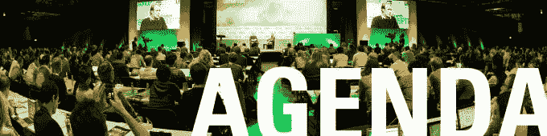

# 宣布 Disrupt SF 2016 议程 

> 原文：<https://web.archive.org/web/https://techcrunch.com/2016/08/22/announcing-the-disrupt-sf-2016-agenda/>

我们很高兴宣布【TechCrunch Disrupt SF 的完整议程。该节目将于 9 月 10 日至 14 日播出，并将重返精彩的 48 号码头场馆。普通入场券和参展商套票仍然有售。

该活动为期五天，我们将在 Disrupt 舞台上展示硅谷的精华，庆祝创业和技术。

硅谷先驱[马克·安德森](https://web.archive.org/web/20230209131051/https://www.crunchbase.com/person/marc-andreessen#/entity)、[马克·贝尼奥夫](https://web.archive.org/web/20230209131051/https://www.crunchbase.com/person/marc-benioff#/entity)和[雷德·霍夫曼](https://web.archive.org/web/20230209131051/https://www.crunchbase.com/person/reid-hoffman#/entity)将回到 Disrupt 舞台谈论他们最新的创业。David Sacks[将会就四面楚歌的 zene fits](https://web.archive.org/web/20230209131051/https://www.crunchbase.com/person/david-sacks#/entity)[的下一步行动发表演讲，Jeff Lawson](https://web.archive.org/web/20230209131051/https://www.crunchbase.com/organization/zenefits) 将会坐下来讨论 Twilio 的首次公开募股。我们有谷歌的黛安·格林为谷歌的云计算平台辩护。

美国国防部长阿什·卡特将加入 TechCrunch 的马特·伯恩斯的讨论，重新定义国防。谷歌公司的美国首席技术官梅根·史密斯和 T21 以及科技博客 TechCrunch 的凯特·康格坐在一起讨论政府中的先进技术。这应该是一次精彩的会议。自从 Smith 和 Macgillivray 加入白宫以来，他们两人已经帮助小企业主和初创公司创始人消除了绘制大数据和人工智能未来的繁文缛节。

金州勇士队和卫冕 NBA 最有价值球员[斯蒂芬·库里](https://web.archive.org/web/20230209131051/https://www.crunchbase.com/person/stephen-curry#/entity)正在谈论投资运动和他最喜欢的社会影响组织 [Nothing But Nets](https://web.archive.org/web/20230209131051/http://nothingbutnets.net/) 。

脸书的首席信使[大卫·马库斯](https://web.archive.org/web/20230209131051/https://www.crunchbase.com/person/david-marcus#/entity)要来聊一聊。硅谷的 [迈克·詹郅](https://web.archive.org/web/20230209131051/https://www.crunchbase.com/person/mike-judge#/entity)正在回归颠覆阶段。上次他来的时候，他在科技上的讽刺节目刚刚结束了第一季，花衣魔笛手赢得了初创公司战地。从那以后，角色和公司都发生了很大的变化。未来派著名作家尼尔·斯戴普亨森将讲述他的新书，并留下来为粉丝签名。

几个令人惊叹的小组已经提上日程。所有的法律都是注定要被打破的吗？这是我们将向来自[通用催化剂](https://web.archive.org/web/20230209131051/https://www.crunchbase.com/organization/general-catalyst-partners)、[图斯克风险投资](https://web.archive.org/web/20230209131051/https://www.crunchbase.com/organization/tusk-ventures)和 [A16z](https://web.archive.org/web/20230209131051/https://www.crunchbase.com/organization/andreessen-horowitz) 的小组成员提出的问题。TechCrunch 的 Sarah Buhr 还将与来自 [Naya Health](https://web.archive.org/web/20230209131051/https://www.crunchbase.com/organization/naia-health) 的 [Janica Alvarez](https://web.archive.org/web/20230209131051/https://www.crunchbase.com/person/janica-alvarez) 、来自 [Fertility IQ](https://web.archive.org/web/20230209131051/https://www.crunchbase.com/organization/fertilityiq) 的 [Deborah Anderson-Bialis](https://web.archive.org/web/20230209131051/https://www.crunchbase.com/person/deborah-anderson-bialis) 以及来自 [Clue](https://web.archive.org/web/20230209131051/https://www.crunchbase.com/organization/clue-app) 的 [Ida Tin](https://web.archive.org/web/20230209131051/https://www.crunchbase.com/person/ida-tin) 一起主持一场关于尝试增强健康的创业会议。

当然，机器人是未来，所以有很多人来扰乱科幻小说。来自[的 Melonee Wise](https://web.archive.org/web/20230209131051/https://www.crunchbase.com/organization/fetch-robotics)Fetch Robotics 即将为仓库中的机器人做准备。 [Boston Dynamic](https://web.archive.org/web/20230209131051/https://www.crunchbase.com/organization/boston-dynamics#/entity) 的创始人兼首席执行官 [Marc Raibert](https://web.archive.org/web/20230209131051/https://www.crunchbase.com/person/marc-raibert) 将演示 [SpotMini](https://web.archive.org/web/20230209131051/https://www.youtube.com/watch?v=tf7IEVTDjng) 并解释为什么世界需要机器狗。

最重要的是，创业战场上有 23 家令人惊叹的年轻公司将竞争赢得令人垂涎的 Disrupt Cup 和 5 万美元。

我们希望你能亲自参加演出。[普通入场券](https://web.archive.org/web/20230209131051/https://techcrunch.com/event-info/disrupt-sf-2016/#tickets)还有。还有[展览套餐](https://web.archive.org/web/20230209131051/https://techcrunch.com/event-info/disrupt-sf-2016/#tickets)可以让你的创业公司或公司在创业巷的活动中，在所有扰乱参与者面前亮相。

*如果您对未来的赞助机会感兴趣，请联系我们的[赞助团队](https://web.archive.org/web/20230209131051/http://beta.techcrunch.com/)。一如既往，我们希望听到你的声音。有问题吗？评论？给我们发电子邮件到 tips@beta.techcrunch.com。*

**议程| 9 月 12 日星期一**

上午 9:00-9:05
开场白

上午 9:05-9:25
与[大卫·马库斯](https://web.archive.org/web/20230209131051/https://www.crunchbase.com/person/david-marcus) (Facebook Messenger)一起生活在文字泡泡里

上午 9:25–9:45
幻想与[杰森·罗宾斯](https://web.archive.org/web/20230209131051/https://www.crunchbase.com/person/jason-robins#/entity) (DraftKings)一起实现

上午 9:45-10:05
计算科技公司的数字[贾格尔·麦康奈尔](https://web.archive.org/web/20230209131051/https://www.crunchbase.com/person/jager-mcconnell#/entity)

上午 10:05-10:30
快速调节，不要弄坏东西:[梅根·史密斯](https://web.archive.org/web/20230209131051/https://www.crunchbase.com/person/megan-smith)和[亚历山大·麦克吉利夫雷](https://web.archive.org/web/20230209131051/http://Fireside%20Chat:%20<a%20href=%22https://www.crunchbase.com/person/megan-smith%22%20target=%22_blank%22>%20Megan%20Smith%20</a>%20and%20<a%20href=%22https://www.crunchbase.com/person/alexander-macgillivray#/entity%22%20target=%22_blank%22>%20Alexander%20Macgillivray%20</a>%20(United%20States%20of%20America))(美国政府)

上午 10:30-10:50
与[摩根·德本](https://web.archive.org/web/20230209131051/https://www.crunchbase.com/person/morgan-debaun#/entity) (Blavity)一起重塑相关性

上午 10:50–上午 11:10
从短信到首次公开募股[杰夫·劳森](https://web.archive.org/web/20230209131051/https://www.crunchbase.com/person/jeff-lawson)

上午 11:10-11:30 休息

上午 11:30-11:50
和[莱斯利·麦莉](https://web.archive.org/web/20230209131051/https://www.crunchbase.com/person/leslie-miley#/entity)一起放松每个人(放松)

上午 11:50-下午 12:10
与[梁敏-谭](https://web.archive.org/web/20230209131051/https://techcrunch.com/startup-battlefield/)(雷蛇)一起玩游戏

下午 12:10-12:30
讽刺谷与[迈克·詹郅](https://web.archive.org/web/20230209131051/http://Founder%20Stories:%20<a%20href=%22https://techcrunch.com/startup-battlefield/%E2%80%9C%20target=%22_blank%22>%20Leslie%20Miley%20</a>%20(Slack)) (HBO 的*硅谷*)

中午 12:30–下午 1:40
午餐

下午 1:40-2:00
与[蒂姆·阿姆斯特朗](https://web.archive.org/web/20230209131051/https://www.crunchbase.com/person/tim-armstrong#/entity)和[玛尼·瓦尔登](https://web.archive.org/web/20230209131051/https://www.crunchbase.com/person/marni-walden#/entity)一起将雅虎融入威瑞森

下午 2:00–下午 2:05
战场如何运作

下午 2:05–3:15
启动战场竞赛-第一场

下午 3:15–3:30
休息

下午 3:30–4:40
启动战场竞赛-第二场

下午 4:40-4:55
休息

下午 4:55–6:05
启动战场竞赛-第三场

下午 6:05–6:10
会议结束

晚上 9:00–凌晨 12:00
由 iTutorGroup 赞助的[公共工程](https://web.archive.org/web/20230209131051/http://publicsf.com/)的会后派对

**议程| 9 月 13 日星期二**

上午 9:00-9:05
开场白

上午 9:05–9:25
与[马克·贝尼奥夫](https://web.archive.org/web/20230209131051/https://www.crunchbase.com/person/marc-benioff#/entity)(销售人员)炉边聊天

上午 9:25-9:45
市场驱动教育与[巴斯蒂安·特龙](https://web.archive.org/web/20230209131051/https://www.crunchbase.com/person/sebastian-thrun)(乌达城)

上午 9:45–10:10
与[雷德·霍夫曼](https://web.archive.org/web/20230209131051/https://www.crunchbase.com/person/reid-hoffman)和[乔希·埃尔曼](https://web.archive.org/web/20230209131051/https://www.crunchbase.com/person/josh-elman) (Greylock Partners)的新投资环境

上午 10:10-10:30
如何使用 [Melonee Wise](https://web.archive.org/web/20230209131051/https://www.crunchbase.com/person/melonee-wise#/entity) 与机器人一起工作(取机器人)

上午 10:30-10:50
与国务卿阿什·卡特[一起重新定义国防](https://web.archive.org/web/20230209131051/https://www.crunchbase.com/person/ash-carter#/entity)(美国国防部)

上午 10:50-11:10
休息

上午 11:10-11:30
马克·安德森(a16z)的推文、金钱、权力

上午 11:30-11:55
艾之眼:[拉纳埃尔卡利欧比](https://web.archive.org/web/20230209131051/https://www.crunchbase.com/person/rana-el-kaliouby#/entity) (Affectiva)和[丹尼兰格](https://web.archive.org/web/20230209131051/https://www.linkedin.com/in/dannylange)(优步)

上午 11:55-下午 12:20
初创公司增压健康:[亚尼卡·阿尔瓦雷斯](https://web.archive.org/web/20230209131051/https://www.crunchbase.com/person/janica-alvarez#/entity)(纳亚健康)[黛博拉·安德森-比亚利斯](https://web.archive.org/web/20230209131051/https://www.crunchbase.com/person/deborah-anderson-bialis#/entity)(生育智商)[艾达·丁](https://web.archive.org/web/20230209131051/https://www.crunchbase.com/person/ida-tin#/entity)(线索)

中午 12:20-12:40
尼尔·斯蒂芬森[的未来、虚构和事实](https://web.archive.org/web/20230209131051/https://www.crunchbase.com/person/neal-stephenson#/entity)

中午 12:40–下午 1:40 午餐

下午 1:40-2:00
开发人员与[克里斯蒂娜·萨斯](https://web.archive.org/web/20230209131051/https://www.crunchbase.com/person/christina-sass#/entity)(安德拉)脱离关系

下午 2:00-2:20
自制智能汽车[乔治“geo hot”Hotz](https://web.archive.org/web/20230209131051/https://www.crunchbase.com/person/george-hotz#/entity)(comma . ai)

下午 2:20–2:40
期待与[大卫·萨克斯](https://web.archive.org/web/20230209131051/https://www.crunchbase.com/person/david-sacks#/entity)

下午 2:40-3:00
谷歌处于劣势，有[黛安·格林](https://web.archive.org/web/20230209131051/https://www.crunchbase.com/person/diane-greene#/entity)(谷歌)

下午 3:00-3:05
战场如何运作

下午 3:05–4:15
启动战场竞赛-第 4 场

下午 4:15–4:30
休息

下午 4:30–5:40
启动战场竞赛-第 5 场

下午 5:40-6:00
与[斯蒂芬·库里](https://web.archive.org/web/20230209131051/https://www.crunchbase.com/person/stephen-curry#/entity)的社会活动(金州勇士队)

下午 6:00–6:05
会议结束

晚上 9:00–凌晨 12:00
在 [1015 Folsom](https://web.archive.org/web/20230209131051/http://1015.com/) 的会后派对

**议程| 9 月 14 日星期三**

上午 9:00-9:05
开场白

上午 9:05-9:25
汽车公司与[凯尔·沃格特](https://web.archive.org/web/20230209131051/https://www.crunchbase.com/person/kyle-vogt#/entity)的同伴(巡航)

上午 9:25–9:45
与[埃米特·希尔](https://web.archive.org/web/20230209131051/https://www.crunchbase.com/person/emmett-shear#/entity)(抽动)一起流式传输未来

上午 9:45–10:05
与[亚当·莫塞里](https://web.archive.org/web/20230209131051/https://www.crunchbase.com/person/adam-mosseri)(脸书)一起传送新闻

上午 10:05-10:30
所有的法律都是注定要被打破的吗？: [Hemant Taneja](https://web.archive.org/web/20230209131051/https://www.crunchbase.com/person/hemant-taneja) (通用催化剂)[Bradley Tusk](https://web.archive.org/web/20230209131051/https://www.crunchbase.com/person/hemant-taneja)(Tusk Ventures)[Ted ull yot](https://web.archive.org/web/20230209131051/https://www.crunchbase.com/person/ted-ullyot#/entity)(a16z)

上午 10:30–10:50
与[Apoorva Mehta](https://web.archive.org/web/20230209131051/https://www.crunchbase.com/person/apoorva-mehta#/entity)(insta cart)合作的新店

上午 10:50-11:15
休息

上午 11:15-11:35
与[谢文·皮舍瓦](https://web.archive.org/web/20230209131051/https://www.crunchbase.com/person/shervin-pishevar) (Hyperloop One)一起炒作与希望

上午 11:35–11:40
黑客马拉松集锦

上午 11:40–上午 11:55
启动战地校友更新

上午 11:55–下午 12:00
经过中断杯

中午 12 点至下午 1 点
午餐

下午 1:00-1:05
战场决赛如何进行

下午 1:05-3:00
启动战场决赛

下午 3:00–下午 3:15
休息

下午 3:15–3:35
与[马克·雷伯特](https://web.archive.org/web/20230209131051/https://www.crunchbase.com/person/marc-raibert#/entity)一起进行犬类计算(波士顿动力)

下午 3 时 35 分至 4 时

即将推出！

下午 4:00-4:30
巨人。打架。机器人。与 [Gui Cavalcanti](https://web.archive.org/web/20230209131051/https://www.crunchbase.com/person/gui-cavalcanti#/entity) 和 [Matt Oehrlein](https://web.archive.org/web/20230209131051/https://www.linkedin.com/in/mattoehrlein) 对话