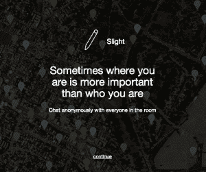

# 匿名社交消息发现位置很重要 

> 原文：<https://web.archive.org/web/https://techcrunch.com/2014/06/30/anonymous-social-messaging-discovers-that-location-matters/>

显然，如果你和地理上最亲近的人分享秘密，效果会更好。

随着匿名社交网络的激增，他们越来越多地转向基于位置的功能，作为保持用户回头客的一种方式。

例如，基于位置的私人消息应用程序 Yik Yak 凭借其地理定位匿名共享服务筹集了 1000 万美元，而其他初创公司也开始提供和测试自己的基于位置的服务。

投资者肯定在试图挖掘过度分享的公众似乎愿意透露的秘密之井——尽管是匿名的。Yik Yak 用了不到 45 天的时间从 Yik Yak 的种子支持者 DCM 领导的投资者那里筹集了最新一轮资金。这轮投资的其他投资者包括:Azure Capital Partners、Tim Draper 和人人联合控股有限公司(Renren Lianhe Holdings)，后者是中国版脸书、[人人网](https://web.archive.org/web/20221207014410/http://www.renren.com/)的风险投资部门。

中国企业似乎被匿名内容分享的概念所吸引([，尽管中国政府打击了社交网站微博](https://web.archive.org/web/20221207014410/http://www.telegraph.co.uk/news/worldnews/asia/china/10608245/China-kills-off-discussion-on-Weibo-after-internet-crackdown.html))。今年早些时候，中国在线游戏和社交媒体巨头腾讯[为](https://web.archive.org/web/20221207014410/https://beta.techcrunch.com/2014/05/19/whisper-v4/) [Whisper](https://web.archive.org/web/20221207014410/http://www.crunchbase.com/organization/whisper) 投资了 3600 万美元。

但是中国公司的兴趣只是反映了国内投资者对被一些人视为下一波社交网络的兴趣。

Yik Yak 的创始人当然看到了本地化匿名的力量，Yik Yak 在高中生匿名分享方面也遇到了麻烦。

Yik Yak 应用程序的两个大学毕业生之一布鲁克斯·巴芬顿说:“上了大学，你仍然要弄清楚你是谁，你的身份是什么。”“当你还在形成你的身份，你认为你是谁的时候，有一个地方让你某一天成为运动的人，另一天成为哲学的人，这很好。”

Buffington 和他的联合创始人 Tyler Droll 在他们的母校弗曼大学(Furman University)创办了 Yik Yak，作为实现社交媒体民主化的一种方式，大学校园仍然是 Yik Yak 发展的基石。

“这个想法来自我们的大学经历，在弗曼大学的校园里，有两三个非常受欢迎的 twitter 账户，正是这两三个账户或受欢迎的运动员账户在校园里拥有强大的声音，”Droll 说。“(我们想)为什么不跳上一项服务，发布一条消息、一个笑话、一条新闻，让你周围的人都看到。”

现在，下一步是看 Yik Yak 如何扩张，因为在全国各地的大学校园中传播 Yik Yak 的用户开始从大学生活的象牙塔转向主要大都市地区的企业丛林。巴芬顿和德罗说，他们已经在纽约、芝加哥、亚特兰大、达拉斯、奥斯汀、休斯顿、西雅图和华盛顿等城市看到了良好的牵引力。

其他匿名网络公司似乎也注意到了这一点。不久前，Secret 开始在内部开展一个名为 Dens，[的项目，该项目允许在工作场所和学校](https://web.archive.org/web/20221207014410/https://beta.techcrunch.com/2014/06/09/secret-is-taking-its-anonymous-networking-app-to-schools-workplaces-with-new-secret-dens-feature/)进行匿名分享。

在这一点上，Secret 希望将内部笑话、更新和八卦局限于一个位置的用户，但 Yik Yak 和其他网站认为地理本地秘密共享可以提供一个不受约束的位置新闻，并开放他们的位置，以便外人可以窥视。

这是新的超本地匿名共享网站背后的功能之一，[轻微](https://web.archive.org/web/20221207014410/https://www.slight.la/)。该应用的用户可以在半径 40 米(约 130 英尺)内的东西上标记帖子，但任何使用该应用的人都可以从任何地方阅读帖子。“这取决于背景，”Slight 的联合创始人之一乔恩·纳什说。“当我们看到帖子被使用的程度有多低时，这是相对的。它们作为瓶子声明中的信息没有意义。”

他说，根据谈话发生的地点，外人仍然会对谈话感兴趣，但轻微并不像耳语或秘密那样是真正的忏悔媒介。纳什说:“当我们在平行网络中进进出出时，我们看不到周围的事物。”。“你在哪里是一个非常重要的指标，表明你是谁(在某个时间)。”

light 上的对话既有同步的(人们在活动中实时发布相关信息)，也有异步的(不同的发帖者留下信息，告知某个地点或活动，并被告知)。

“我把这描述为社交网络的长尾，”纳什说。“你有数百万社交用户，但没有什么真正的趋势。某个位置的较小对话会消失，而较大、丰富的对话会占用更多空间。

Yik Yak 的创始人表示，最终，位置作为一种组织原则和潜在的收入来源变得有说服力。该公司尚未将重点放在盈利上，而是利用新融资开发基础设施，为新学年做准备，并满足该公司不断增长的需求。

“我们通过将位置作为共同点来为匿名提供背景，”Droll 说。“我们相信 Yik Yak 是最强大的应用程序..这是一个超级开放的社交网络，这样你就可以发送一条消息，在那个位置的任何人都可以看到它。“秘密”和“悄悄话”都会称赞他们的匿名性。我们所指的是我们的地理位置……这就是为什么[Yik Yak]是这样的。”

*图片来自 Flickr 用户[桂安·博利赛](https://web.archive.org/web/20221207014410/https://www.flickr.com/photos/instantvantage/)*