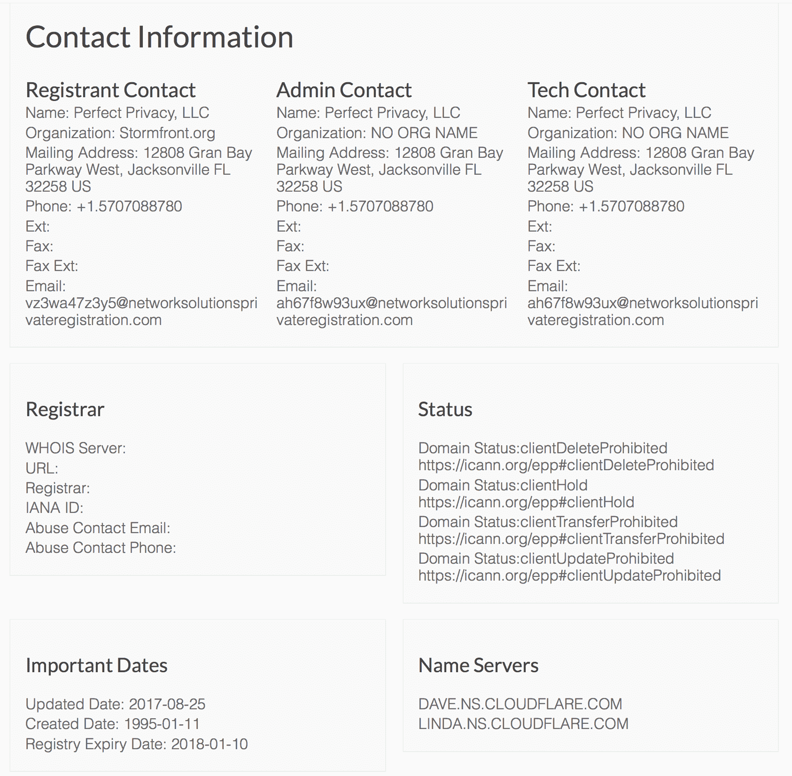

# 另一个新纳粹网站 Stormfront 被关闭 

> 原文：<https://web.archive.org/web/https://techcrunch.com/2017/08/28/another-neo-nazi-site-stormfront-is-shut-down/>

# 另一个新纳粹网站“风暴前线”被关闭

网络上最古老的新纳粹论坛 Stormfront 已经被其域名提供商 Network Solutions 关闭，域名也被正式搁置。新闻[紧随](https://web.archive.org/web/20230103151248/http://www.knoxnews.com/story/news/2017/08/26/white-supremacist-forum-site-stormfront-seized-domain-hosts/604902001/)另一个种族至上主义网站[每日改革者](https://web.archive.org/web/20230103151248/https://techcrunch.com/tag/DailyStormer)的关闭。

Stormfront 开始于 20 世纪 90 年代，最初是一个拨号 BBS，然后在 1995 年左右演变成一个网站和论坛。自 1995 年以来，它已在网络解决方案注册。

法律下的民权律师委员会执行主任克里斯汀·克拉克说，她的组织采取了“反对风暴前线的行动。”

她写道，“他们的网站是一种工具，被用来宣传出于种族动机的暴力和仇恨。”该组织告诉网络解决方案，风暴前线违反了他们的服务条款。

Stormfront 的独特之处在于，它被南方贫困法律中心(Southern Poverty Law Center)视为[【互联网谋杀之都】](https://web.archive.org/web/20230103151248/https://www.splcenter.org/20140401/white-homicide-worldwide)，截至 2014 年，超过 100 起谋杀案归咎于 Stormfront 用户。SPL 写道，这个网站很受“伤口收集者”的欢迎

“被吸引到种族主义论坛 Stormfront.org 的典型杀人犯是一个沮丧、失业的成年白人男性，与他的母亲或分居的配偶或女朋友住在一起，”SPL 在 2014 年写道。“她是家里唯一的养家糊口的人。法医心理学家称他为“伤口收集者”。他没有建立自己的简历、寻找工作或继续深造，而是将自己的不满投射到社会上，并在互联网上寻找与自己的行为或人生选择无关的借口或解释。"

根据 DNS 记录，该组织还有一个 Cloudflare 帐户。Cloudflare 的首席执行官公开反对仇恨组织，并在开始攻击 DailyStormer 的过程中发挥了[的作用。目前还不清楚《风暴前线》何时何地回归，但在撰写本文时，该网站完全无法访问。](https://web.archive.org/web/20230103151248/https://techcrunch.com/2017/08/16/digital-ocean-and-cloudflare-ditch-neo-nazi-client-the-daily-stormer/)