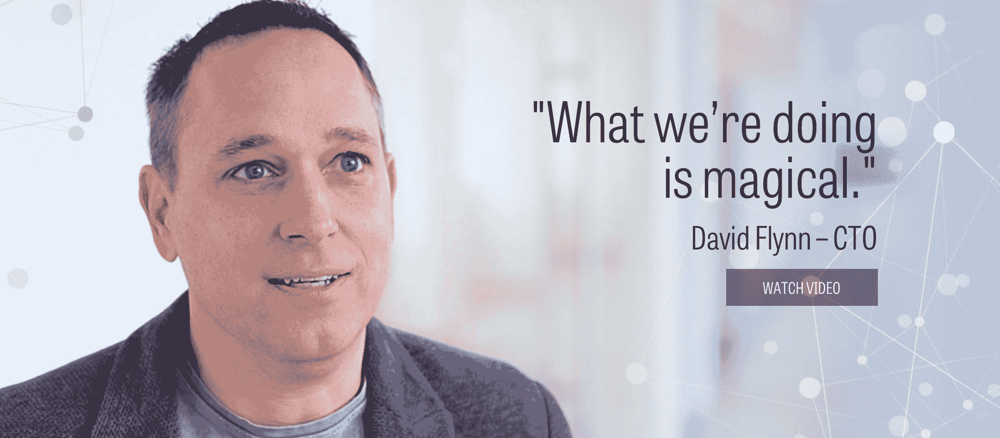

# 另一家短命、资金过剩的初创公司正在关闭:原始数据

> 原文：<https://web.archive.org/web/https://techcrunch.com/2018/01/22/another-short-lived-overfunded-startup-is-shutting-down-primary-data/>

一家以秘密模式运营的初创公司在发布一款产品之前，会筹集到数额惊人的资金。无论如何，投资者都会因为参与其中的人而给这家公司开出巨额支票，但在你意识到这一点之前，噗的一声，这家公司就内爆了，资金也没了。

在这一点上，行业观察人士对这个故事了如指掌。Clinkle 是一个支付奖励网络，它筹集了当时硅谷历史上最大的一轮种子资金，但却从未发布过一个产品，仍然是这种类型中最受[广泛嘲笑的例子](https://web.archive.org/web/20230316161016/https://www.forbes.com/sites/ryanmac/2016/01/22/clinkle-up-in-smoke-as-investors-want-their-money-back/#39498d55138d)。另一个相关的失败是视频聊天服务 Airtime，它是由 Napster 创始人肖恩·帕克和肖恩·范宁创建的，并在 T4 大张旗鼓地推出，以至于你知道它不会走远。

最近一个遵循类似轨迹的例子是:总部位于加州洛斯加托斯的数据虚拟化初创公司 Primary Data，在筹集了高达 1 亿美元的股权和债务并吸引了苹果联合创始人史蒂夫·沃兹尼亚克(Steve Wozniak)等人加入其管理团队后，正处于关闭过程中。

发生了什么事？该公司和我们周末联系的众多投资者都没有回复我们的置评请求。但据一位接近该公司的可靠消息人士称，Primary Data 从一开始就存在的问题是，鉴于该公司试图销售任务关键型软件，其技术从未像需要的那样引人注目。(如果达不到标准，数据虚拟化软件可能会给可管理性、可用性、数据质量和性能带来挑战。)

当然，这个问题不是 Primary Data 的投资者——包括 Accel Partners、Battery Ventures、Lightspeed Ventures Partners 和 Pelion Venture Partners——一开始就预料到的。

有了原始数据，风投们正在对一个团队进行再投资，这个团队曾通过他们之前的初创公司 Fusion.io 为他们带来了财务上的成功，fusion . io 是一家闪存存储公司，在 2011 年获得了非常成功的公开募股。事实上，当 Fusion.io 的联合创始人大卫·弗林和里克·怀特在 2013 年离开时，投资者很快为这两人提供了[5000 万美元](https://web.archive.org/web/20230316161016/https://venturebeat.com/2013/10/31/primary-data-raises-50m-its-all-about-the-data-not-the-storage/)来启动他们的下一个项目。(另外，Fusion.io 严重依赖于两个大客户，这一点变得越来越明显。随着这些客户减少对闪存的使用，Fusion.io 的股价开始下滑，它于 2014 年被芯片制造商 SanDisk 收购。)

在撰写本文时，我们还不确定为什么 Primary Data 的软件令人失望。我们所知道的是，该公司在 2014 年聘请了创始人的长期同事兰斯·史密斯(Lance Smith)担任 Primary Data 的新任首席执行官。Smith 于 2008 年 7 月加入 Fusion.io 担任总裁和首席运营官，并在该公司工作了六年。

加入 Primary Data 后，Smith 立即意识到其烧钱速度已经失控，尤其是对于一家没有收入的公司。但是，尽管史密斯制定的流程有所帮助，但它们并没有改变财富 500 强公司不准备购买 Primary Data 的技术的事实——即使在沃兹尼亚克[加入](https://web.archive.org/web/20230316161016/https://venturebeat.com/2014/11/19/steve-wozniak-joins-his-old-fusion-io-friends-at-primary-data-as-chief-scientist/)团队担任首席科学家后不久。(和史密斯一样，沃兹尼亚克也是 Fusion.io 的校友，他在 2009 年被任命为首席科学家。)

我们被告知，以色列一家名为 Tonian 的存储技术公司(Primary Data [以未披露的条款收购了](https://web.archive.org/web/20230316161016/https://www.theregister.co.uk/2013/08/28/tonian_transforms_into_primary_data/))提供的产品有望帮助解决这个问题，但效果不佳。与此同时，Primary Data 在 8 月推出的[新版本](https://web.archive.org/web/20230316161016/https://siliconangle.com/blog/2017/08/03/primary-data-lands-40m-fuel-chase-data-management-leadership/)软件可能也不足以吸引关键客户。

公平地说，随着戴尔的 VMware 等虚拟化巨头不断壮大，以及更广泛的数据存储市场继续整合，主数据和其他数据虚拟化新贵面临着越来越严峻的挑战。(甚至思科[最近也出售了](https://web.archive.org/web/20230316161016/https://www.theregister.co.uk/2017/10/09/cisco_sells_data_virtualization_to_tibco/)其数据虚拟化业务，但未透露具体条款，称其与思科的长期目标“不一致”。)

不过，Primary Data 的高估值显然也对该公司不利。虽然它在今年夏天宣布了来自内部人士的资金——它宣布了 2000 万美元的后续资金和 2000 万美元的信贷额度，我们知道这基本上是由其创始人提供的过渡性贷款——但我们被告知，其支持者最近决定，他们宁愿关闭公司，也不愿以他们认为不愉快的条款重新投资。

具体来说，他们被要求允许将优先股转换为普通股，然后以 20:1 的比例反向拆分。(换句话说，管理层希望减少发行在外的股票总数，并以同样的倍数提高股价。)

风投们拒绝了。不久之后，该公司的网站[变成了空白](https://web.archive.org/web/20230316161016/http://primarydata.com/)。

昨晚通过电子邮件联系到沃兹尼亚克，他说他没有“了解”Primary Data 的日常事务，主要是因为他的公开演讲义务。

他还说，他自豪地保持着公司首席科学家的身份，同时承认他“不参与再融资或关闭之类的事情。”

沃兹尼亚克经常被描述为科技界最善良的人之一，他进一步补充说，他确实认为自己是“原始数据的一部分，并将尽我所能帮助他们，即使没有薪水。”

他告诉我们，如果“PD 关闭了”，这是非常令人难过的，因为这么长时间以来，他们开发了多少好的技术。”

*上图:联合创始人大卫·弗林(David Flynn)在 Primary Data 的网站上拍摄的照片。*