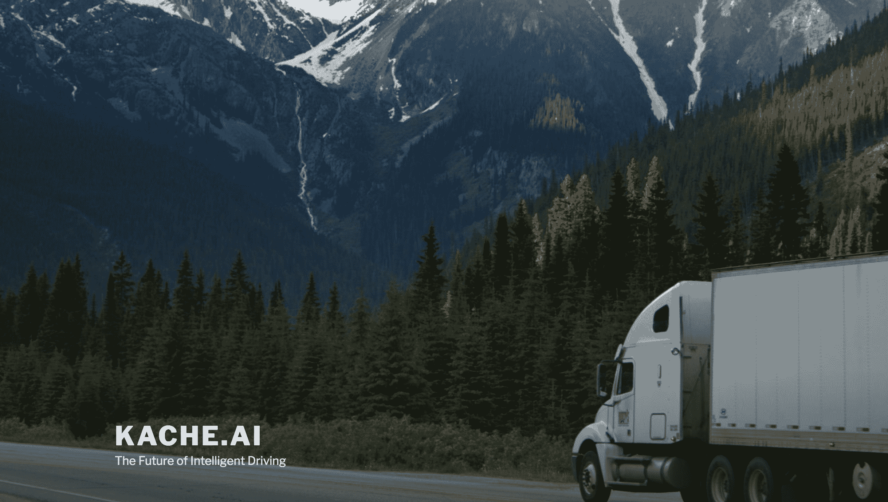
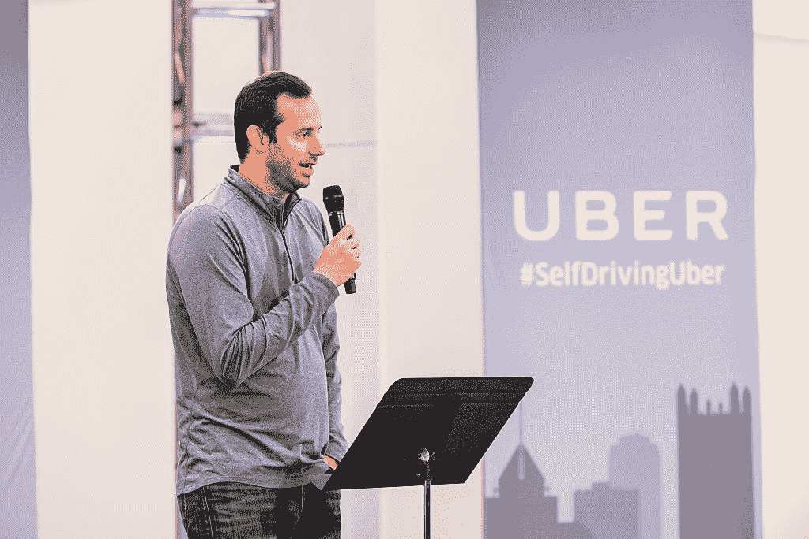

# 安东尼·莱万多夫斯基(Anthony Levandowski)带着一家名为 Kache.ai  的新自动驾驶初创公司回归

> 原文：<https://web.archive.org/web/https://techcrunch.com/2018/07/02/anthony-levandowski-is-back-with-a-new-self-driving-startup-called-kache-ai/>

这是一个东山再起的故事。或者至少是第一章。

前谷歌工程师、连续创业家安东尼莱万多夫斯基(Anthony Levandowski)回归了，他曾处于优步和 Waymo 之间商业秘密诉讼的中心。TechCrunch 了解到，他与一家仍处于秘密模式的自动货运公司有联系。

这家名为 [Kache.ai](https://web.archive.org/web/20230307212649/http://kache.ai/) (发音像 cache)的公司，自近七个月前首次向加州国务卿提交注册文件以来一直保持低调。乍看之下，没有迹象表明莱万多夫斯基与该公司有任何关联。(*更新* : Kache.ai 更名为 [Pronto.ai](https://web.archive.org/web/20230307212649/https://pronto.ai/) 并于 2018 年末脱离隐身状态[。)](https://web.archive.org/web/20230307212649/https://techcrunch.com/2018/12/18/anthony-levandowski-prontoai-self-driving-trucks/)

提交给州政府的公司文件显示，“小托马斯·s·李”是公司总裁。LinkedIn 上的搜索显示，软件开发人员李(Lee)是 Kache.ai 的总裁，他之前的经历包括共同创立了两家总部位于圣地亚哥的公司。自从联系 Kache.ai 以来，LinkedIn 上所有关于该公司的参考资料都已被删除。

然而，在[公司的国家文件](https://web.archive.org/web/20230307212649/https://businesssearch.sos.ca.gov/Document/RetrievePDF?Id=04105000-23603907)上列出的地址讲述了一个不同的故事。Kache.ai 提交给该州的文件列出了一个位于加州圣赫勒拿岛的地址。根据 TechCrunch 查看的财产税和产权记录，这处房产归莱万多夫斯基的父亲和继母所有。莱万多夫斯基的继母苏珊娜·穆西克(Suzanna Musick)是莱万多夫斯基的另一家初创公司 [510 Systems](https://web.archive.org/web/20230307212649/https://www.wsj.com/articles/how-a-star-engineer-sparked-a-war-between-google-and-uber-1495556308) 的首席执行官。

该公司没有回复要求置评的电话。然而，全球自动驾驶汽车生态系统内的其他未透露姓名的消息人士向 TechCrunch 证实，Levandowski 与该公司有关。

人们对 Kache.ai 知之甚少。中文中的“Kǎchē”是卡车的意思，可能意味着与中国的联系。尽管 TechCrunch 无法独立核实 Kache.ai 是否有任何外部合作伙伴或支持者。

该公司的网站一度列出了李开复的电子邮件联系方式，并描述了其使命，但现在除了一张锯齿状山脊的图片外，网站上一片空白。TechCrunch 能够查看并捕捉到网站更改前的截图，其中一张截图如上所示。当时，Kache.ai 网站称，该公司正在研究“商业卡车运输行业的下一代自动驾驶汽车技术。”现已被删除的网站的就业机会部分曾经说过:

> 我们正在为下一阶段的公路自动驾驶卡车开发解决方案。我们的开发理念基于快速发展、非常积极的敏捷团队方法，我们正在寻找在这样的环境中茁壮成长的软件和硬件工程师。

该公司似乎正在招聘各个层次的员工，从地图和数据库专家到拥有机器人和模拟技能的人。该网站还指出，该公司正在寻找在卷积神经网络以及计算机视觉和机器学习算法方面有经验的软件工程师。

该网站称 Kache.ai 位于旧金山地区。

## 并非不可能的回报

对于外人来说，莱万多夫斯基重返自动驾驶汽车舞台在一年前可能还不太可能。对于以前的同事和其他认识他的人来说，这是不可避免的。然而，除了一些含糊的评论说莱万多夫斯基“正在做一些事情”之外，他的回归(直到现在)主要是基于谣言和猜测。

莱万多夫斯基是自动驾驶汽车技术智囊团的一员，多年来，这项技术主要局限于学术研究。

这种情况在 2004 年 3 月 13 日开始改变，当时 15 个团队将他们的自动驾驶汽车带到了加州巴斯托郊外的沙漠。他们在那里参加了[大挑战](https://web.archive.org/web/20230307212649/http://archive.darpa.mil/grandchallenge04/teams.htm)，这是一场 142 英里的比赛，由国防高级研究计划局赞助，旨在鼓励自动驾驶汽车技术的发展。莱万多夫斯基的“蓝队”与众不同，他们是唯一一个带来两轮车的人，这是一辆被他们称为 Ghostrider 的自动摩托车。这辆车现在在史密森尼国家美国历史博物馆。

虽然没有一个团队完成了课程，但这促使 DARPA 举办了两次自动驾驶汽车挑战赛。这种努力激发了几十个人的兴趣和热情，他们后来领导了谷歌的自动驾驶项目，在大公司领导 AV R&D 的工作，或者寻找推动自动驾驶汽车前进的方法。莱万多夫斯基是其中之一。

2007 年，莱万多夫斯基加入谷歌，他是谷歌街景的主要设计师之一。这位工程师也有其他项目，特别是一家名为 510 Systems 的[初创公司，该公司制造并向其雇主谷歌销售传感器系统。510 系统公司是使用激光雷达这种光测距和探测系统制作地图的先驱。谷歌在 2011 年悄悄收购了 510 Systems 和他的另一家初创公司 Anthony's Robots。](https://web.archive.org/web/20230307212649/https://spectrum.ieee.org/robotics/artificial-intelligence/the-unknown-startup-that-built-googles-first-selfdriving-car)

(图片:安吉洛·梅伦迪诺/法新社/盖蒂图片社)

## 急速的上升和下降

在谷歌工作了近九年后，莱万多夫斯基和谷歌的同事利奥·罗恩一起离开了公司。两人与唐·伯内特(Don Burnette)和克莱尔·德劳内(Claire Delaunay)一起创建了奥托莫托，后来成为奥托。

时机再好不过了。部署自动驾驶汽车的竞赛已经升温，创造了一个疯狂的赢家通吃的环境。公司之间吸引人才的竞争推高了薪资和激励。对于那些在谷歌自动驾驶项目和其他高调创业公司和学术职位上打头阵的人来说，世界是他们的。风险投资界不仅仅注意到了这一点；他们为此投入了大量资金。寻求优势的大型汽车制造商和一级供应商开始抢购充满自动驾驶技术人才的初创公司。

2016 年 8 月，优步以令人瞠目结舌的 6 . 8 亿美元收购了 Otto，这仅仅是收购狂潮的一个例子。作为收购的一部分，莱万多夫斯基成为优步自动驾驶汽车研究的负责人。(作为 Waymo 和优步之间诉讼的一部分提交的文件表明，赔偿可能低至[2.2 亿美元](https://web.archive.org/web/20230307212649/https://spectrum.ieee.org/cars-that-think/transportation/self-driving/turns-out-uber-got-otto-on-the-cheap)。)

但围绕奥托交易规模的喧嚣很快会被一种不同的、更不受欢迎的关注所取代。

收购 9 个月后，优步卷入了与 Waymo 的商业秘密诉讼，way mo 是谷歌的前自动驾驶项目，后来成为 Alphabet 旗下的一项业务。莱万多夫斯基失业了。

该诉讼于 2017 年 2 月针对自动驾驶卡车初创公司奥托及其母公司优步提起，指控其侵犯专利和窃取商业秘密。该诉讼针对莱万多夫斯基提出了多项指控，包括他在辞职前不久下载了超过 1.4 万份机密和专有文件。Waymo 声称，奥托和优步正在使用其自动驾驶技术的关键部分，特别是与其光探测和测距雷达有关的部分。这项技术在业内被称为激光雷达，它使用激光来测量距离，以生成汽车周围世界的高度精确的 3D 地图。

该案于 2018 年 2 月开庭审理。经过几天令人兴奋的证词，包括前优步首席执行官特拉维斯·卡兰尼克的证词，双方达成了和解协议。优步同意不将 Waymo 的机密信息整合到他们的硬件和软件中。根据 G-1 系列 720 亿美元的估值，优步还同意支付包括 0.34%优步股权的财务结算。换句话说，Waymo 获得了约 2.448 亿美元的优步股权。

六个星期后，优步将在亚利桑那州坦佩与一辆无人驾驶测试车发生的[悲惨致命事故](https://web.archive.org/web/20230307212649/https://techcrunch.com/story/uber-self-driving-car-strikes-and-kills-pedestrian-while-in-autonomous-mode/)作斗争

奥托的其他三位创始人也都离开了优步。伯内特是最后一个离开的人，今年 4 月，他与曾在 Battery Ventures 工作的帕兹·埃谢尔(Paz Eshel)一起创建了一家名为 Kodiak Robotics 的自动驾驶汽车公司。

## Kache.ai 下一章

莱万多夫斯基的回归可能会引发优步和 Waymo 内部人士的质疑，甚至愤怒。然而，尚不清楚 Kache.ai 是否会使用激光雷达，这是商业秘密诉讼的核心传感技术，也是莱万多夫斯基的天赋之一。

一些自动驾驶卡车初创公司一直避免使用激光雷达，除非用于地图绘制，因为他们认为，在高速公路上以超过每小时 60 英里的速度行驶的重型自动驾驶卡车上，这些传感器并不实用。相反，像 TuSimple 这样的自动卡车运输公司使用多个摄像头，分辨率更高。如果 Kache.ai 绕过激光雷达(目前尚不清楚)，它可能有助于缓解知识产权担忧并吸引投资者。

目前，Kache.ai 故事的开始与 Levandowski 的过去联系在一起，其特点是工程实力和独创性，以及法律和道德失误。剩下的章节将揭示 Kache.ai 正在开发的独特价值支柱是否足够强大，足以让所有这些变得毫无意义。

*更新* : Kache.ai 更名为 [Pronto.ai](https://web.archive.org/web/20230307212649/https://pronto.ai/) 并于 2018 年末退出[的隐身状态。](https://web.archive.org/web/20230307212649/https://techcrunch.com/2018/12/18/anthony-levandowski-prontoai-self-driving-trucks/)