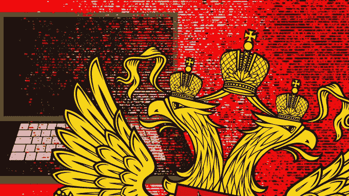

# 扎克伯格请求原谅，但脸书需要改变

> 原文：<https://web.archive.org/web/https://techcrunch.com/2017/10/01/anticipate-the-worst/>

今晚是犹太人的赎罪日，马克·扎克伯格在脸书网站上写道:“我的作品被用来分裂人们，而不是让我们团结起来，我请求宽恕，我会努力做得更好。”。然而，首先，脸书必须认识到它对世界天真无邪的信任可能会被滥用，从而自我救赎。

扎克伯格最近面临自由主义者的严厉批评，指责脸书未能阻止假新闻和俄罗斯干涉 2016 年美国大选，同时脸书被总统本人称为“反特朗普”。

今天的声明引起了不同的反应，一些人指出，扎克伯格在 2016 年底之前[一直将自己](https://web.archive.org/web/20221222145557/https://www.washingtonpost.com/news/acts-of-faith/wp/2016/12/30/mark-zuckerberg-says-hes-no-longer-an-atheist-believes-religion-is-very-important/?utm_term=.e1d9971a4650)列为无神论者，当时他重申了他从小接受的犹太信仰。

“哦，前无神论者马克·扎克伯格，现在突然变得如此虔诚，他的目标是世界总统。非常明确地说:做一个无神论者没有任何问题；问题是将宗教作为政治工具，”巴西广告平台 Boo Box 的联合创始人马尔科·戈麦斯在推特上写道。

“双方都否认宽恕。上帝和人类，因为你和谢丽尔知道发生了什么，宽恕了它，然后对它的存在和影响撒谎”[在推特上写道，风险投资基金数据集体的合伙人马特·奥科](https://web.archive.org/web/20221222145557/https://twitter.com/mattocko/status/914353232305991685)。来自《纽约时报》和《华尔街日报》的记者谨慎地分享了扎克伯格的帖子，没有发表评论。

脸书在阻止干预德法选举、删除恶意账户以及与选举委员会密切合作方面取得了显著进展。但是随着更多关于俄罗斯干预美国总统竞选程度的信息出现，扎克伯格受到了更多的攻击。

来源:沃尔坎·福伦库/阿纳多卢通讯社+大卫·拉莫斯/盖蒂图片社

该公司曾多次被警告滥用职权和应对不力，但却以边缘案例或系统缺陷为由不予理会。早在 2015 年，俄罗斯巨魔用不恰当内容的虚假报道攻击乌克兰抗议者，导致他们的账户被关闭。现在，关于俄罗斯人发布假新闻和购买广告以煽动美国的反移民情绪、打击民主党选民并进一步分裂美国的新闻继续出现。

当扎克伯格回应特朗普的推文“脸书一直反对特朗普”时，事情变得更糟，他说“特朗普说脸书反对他”。自由派说我们帮了特朗普。双方都对自己不喜欢的想法和内容感到不安。这就是为所有想法运行一个平台的样子。”

这一回应嘲笑批评者思想狭隘，淡化了脸书的麻烦是不可避免的，同时强调了脸书对选举的积极影响。这也吓退了特朗普欺负对手希望得到更软待遇的策略。扎克伯格被引诱将脸书定位为中立，尽管俄罗斯干预了特朗普的竞选活动。

扎克伯格说，批评来自各个方面，脸书在中间，而不是直接反驳总统的声明，扎克伯格将脸书置于一个微妙的境地。如果其对选举干预的内部调查报告称俄罗斯人帮助了特朗普，总统可以仅仅将其视为他警告的“反特朗普”情绪。

在过去 7 年报道脸书的过程中，我采访了扎克伯格无数次，我相信他今天的道歉是真诚的。他似乎有理由担心他的平台在过去一年中产生的潜在负面影响。

但是这种说法与他过去的解释不一致。将犹太节日政治化肯定会引起一些人的不满，并被公众和媒体视为要求更宽容的对待。

“我承认我们措手不及，在假新闻和选举干预方面犯了错误，没有成为所有想法的安全平台，我们正在做些什么来解决它”这样一种更一致的方法可能会更好地被接受。将对选举干预的合理担忧与特朗普的咆哮相提并论，同时指出脸书在中间的良好意图，这错误地最小化了抱怨，同时加强了特朗普的宣传。

很可能是脸书领导层的理想主义观点导致了对滥用社交网络的可能性的天真，而不是故意的无知或贪婪。但是前进的道路不是通过假中立或宽恕，而是明确承认渎职和明显的改变。

科技行业不再只是科技行业，应用也不只是应用。这些产品可能比历史上任何传播系统都具有更大的影响力和影响力，必须用更多的怀疑和冷嘲热讽来引导它们。最坏的情况会发生，我们必须做好准备，而不是假设它不太可能发生。让每个人都有发言权是一把双刃剑。虽然它可能是一种好的力量，但它也需要对刀刃的背面进行更明智的保护。