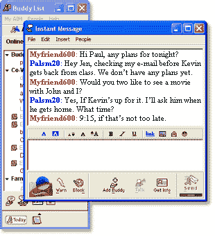

# 20 年后，美国在线即时通讯软件即将关闭

> 原文：<https://web.archive.org/web/https://techcrunch.com/2017/10/06/aol-instant-messenger-shut-down/>

教会我们发短信的开创性聊天应用正在被拔掉插头。12 月 15 日，AOL Instant Messenger 自 1997 年运行[后将关闭。在世纪之交，AIM 主导了北美的在线聊天。但随着短信和社交应用如脸书和 WhatsApp 征服了聊天，AOL 放弃了这场战斗，没有计划替代。](https://web.archive.org/web/20230307142250/https://twitter.com/aim/status/916290747850264577)

“我们知道有那么多忠实粉丝，用了几十年 AIM 自 1997 年以来，我们喜欢工作和建立第一个这种类型的聊天应用程序，”AOL 在 [AIM 帮助页面](https://web.archive.org/web/20230307142250/https://help.aol.com/articles/aim-discontinued)上写道。“我们将始终专注于提供消费者想要的创新体验。我们比以往任何时候都更兴奋地专注于打造下一代标志性品牌和改变生活的产品。”

TechCrunch 读者[丹尼尔·辛克莱](https://web.archive.org/web/20230307142250/https://twitter.com/_DanielSinclair)向我们透露了关闭的消息，这是继三月份第三方应用[关闭](https://web.archive.org/web/20230307142250/https://www.engadget.com/2017/03/01/aol-starts-to-shut-down-third-party-aim-apps/)之后。现在，AIM 的官方 MacOS、Windows、 [iOS](https://web.archive.org/web/20230307142250/https://twitter.com/BuzzFeedBen/status/836675627109482496) 和 Android 应用正在脱离生命支持。

“从设置完美的离开消息到熟悉的来电聊天铃声，AIM 将永远在我们心中占据特殊的位置，”AOL [在一封电子邮件](https://web.archive.org/web/20230307142250/https://pastebin.com/raw/QxmQAQqh)中写道。人们可以下载他们在 12 月 15 日之前发送的图像，但该应用的下载链接现在将开始消失。不幸的是，没有办法保存或移植您的好友列表。

最初，AOL 桌面内置了聊天体验，AIM 于 1997 年作为独立应用推出。其标志性的客场消息是现代推特和状态更新的鼻祖。它与 ICQ 等竞争对手以及雅虎和微软 MSN 的信使争夺霸权。但最终短信、谷歌的 GChat 和脸书接管了市场，而 AIM 从未完全搞清楚向手机的转移。这导致 AOL 失宠，从今天的 2240 亿美元跌至 2015 年卖给威瑞森时的 44 亿美元。关于 AOL 错过的业务背景，WhatsApp 同年以超过 190 亿美元的价格卖给了脸书。

今年 3 月，美国在线的一名前雇员告诉 [Ars Technica](https://web.archive.org/web/20230307142250/https://arstechnica.com/information-technology/2017/02/aol-will-cut-off-third-party-app-access-to-aim/) ，他估计 AIM 的使用量已经下降到个位数的数百万用户，美国在线维持 OSCAR 消息协议运行的成本变得太高，不值得。

不管(披露)TechCrunch 被美国在线(AOL)拥有，这一刻对我来说是苦乐参半。12 岁时，AIM 教我写作，试图在小学友谊和浪漫的世界中遨游。我是一个害羞的孩子，会自己笨嘴拙舌，但通过键盘找到了自己的声音，我可以在表达想法之前创作和编辑自己的想法。在连续三个通宵的 AIM 聊天后，我约了我的初恋女友，坐立不安地盯着我的阴极射线管，直到她同意。

AIM 是一个父母不理解的领域，给它一种秘密的酷感——类似于为互联网一代买了第一辆车。事实上，这是第一次让我相信，社交技术将如此生动地改变我们彼此互动的方式，以至于它值得研究并最终以此为生。

所以，永别了 AIM 和我尴尬的网名 KDog313。作为一个青少年听起来总是像你收到的信息之一。

https://www.youtube.com/watch?v=hxVQ9rhjyTY