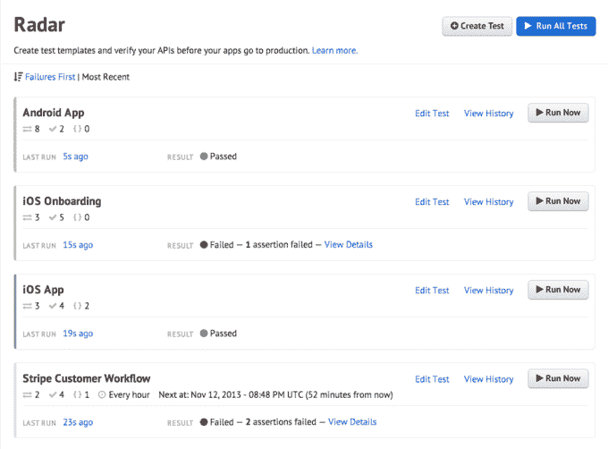

# API 测试服务 Runscope 融资 600 万美元由 General Catalyst 领投，推出企业工具

> 原文：<https://web.archive.org/web/https://techcrunch.com/2014/04/10/api-testing-service-runscope-raises-6m-series-a-round-led-by-general-catalyst-announces-enterprise-tools/>

# API 测试服务 Runscope 融资 600 万美元由 General Catalyst 领投，宣布推出企业工具

帮助开发者[测试和调试](https://web.archive.org/web/20221204032059/https://beta.techcrunch.com/2013/11/14/runscope-offers-new-service-to-test-live-api-calls-for-improving-the-quality-of-mobile-apps/)API 的服务 Runscope 今天宣布，它已经在由 General Catalyst Partners 牵头的首轮融资中筹集了 600 万美元，Lerer Ventures 和 True Ventures 也参与了融资。作为这项投资的一部分，通用催化剂董事总经理史蒂夫·赫罗德将加入公司董事会。

True Ventures 在 2013 年初领导了 Runscope 的 110 万美元[种子轮](https://web.archive.org/web/20221204032059/https://beta.techcrunch.com/2013/05/22/runscope-lands-1-1m-from-true-ventures-and-andreessen-horowitz-for-tools-that-address-the-broken-api-plague/)。Lerer Ventures 也参与了那一轮投资。自从筹集到这一轮种子资金后，它推出了用于测试后端服务的旗舰产品。该公司计划利用新一轮融资来壮大其团队并将其产品线扩展到企业中。正如 Runscope 的首席执行官兼联合创始人 John Sheehan 告诉我的那样，该公司还计划扩大其营销努力，以吸引更多的开发者，并可能很快聘请一名营销主管。

Runscope 表示，到目前为止，“成千上万的开发人员”已经使用了它的工具。总的来说，该服务已经捕获了超过 10，000 个 API 的超过 50，000，000 个请求。

有了 Runscope Enterprise(该公司今天也宣布了),大公司将能够将该服务的 API 调试和测试工具置于防火墙之后，或者使用混合方法。Runscope 认为，由于移动应用、微服务和新一代基于 REST 的面向服务的架构，现在大公司内的 API 使用量达到了历史最高水平，其中许多公司也将需要它的服务。根据 Runscope 的说法，企业版是专门为处理大量的内部 API 消费而定制的。

今天，Runscope Enterprise 将在精选的几家公司中进行有限的私人预览。在接下来的几个月里，该公司希望向更多用户开放这项服务。不过，首先，团队需要为服务添加单点登录和数据保留策略等功能。

正如许多 SaaS 公司在过去几年中发现的那样，与试图通过让个体创业公司和开发人员注册订阅来建立业务相比，向企业公司销售往往是一个容易得多的提议。